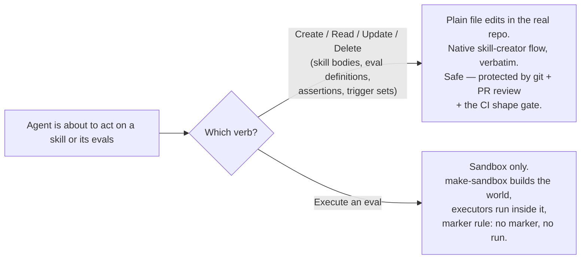
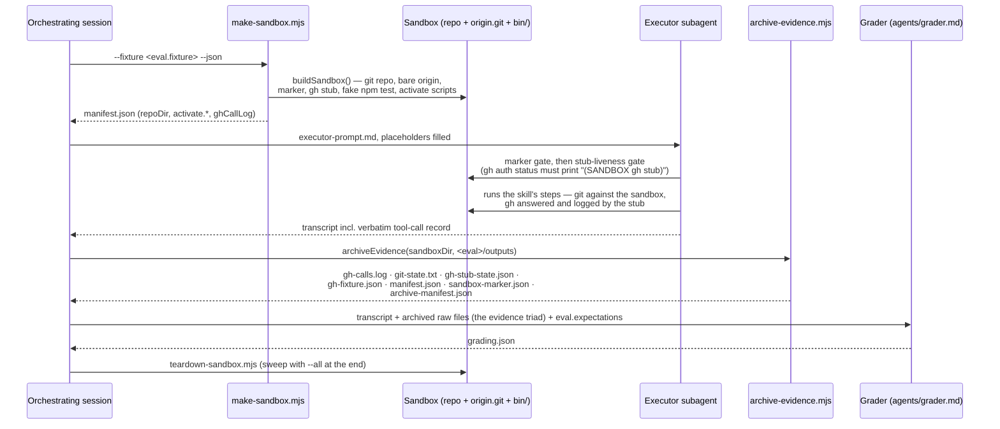
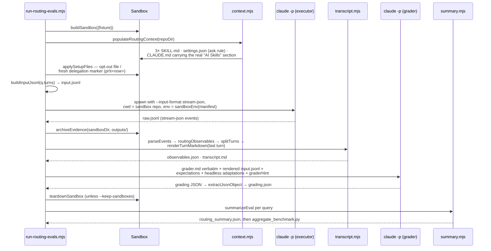

# Design — Skill-evals harness

Status: as-built 2026-09-18, against `scripts/skill-evals/` at commit `7b8f157` (PR #530). Baseline done except two items (§10). Author: Blake, with Claude; the 2026-09-18 scope decisions behind this doc are recorded as comments on #507. Tracks #507. Supersedes `docs/old-archive/spec-skill-evals-baseline.md`.

This is a design doc — the concrete decisions, module map, and rationale for one thing: the
machinery that lets this repo test its Claude Code skills without touching the real repo or real
GitHub. It sits below `strategy-skill-evals.md` (which tells you how to *run* it) and above the
code.

## 0. How to read this

Primary reader: an AI agent picking up harness work cold. A human can skim §1, §2, §4's two flow
diagrams, §10 and §11 and stop.

### Task → where to go

| Your task | Read |
|---|---|
| Run the eval suite; add an eval; look up the schema | [`strategy-skill-evals.md`](strategy-skill-evals.md) §3, §6 — not this doc |
| Understand *why* the harness is shaped this way | §6 here |
| Fix a harness bug; find which module owns a behavior | §4 here, then [`../scripts/skill-evals/README.md`](../scripts/skill-evals/README.md) |
| Understand what stops an eval run reaching the real repo | §5 here, then `strategy-skill-evals.md` §4 |
| Add a fixture profile | §4's fixture entry here, then `../scripts/skill-evals/lib/fixtures.mjs` |
| Write or retire an assertion | §6's assertion-design rules here |
| A routing eval is flaky | §6's assertion-design rules here — "sort variance by locus" and the #527/#528 worked example — then §11 for the measured counts, and §10's "No procedure for changing a routing assertion" for what is *not* decided yet |
| The `gh` stub rejected a command | §4.3's subcommand table here (default-deny is deliberate), then [`../scripts/skill-evals/README.md`](../scripts/skill-evals/README.md)'s gh-stub surface table |
| Is this eval able to fail at all? | §11's red controls, then §6's assertion-design rules |
| Find out what is known-broken or unfinished | §10 here |
| Find a number (pass rates, run counts) | §11 here |
| Decode an id you found in a comment (`C8`, `R4`, `DP1`, `E1`, `II.2e`, `F-B`, `ruling 3`) | §12 here |
| Change a skill's *behavior* | [`spec-portable-ai-procedures.md`](spec-portable-ai-procedures.md) §4 |

### The siblings, one line each

| Doc | Owns |
|---|---|
| [`strategy-skill-evals.md`](strategy-skill-evals.md) | The operational runbook: the one rule, the eval schema, the exact run commands, the merge-discrimination rule, the manual routing runbook, maintenance rules. Highest fan-in of the family. |
| [`spec-skill-evals-manifest.md`](spec-skill-evals-manifest.md) | The pinned, id-by-id mapping from the 23 original acceptance evals to today's 25 entries. Enforced by the contract test. |
| [`doc-skill-creator.md`](doc-skill-creator.md) | Operating the vendored `/skill-creator` copy: the pin, the refresh command, the Python prerequisite, the `quick_validate.py` divergence. |
| [`spec-portable-ai-procedures.md`](spec-portable-ai-procedures.md) | What `/commit`, `/pr`, `/ship` each *do*, step by step. The behavior the evals test. |
| [`plan-skill-nl-invocation.md`](plan-skill-nl-invocation.md) | The natural-language invocation mechanism: Step 0, the delegation marker and its 30s lease, the announcement contract. |
| [`plan-skill-creator-vendoring.md`](plan-skill-creator-vendoring.md) | Why the skill-creator copy is vendored rather than submoduled, and the PR sequence that delivered it. |
| [`strategy-security.md`](strategy-security.md) | The checked-in `ask` rule on `gh pr merge` — its precedence and its stated limits. |
| [`../scripts/skill-evals/README.md`](../scripts/skill-evals/README.md) | Harness CLI surface, sandbox directory layout, the gh-stub surface table, the selfcheck item list. |
| [`../scripts/skill-evals/routing/README.md`](../scripts/skill-evals/routing/README.md) | The routing runner's CLI, its workspace tree, the headless adaptations. |
| [`devjournal.md`](devjournal.md) | Chronology and issue numbers. |

### Terminology — one term per concept, held throughout

- **Harness** — everything under `scripts/skill-evals/`. Our code. Never the vendored skill-creator.
- **Vendored machinery** — `.claude/skills/skill-creator/`, pinned verbatim upstream.
- **Sandbox** — one disposable directory tree built by `buildSandbox()`, containing a throwaway git
  repo, a local bare origin, the stub `gh`, and the marker. Torn down after every run.
- **Workspace** — `.claude/skills/<skill>-workspace/`, the *vendored* machinery's own output tree
  (`iteration-N/eval-X/` holding `eval_metadata.json`, `grading.json` and the rest — see §2's
  enabling insight). Gitignored, and it persists across runs. Not a sandbox: a sandbox is
  disposable git and `gh` state, a workspace is the durable-on-disk evidence a run leaves behind.
- **Marker** — the file `.skill-eval-sandbox`. Written at both the sandbox root and `repo/`.
- **Fixture / fixture profile** — a named starting-state entry in `lib/fixtures.mjs`. Plain data.
- **Execution eval** — `kind: execution`. The prompt makes the skill do its work. Runs in a sandbox.
- **Routing eval** — `kind: routing`. Tests *whether or how* the skill fires. Runs through the
  routing runner.
- **Query** — one entry in `ROUTING_QUERIES`. Eleven queries cover nine routing evals, because
  `commit-5` fans out to three.
- **Expectation / assertion** — one entry in an eval's `expectations` array. The schema field is
  `expectations`; this doc and its siblings call one entry an "assertion" (or a "Must-level
  assertion") in prose. Same thing.
- **Batch** — one full run of every execution eval across all three skills, driven by
  `prompts/batch-prompt.md`; this is the unit the one testing rule operates on. The routing runner's
  own unit — all eleven queries × N repetitions — is also called a batch where the context is
  routing (§11).
- **Red control** — a deliberately mutated copy of a skill's `SKILL.md`, kept in a gitignored
  workspace and run through an eval to prove that eval's assertions can actually go red. Never
  applied to the real skill files. The three on record are in §11.
- **Evidence triad** — transcript, `gh` call log, sandbox git state. `observables.json` is not a
  fourth leg: it corroborates the grader, it is not evidence in its own right (§6).
- **Observables** — the script-computed facts in `observables.json`. They corroborate the grader;
  they never replace it.
- **Trigger rate** — the fraction of repetitions in which a routing eval's skill fired.
- **The one rule** — skill-eval prompts are never executed against the real repo or real GitHub,
  any skill, any origin.

### The tense rule

Present tense in this doc means: verified in the code as it stands at the Status line above.
Anything designed but not built lives in §8 and nowhere else. Every claim about code names a file
and a function or exported symbol. No line numbers appear anywhere — they rot.

## 1. Purpose

### The problem

The team's three Claude Code skills — `/commit`, `/pr`, `/ship` — encode the repo's guarded
commit → PR → merge workflow. The vendored `/skill-creator` ships a complete test kitchen for
skills, but its runner assumes evals are harmless: hand a subagent a prompt, grade the files it
produces. These three skills stage, commit, push, open PRs and merge. Run their evals naively and
the "test" makes real branches and real pull requests.

Underneath that is a succession problem. Verifying a skill change used to be a manual, AI-guided
pass that only Blake knew how to run. This is a small volunteer team with widely varying
experience; the moment the one person who can verify a skill change is unavailable, skills freeze
for everyone.

### The north star

**A skill change by someone other than Blake is routine — through the vendored `/skill-creator`
front door.** Every skill task starts by invoking `/skill-creator`, by slash command or natural
language. The infrastructure this doc describes engages underneath that door; the operator never
learns a second system and never performs an opt-in step to get safety.

### Success criteria

Carried forward from the baseline program and still the bar:

- A non-Blake operator can test a skill change in a small fraction of a session's time and tokens.
- A dev or agent can build, or fully re-eval, a skill end to end through `/skill-creator`'s stock
  flow with no help — the golden-path walkthrough. **Passed 9/9** in Phase 5, run by a non-author
  operator; recorded on #507's body checklist, evidence on #513.
- Structural validation (Layer A) recorded for the four skills in the contract and vendored sets —
  `/commit`, `/pr`, `/ship`, `/skill-creator`. (Unrelated to `/handoff`, which §10 calls a fourth
  *team* skill.)
- Every execution eval runnable end to end in a sandbox, graded by the native grader, aggregated
  by `aggregate_benchmark.py`, reviewed through `eval-viewer/generate_review.py`.
- The contract test green in CI and in `/commit`'s local `npm test` gate.
- Trigger-eval sets exist for `/commit` and `/pr`, and the description-optimization loop has run
  at least once per skill with before/after train/test scores reviewed.
- **Zero real-repo or real-GitHub mutations during any eval run.**
- The nine routing evals graded as trigger rates.

**One of these eight is unmet:** the description-optimization loop has never run in a genuine
cloud or Cowork session. §10 explains why, alongside the other open baseline item — the macOS
platform-validation artifact, which is a completion gate rather than one of the criteria above.

### What this doc is and is not

**Is:** the as-built design record. Purpose, constraints, module map and data flow, the safety
model named to code, the reasoning behind the shape, the scenarios, the decision ledger, the
known gaps, the evidence on disk.

**Is not:** a runbook. It contains no operational run commands and no schema table — those live in
`strategy-skill-evals.md`, which is current and has the highest fan-in in the family; duplicating
it is precisely what made the predecessor spec unreadable and, in three places, wrong. The one
exception is §11, which carries a read-only script that reproduces its own evidence table.

## 2. Context

Four arcs stack, each solving a problem the previous one created. Full chronology and issue
numbers are in [`devjournal.md`](devjournal.md).

**Arc 1 — the three skills (#133 / #62, May 2026).** The team's check-in conventions lived in
people's prompting habits. `spec-portable-ai-procedures.md` encoded them as three skills and fixed
their step lists. This arc created the dependency everything later inherits: **the skills mutate
real git and real GitHub.**

**Arc 2 — natural-language invocation (#353 / #484, June–July).** All three skills started
explicit-only, so humans had to remember to type the slash command. `plan-skill-nl-invocation.md`
designed the two-tier answer: `/commit` and `/pr` became NL-invocable behind a Step-0 intent gate;
`/ship` stayed explicit-only, backstopped by a checked-in `ask` permission rule on `gh pr merge`
in `.claude/settings.json`. PR #484 added the announcement and affirmation routing.

**That `ask` rule matters to everything after it.** It fires at the Claude Code permission layer —
*above* the sandbox, *before* the stub `gh` ever runs. So in an eval session a `gh pr merge` is
frequently intercepted and never logged. A `/ship` that wrongly merges leaves the same empty call
log as a correct abort. Every merge-adjacent grading decision in this system is shaped by that one
fact; it is why §5's trust boundary has a layer above the stub, why §6 says observables corroborate
rather than decide, and why risk R8's original mitigation is wrong (§9's risk register). Its security rationale and
its own stated limits live in [`strategy-security.md`](strategy-security.md).

**Arc 3 — vendored skill-creator (#396, June–July).** Skills were built with `/skill-creator`,
which nobody had on clone. `plan-skill-creator-vendoring.md` vendored it, added the contract test
and a monthly drift workflow — and noticed that the committed evals were inert.

**Arc 4 — the skill-evals baseline program (#507, July onward).** That inertness became this
program. It ran in nine phases; `strategy-skill-evals.md` grew alongside the build. PR #530
(`7b8f157`, 2026-09-16) closed #527 and #528, hardened the routing runner and corrected its
5a/5b grading.

### The three test layers

The vendored machinery tests a skill in three layers. In every one, the pattern is the same: **the
vendored machinery does the work; our additions supply what it needs.**

| Layer | Question | Vendored machinery | What the harness adds |
|---|---|---|---|
| **A — structural** | Is the skill well-formed? | `scripts/quick_validate.py` (reference only) | `tests/functional/skills/skill-contract.test.ts` — the actual CI gate, and it also covers the eval-file shape |
| **B — behavior** | Does the skill do the right things? | the SKILL.md eval workflow, `agents/grader.md`, `scripts/aggregate_benchmark.py`, `eval-viewer/generate_review.py` | runnable eval definitions plus the sandbox harness |
| **C — triggering** | Does the right wording fire the skill? | `scripts/run_eval.py`, `scripts/run_loop.py`, `scripts/improve_description.py` | committed trigger sets plus platform routing (Windows → cloud/Cowork) |

Layer A's `/ship` divergence is expected and permanent: upstream's validator carries a strict
frontmatter key allowlist that predates `disable-model-invocation`. `doc-skill-creator.md` and
`strategy-skill-evals.md` §5 both cover it.

### The enabling insight

**No vendored script reads `evals/evals.json`.** The Python machinery operates on *workspace
artifacts* Claude writes during a run — `<skill>-workspace/iteration-N/eval-X/` holding
`eval_metadata.json`, run outputs, `timing.json`, `grading.json`, then `benchmark.json` via
`aggregate_benchmark.py`. Verified again at the Status date: no file under
`.claude/skills/skill-creator/scripts/` mentions `evals.json` or the `evals/` path at all.

This is the load-bearing architectural fact of the whole design. It means our additive eval-file
fields (`kind`, `fixture`, `human_script`, `expectations`) cost the vendored machinery nothing —
the eval file is just the source an orchestrating agent reads to generate the workspace artifacts.
The nonstandard format was therefore a small conversion problem, and the real work was the safe
execution environment. It is also what lets constraint C1 (never edit the vendored directory) hold
without any compromise.

## 3. The organizing rule and the constraints

### Separate the verbs



CRUD on skills and evals is plain file editing — safe anywhere, fully native. **Execute is the one
dangerous verb**, and it was never safe vanilla. The harness is what makes `/skill-creator`'s
central tenet viable for side-effecting skills, not a restriction on it. Scope: actions on skills
and their evals. Everything else in the repo follows the normal dev workflow.

### Constraints

Ids are load-bearing — code comments, tests and the strategy doc cite several by bare number. Each
row says whether it **holds** as written or has **changed**.

| # | Constraint | Status today |
|---|---|---|
| **C1** | The vendored `.claude/skills/skill-creator/` directory stays verbatim upstream; only `UPSTREAM.md` is local. The refresh script clobbers anything else placed there — which is why `evals/skill-creator.evals.json` stays at the repo root. | **Holds.** `skill-contract.test.ts` asserts the root file's `skill_path` resolves and that each entry carries ≥3 evals. |
| **C2** | `run_eval.py` calls `select.select()` on a subprocess pipe — Unix-only; it raises `OSError [WinError 10093]` on native Windows, and `run_loop.py` imports it, so all of Layer C is Unix-only. | **Holds.** The routing runner sidesteps it entirely: `runExecutor()` and `runGrader()` in `routing/lib/driver.mjs` consume child stdout through Node stream events, never a `select()` equivalent. |
| C3 | Layer C scripts are needed only for description optimization; Layers A and B are plain file processing and run fine on native Windows. | Holds. |
| C4 | Cowork can run the Layer C scripts. | Holds, still per upstream's own Cowork section — not independently verified. |
| C5 | Cloud Claude Code sessions are Linux; nested `claude -p` inside a cloud sandbox needs a one-time smoke test. | **Unverified in a genuine cloud session.** Nested `claude -p` is confirmed working on the native Windows host, which is not the case C5 is about. Tracked on #512. |
| C6 | The skills are interactive; subagents cannot use `AskUserQuestion`, so eval runs use scripted human replies, valid only inside a marker-bearing sandbox. | **Holds, and extended.** Headless `claude -p` has no `AskUserQuestion` either, so the routing grader grades an observable proxy — `runGrader()` in `routing/lib/driver.mjs` injects that adaptation into every grader prompt. |
| **C7** | Upstream `quick_validate.py` rejects `/ship`'s `disable-model-invocation` key. Accepted divergence; the repo's gate is the Vitest contract test. | **Holds.** |
| **C8** | The agent-guidance layers (CLAUDE.md, eval-file notices, the marker rule) are prompt-level, not hard enforcement. The skills' human-approval checkpoints are also prompt-level in the eval context, since an agent holding a `human_script` can satisfy a checkpoint from the script instead of stalling. The only gate that fires regardless is the checked-in `ask` rule on `gh pr merge` — and it guards merges, not pushes or PR creation. | **Holds.** See §5 for what is structural and what is not. |
| C9 | `spec-portable-ai-procedures.md` §3 needs a clarification that `evals/` is upstream skill anatomy, not an auxiliary doc. | **Delivered.** That §3 now says so explicitly and links the strategy doc. |
| C10 | Python 3 + PyYAML is an authoring-time prerequisite; nothing in CI or the app runs the Python. | Holds. |
| **C11** | The advisory-pending ship eval takes ≥5 real minutes by design; it stays in the single batch, scheduled in the first parallel wave so its wait overlaps the others. | **Changed in naming only.** The eval is `ship-2a` (~10 minutes: wait, `wait+5`, wait, abort); `ship-2c` was removed in the Phase-7 right-sizing. The scheduling rule is unchanged and is stated in `prompts/batch-prompt.md`. |
| **C12** | Real-repo testing is exception-only and gated: automated runs never touch the real repo, full stop; the sole allowed touch is an occasional human-run, AI-guided end-to-end smoke, gated by a recorded justification and a cleanup-owed runbook. | **Holds.** The runbook is `strategy-skill-evals.md` §10. |
| **C13** | Dead simple beats clever — usable and maintainable by 4–5 volunteer engineers at varying experience levels. The recorded tie-breaker: fixtures as data not a DSL; the stub as a lookup not a simulator; the tracker as an issue not a board; harness scripts in Node, not shell. | **Holds, and visible in the code.** `scripts/skill-evals/package.json` declares zero runtime dependencies; `lib/fixtures.mjs` is a plain object literal; only the three `gh` wrappers are shell. |
| **C14** | One cohesive testing story: the existing Vitest contract gate keeps working; the harness may enhance it but never interfere. The SKILL.md-structural assertions pass unchanged; the eval-artifact assertions were rewritten for the per-skill layout, and root `evals/evals.json` was deleted. | **Holds, and grew.** CI now runs two skill test files: `skill-contract.test.ts` and `routing-harness.test.ts`. Both sit in the same `functional-skills` Vitest project inside the required `Lint & Functional Tests` check — no new workflow, no new config. |

## 4. Module map and data flow

Everything the harness owns lives under `scripts/skill-evals/`. Node core only; zero runtime
dependencies; `package.json` pins `engines.node >= 20`, and `assertNodeEngine()` in `lib/engine.mjs`
re-checks it at runtime so a too-old Node fails with a sentence instead of an obscure API error.

### 4.1 Entry points

| File | Job | Key symbols | Called by |
|---|---|---|---|
| `make-sandbox.mjs` | Build one sandbox for a named fixture and print either the human activation block or the raw manifest. | argument helpers `has`/`value`/`firstPositional`/`printHelp`; delegates to `listFixtures()` and `buildSandbox()` | humans, the batch prompt, the routing runner (indirectly, via `buildSandbox()`) |
| `teardown-sandbox.mjs` | Remove one sandbox or sweep all of them; `--archive <destDir>` captures evidence first, so archive-then-teardown is one operation. | delegates to `archiveEvidence()`, `teardownSandbox()`, `teardownAll()` | humans, the batch prompt |
| `archive-evidence.mjs` | Copy the harness-owned raw evidence legs into an eval's `outputs/` directory before teardown. | delegates to `archiveEvidence()` | the batch prompt, the executor prompt |
| `selfcheck.mjs` | Run the whole safety checklist and exit non-zero if anything fails. | `checkFixtureCompleteness`, `checkStubBehaviors`, `checkEnvScrub`, `checkTeardown`, `checkWrapperOnPath`, `checkGitBashActivation`, `checkEvidenceArchive`, `checkZeroMutation`, plus `runStub`, `findPosixShell`, `repoState`, `referencedFixtureNames`, `report` | humans, after any harness change |
| `fake-test.mjs` | The sandbox's `npm test`. Passes instantly; exits non-zero if a `.skill-eval-fail-test` sentinel exists in the working directory. | — | copied into each sandbox as `.skill-eval-fake-test.mjs` by `buildSandbox()` |
| `routing/run-routing-evals.mjs` | Drive the eleven routing queries as graded trigger rates. | `loadExpectations`, `buildInputJsonl`, `applySetupFiles`; top-level loop | humans |

`selfcheck.mjs` declares thirteen named checks and emits twenty-three result rows. Several checks
contribute more than one row — `default-deny`, for example, yields `exit`, `logged` and
`no-passthrough`. The check list itself is documented in
[`../scripts/skill-evals/README.md`](../scripts/skill-evals/README.md).

### 4.2 The library

| File | Job | Key exports |
|---|---|---|
| `lib/paths.mjs` | Path resolution and the load-bearing location guard. | `HARNESS_DIR`, `REPO_ROOT`, `MARKER_FILENAME` (`.skill-eval-sandbox`), `SANDBOX_PREFIX` (`skill-eval-`), `sandboxRoot(override)`, `assertOutsideRepo(target)`, `isSandbox(dir)` |
| `lib/engine.mjs` | Node floor, enforced at runtime. | `NODE_ENGINE_FLOOR`, `assertNodeEngine()` |
| `lib/fixtures.mjs` | The fixture profiles, as plain data, plus the shared baseline files every sandbox commits first. Fourteen profiles at the Status date — a count that moves whenever an eval is added, in lockstep with the file's own `// The 14 profiles.` comment. | `listFixtures()`, `getFixture(name)`, `assertNoCaseCollisions(name, profile)`, and the data constants `BASE_FILES`, `HUMANS`, `REVIEWER_COLLABORATORS`, `OWNER`, `REPO`, `SELF` |
| `lib/gh-fixture.mjs` | Turn a profile's `gh` block into the `gh-fixture.json` the stub answers from, deriving the reviewer display-name map. | `buildGhFixture(profile)` |
| `lib/sandbox.mjs` | Build, tear down and archive. The biggest module. | `buildSandbox({fixture, root, note})`, `teardownSandbox(dir)`, `teardownAll(root)`, `archiveEvidence(sandboxDir, destDir)`; internal helpers `git`, `gitSafe`, `forceRemove`, `clearReadOnly`, `setLocalConfig`, `writeFiles`, `writeTeamCache`, `writeMarker`, `installGhStub`, `writeActivateScripts`; the constant `SCRUB_UNSET` |

A fixture profile is a plain object. `getFixture()` returns it with a `name` key added; the fields
a profile itself declares are:

| Field | What it does |
|---|---|
| `summary` | One-line human description. Not read by the builder beyond being copied into the manifest. |
| `branch` | The feature branch the sandbox checks out after the baseline commit on `main`. |
| `baseFilesExtra` | Extra files committed alongside `BASE_FILES` in the baseline commit on `main`. |
| `branchCommits` | Ordered commits replayed on the feature branch; each is `{message, write, delete}`. |
| `pushedBranchCommits` | Push the branch to the bare origin **after** the Nth of those commits, leaving the rest unpushed. Omit it and nothing is pushed unless `openPr` is set. |
| `openPr` | `true` pushes the whole feature branch to the bare origin when `pushedBranchCommits` is absent. Set it whenever `gh.branchPr` claims a PR exists — a PR's head has to exist on origin, and a profile that sets `branchPr` without pushing builds a sandbox whose git state silently contradicts its own `preconditions`. |
| `working` | Uncommitted working-tree changes applied last: `{write, delete}`. This is what makes a fixture "dirty". |
| `teamCache` | Preseeds `/pr`'s reviewer cache: `{refreshedAtDaysAgo, collaborators, extraDisplayNames}`. Omit for a cold cache. |
| `gh` | The data the stub answers from: `owner`, `repo`, `auth`, `self`, `collaborators`, `issues`, `prs`, `branchPr`, `checks`, `runs`, `createPr`, `sequences`, `vercelProductionUrl`. |

`buildSandbox()` interprets most of these directly; the `gh` block goes through `buildGhFixture()`
and `teamCache` through `writeTeamCache()`. Profiles are written in house style using the
module-local helpers `existingPr()`, `featureModule()` and the constants `AUTH_OK`,
`REVIEWER_COLLABORATORS`, `OWNER`, `REPO`, `SELF` — copy the nearest existing profile rather than
writing one from scratch.

`buildSandbox()`, in order: assert the Node floor → look up and validate the profile → resolve and
prove the sandbox root is outside the repo → create the root `0700` and the per-sandbox directory
with `fs.mkdtempSync` → `git init --bare` the origin and `git init` the repo → `setLocalConfig()`
→ write `BASE_FILES` plus the profile's `baseFilesExtra`, commit, add the local origin remote,
push `main` → create the feature branch and replay `branchCommits`, pushing at
`pushedBranchCommits` if set → apply the profile's uncommitted `working` changes → write the
preseeded reviewer team cache if the profile asks for one → write the marker, copy `fake-test.mjs`
in, install the `gh` stub into `bin/` → write `gh-fixture.json`, an empty `gh-calls.log`,
`env.json`, the two activation scripts, `manifest.json`, and the root marker → return the manifest.

### 4.3 The `gh` stub

`gh-stub/gh-stub.mjs` is copied into every sandbox's `bin/`, alongside three thin wrappers — `gh`
(POSIX shell), `gh.ps1`, `gh.cmd` — that each exec `node gh-stub.mjs "$@"`. Because `bin/` is
prepended to `PATH`, this is the `gh` an executor runs.

`main()` refuses immediately if the marker is absent, then `dispatch()` routes on the first two
argv tokens. Every answered and every refused call is appended to `gh-calls.log` by `logCall()`,
which records `ts`, `argv`, `cwd`, `sub`, `credsPresent` (whether `GH_TOKEN`/`GITHUB_TOKEN` were
set), `ghConfigDir`, a `decision` of `answered` / `denied` / `no-marker` / `error`, the `exitCode`,
and per-handler extras.

| Subcommand | Handler | Behavior |
|---|---|---|
| `auth status` | `handleAuthStatus` | Writes to **stderr**, like real `gh`, and includes the literal `(SANDBOX gh stub)` — the string the executor prompt's stub-liveness gate greps for. Exit 0 logged in, 1 not. |
| `issue view <N>` | `handleIssueView` | Emits the fixture's issue JSON, or exit 1 if it is not `OPEN`. |
| `pr view [N]` | `handlePrView` | With a number, the fixture's `prs[N]` or `branchPr`; without, `branchPr`. Exit 1 when absent. |
| `pr list` | `handlePrList` | The read-only branch-PR-detection alias: emits `[branchPr]` or `[]`. |
| `pr create` | `handlePrCreate` | Consults the per-call sequence `sequences["pr create"]` **first**; only if the profile has none does it fall back to `createPr`'s URL. (`pr-7`'s error-then-success run depends on that precedence.) Logs the `--reviewer` and `--assignee` values. |
| `pr checks <N> [--watch]` | `handlePrChecks` | Prints one tab-separated line per fixture check. Exit **0** all pass, **8** any pending, **1** any fail — real `gh`'s codes. |
| `pr merge <N>` | `handlePrMerge` | Prints a simulated success, calls `recordMerge()` to append a durable record to `gh-stub-state.json`, and logs the `--merge` / `--delete-branch` / `--squash` flags. It never mutates the sandbox git tree, so the skill's own `git branch -d` still behaves. |
| `pr comment <N>` | `handlePrComment` | Returns a synthetic comment URL; logs whether a body was supplied. |
| `run list` / `run watch <id>` | `handleRunList` / `handleRunWatch` | Post-merge run discovery and watch, from the fixture's `runs`. |
| `api user` / `api users/<login>` / `api repos/<o>/<r>/collaborators` | `handleApi` | Emulates exactly the `--jq` filters `/pr` uses (`.login`, `.name // .login`, `.[].login`). Any other endpoint falls through to default-deny. |
| anything else | `dispatch` default branch | **Default-deny.** |

Exit codes: **64** un-stubbed subcommand (default-deny), **66** sandbox marker missing, **70**
internal stub error. The stub never passes a call through to the real `gh`. Argument parsing is
handled by `positionals()`, `firstPositional(n)`, `hasFlag(name)`, `flagValue(name)` and
`stripSurroundingQuotes`, with `FLAGS_WITH_VALUE` telling the positional scanner which flags
consume the next token. `takeSequenced()` implements per-call sequencing by advancing a counter in
`gh-stub-state.json`.

The full surface table with "used by which skill" annotations lives in
[`../scripts/skill-evals/README.md`](../scripts/skill-evals/README.md); it is a superset of the
original design's illustrative list because `pr-1` and the ship evals genuinely call `pr comment`,
`run list` and `run watch`.

### 4.4 The routing runner

| File | Job | Key exports |
|---|---|---|
| `routing/routing-plan.mjs` | The driver plan: one entry per **query**, carrying the seeded turns, the fixture, setup files, an optional `expectationsOverride` (replaces the eval's committed `expectations` for one sub-scenario — §6), and a `graderHint` (freeform scenario context appended to the grader's prompt — §6). | `ROUTING_QUERIES`, `FRESH_DELEGATION` |
| `routing/run-routing-evals.mjs` | Orchestrates build → context → setup → drive → archive → observe → render → grade → tear down, per query per repetition; then aggregates. | **Nothing** — the script executes on import, so `loadExpectations`, `buildInputJsonl` and `applySetupFiles` are module-local and cannot be pulled into a test. That is why `lib/summary.mjs` was extracted. |
| `routing/lib/context.mjs` | Copy the real repo's routing context into a sandbox so a fresh session *discovers* the skills. | `REPO_ROOT`, `extractAiSkillsSection(repoRoot)`, `populateRoutingContext(repoDir, repoRoot)` |
| `routing/lib/driver.mjs` | Shell out to `claude -p` twice — once as executor, once as grader — and recover the grader's JSON. | `sandboxEnv(manifest)`, `runExecutor(...)`, `runGrader(...)`, `extractJsonObject(text)`; internal `repairEscapes`, `parseOrRepair`, and the constant `GRADER_MD_REL` |
| `routing/lib/transcript.mjs` | Turn the stream-json output into a graded transcript, render the fed input turns as ground truth, and compute observables. | `renderInputTurns(path)`, `parseEvents(outFile)`, `splitTurns(events)`, `turnItems(turn)`, `renderTurnMarkdown(turn, heading)`, `routingObservables(events, {skill, ghCallLog})` |
| `routing/lib/summary.mjs` | Per-eval aggregation, extracted from the runner script so it is unit-testable. | `NEGATIVE_CONTROLS`, `INLINE_FIRE`, `polarityFor(queryId)`, `summarizeEval({...})`, `formatSummaryLine(e)` |

`populateRoutingContext()` copies the three team `SKILL.md` files, `.claude/settings.json` (so the
`ask` rule is present exactly as in real life), and a sandbox `CLAUDE.md` whose body is the real
repo's `## AI Skills` section extracted verbatim by `extractAiSkillsSection()`. It refuses any
target that resolves inside the real repo, and refuses any directory without the marker.

`runExecutor()` spawns `claude -p` with `--input-format stream-json --output-format stream-json
--verbose --model <m> --allowedTools "Bash Read Grep Glob Edit Write Skill TodoWrite"
--permission-mode acceptEdits`, cwd set to the sandbox repo and env from `sandboxEnv()`. It writes
the input JSONL to the child's stdin, streams stdout to `raw.jsonl`, and kills the child with
`SIGKILL` after 240 seconds — the routing decision lands early, so a timeout still leaves a
gradeable turn. `runGrader()` spawns a second `claude -p` with `--output-format json` and read-only
tools, cwd set to the run directory, with a 180-second timeout.

**The eleven queries.** Nine routing evals, eleven queries, because `commit-5` fans out
(§6 explains why):

| Query | Source eval | Skill | Polarity |
|---|---|---|---|
| `commit-4` | `commit-4` | commit | should-fire |
| `commit-5a-slash` | `commit-5` | commit | should-fire-inline |
| `commit-5b-delegation` | `commit-5` | commit | should-fire |
| `commit-5c-optout` | `commit-5` | commit | should-fire |
| `commit-6` | `commit-6` | commit | should-fire |
| `commit-7` | `commit-7` | commit | should-NOT-fire |
| `commit-8` | `commit-8` | commit | should-NOT-fire |
| `pr-8` | `pr-8` | pr | should-fire |
| `pr-9` | `pr-9` | pr | should-fire |
| `ship-4` | `ship-4` | ship | should-NOT-fire |
| `ship-5` | `ship-5` | ship | should-NOT-fire |

Polarity comes from `polarityFor()`: `NEGATIVE_CONTROLS` holds the four over-trigger controls,
`INLINE_FIRE` holds `commit-5a-slash` alone.

### 4.5 Flow — one execution eval

An execution eval is driven by an orchestrating session following
`prompts/batch-prompt.md`, which fans `prompts/executor-prompt.md` across every `kind: execution`
eval. There is no execution-eval runner script; the orchestration is a prompt, deliberately (§6).

**What the diagram shows:** one eval, one sandbox, one grade, then teardown — and nothing in the
loop touches the real repo or real GitHub.



Two gates in that flow are non-negotiable and both live in `prompts/executor-prompt.md`: the
**marker gate** (no `.skill-eval-sandbox` in cwd → stop) and the **stub-liveness gate** (`gh auth
status` must print `(SANDBOX gh stub)` on stderr, or the real GitHub CLI won the `PATH` race →
stop). The second exists because credential scrubbing still blocks a real-GitHub reach even when
`PATH` is misrouted, but the stub's call log then silently goes dark — and grading against a dark
log is worse than not grading.

Archiving happens **before** teardown, as harness behavior rather than a request an agent may skip.
`archiveEvidence()` also writes `archive-manifest.json` recording which legs were captured and
restating the merge-discrimination caveat, so a reader of the archive alone cannot misread an empty
log.

### 4.6 Flow — one routing eval

**What the diagram shows:** the runner does by script what the execution flow does by prompt —
build a sandbox, make the skills *discoverable* in it, drive one fresh headless session, grade the
last turn, tear down — repeated N times so the result is a rate.



Three details in that flow matter and are easy to get wrong:

1. **The grader is handed the fed input turns as ground truth.** `runGrader()` inlines
   `renderInputTurns(input.jsonl)` into the prompt and states a **seed-presence rule**: any claim
   about whether a prior turn was present must be answered from that rendering, never inferred from
   `transcript.md` (only the final graded turn) or `raw.jsonl` (the executor's *output* stream,
   which structurally never carries the fed turns as history). `renderInputTurns()` distinguishes a
   legitimate single-turn eval — "Seeded prior turns: NONE" — from a missing, empty or unparseable
   file, which it reports as unverifiable rather than asserting a negative.
2. **The runner owns timing and metrics.** After the grader returns, the runner overwrites
   `grading.timing` with real wall-clock numbers and fills `execution_metrics`, then coerces
   `user_notes_summary` and `expectations` to the shapes `aggregate_benchmark.py` expects. A grader
   that emits `null` there would otherwise crash the Python aggregate.
3. **Ungraded runs are loud.** When `extractJsonObject()` returns null the runner writes
   `grader-raw.txt` instead of `grading.json`, `summarizeEval()` counts the run in `ungraded_runs`
   and names it in `ungraded`, and the runner prints a warning. The mean is still taken over graded
   runs only — you cannot average a result you do not have — but the count sits beside it so a
   batch cannot quietly shed failing reps and report a flattering number.

### 4.7 Artifacts

**Inside a sandbox** — `repo/` (the executor's cwd, holding the marker, `.git`, the baseline files
and `.skill-eval-fake-test.mjs`), `origin.git/` (the local bare push target), `bin/` (the stub and
its three wrappers), `gh-config/` (the isolated `GH_CONFIG_DIR`), `gh-fixture.json`,
`gh-calls.log`, `gh-stub-state.json`, `env.json`, `activate.sh`, `activate.ps1`, `manifest.json`,
and a root-level marker so an audit or sweep can identify the directory even if `repo/` is gone.

**Archived into an eval's `outputs/`** — `gh-calls.log`, `gh-stub-state.json`, `gh-fixture.json`,
`manifest.json`, `sandbox-marker.json`, `git-state.txt`, `archive-manifest.json`. `git-state.txt`
is a labelled dump of `rev-parse HEAD`, `status --porcelain=v1 -b`, `log --oneline --all -n 50`,
`branch -avv`, `reflog -n 50`, unstaged and staged diffs, plus the bare origin's log and branch
list. Every command runs through `gitSafe()`, so a failure becomes a bracketed note in the dump
rather than aborting the archive.

**A routing run adds** `input.jsonl`, `seeded-turns.md` (the on-disk audit copy of what the grader
was shown), `raw.jsonl`, `executor.err`, `transcript.md`, `timing.json`, `grading.json` (or
`grader-raw.txt`), `runner-error.txt` on a thrown error, and `outputs/observables.json`. At batch
level: `eval_metadata.json` per query, `routing_summary.json`, and `benchmark.json` / `benchmark.md`
from `aggregate_benchmark.py`. The tree shape is documented in
[`../scripts/skill-evals/routing/README.md`](../scripts/skill-evals/routing/README.md).

`observables.json` carries `firstText`, `announcementPresent`, `announcementIsFirstLine`,
`skillInvocations`, `invokedThisSkill`, `mutatingBashCmds`, `askUserQuestionUsed`, `ghLog`
(`present`, `lines`, `hasPrMerge`, `live`), `result` and `numGradedTools`.

### 4.8 What CI runs — and what it does not

`.github/workflows/ci.yml`'s `Lint & Functional Tests` job is the required check. It runs Biome and
the Vitest functional suites, which include both skill test files. A docs-only PR skips the work
via a `paths-filter` step but still reports success, so branch protection is satisfied.

**No workflow runs the harness, the selfcheck, or any eval.** Eval runs are human-triggered, by a
person or their session's agent, by design (the reasoning is in §6). The only other skill-related
workflow is `.github/workflows/skill-creator-drift.yml`, a monthly read-only check that opens one
tracking issue when the vendored pin falls behind upstream.

`tests/functional/skills/skill-contract.test.ts` holds `/commit`, `/pr` and `/ship` to their
structure — frontmatter `name` matching the directory, the per-skill invocation policy in
`EXPLICIT_ONLY`, the `REQUIRED_SECTIONS` subsequence, the `SOFT_LINE_CAP` warning — and pins the
eval artifacts: allowed `kind` values in `ALLOWED_KINDS`, `fixture` plus ≥1 expectation on every
execution eval, the exact execution-eval id set in `EXPECTED_EXECUTION_IDS`, and the continued
absence of root `evals/evals.json`. `tests/functional/skills/routing-harness.test.ts` covers the
routing harness's pure functions — `extractJsonObject`, `renderInputTurns`, `summarizeEval`,
`polarityFor` — one case per defect found in the #527/#528 review.

## 5. Safety and the trust boundary

**The boundary:** everything inside a marker-bearing sandbox is disposable and may be mutated
freely; everything outside it is the real repo, where eval execution is forbidden and only the
normal human-approved workflows change state.

The mechanisms, named to where they live:

| # | Mechanism | Where |
|---|---|---|
| 1 | **The sandbox can never be inside the repo.** Every resolved path is run through a guard that refuses the repo root or anything under it. | `assertOutsideRepo()` in `lib/paths.mjs`, called by `buildSandbox()`, `teardownSandbox()`, `teardownAll()` and `archiveEvidence()` in `lib/sandbox.mjs` |
| 2 | **Each sandbox is a unique, private, exclusively-created directory.** The root is created `0700`; the per-sandbox directory uses `fs.mkdtempSync`, so nothing lands in a fixed, pre-creatable path. | `buildSandbox()` in `lib/sandbox.mjs` |
| 3 | **No marker, no run.** Two markers are written: `writeMarker()` writes the `repo/` one (the payload the stub and the executor check), and `buildSandbox()` writes a leaner root-level one inline so an audit or sweep can still identify the directory if `repo/` is gone. The stub refuses without the `repo/` marker; the routing context installer refuses without it; teardown refuses a directory that has neither marker nor a manifest. | `writeMarker()` and `buildSandbox()`'s root-marker write, both in `lib/sandbox.mjs`; `main()` in `gh-stub/gh-stub.mjs` (exit 66); `populateRoutingContext()` in `routing/lib/context.mjs`; `teardownSandbox()` in `lib/sandbox.mjs` |
| 4 | **Default-deny `gh`.** Anything outside the traced surface hard-fails and is logged; it never passes through to the real `gh`. Unknown `api` endpoints deny too. | the default branch of `dispatch()` and of `handleApi()` in `gh-stub/gh-stub.mjs` (exit 64) |
| 5 | **Credentials are scrubbed and `gh` config is isolated.** `GH_TOKEN`, `GITHUB_TOKEN`, `GH_ENTERPRISE_TOKEN` and `GITHUB_ENTERPRISE_TOKEN` are unset and `GH_CONFIG_DIR` is pointed inside the sandbox — declared in `env.json`, applied by both activation scripts, and applied in-process for the routing runner. | `SCRUB_UNSET` and `writeActivateScripts()` in `lib/sandbox.mjs`; `sandboxEnv()` in `routing/lib/driver.mjs` |
| 6 | **There is no real GitHub to reach.** `origin` is a local bare repository addressed by a `file://` URL, so a push lands on disk. | `buildSandbox()` in `lib/sandbox.mjs` |
| 7 | **The sandbox repo runs no hooks and signs nothing.** `core.hooksPath` points at a directory that does not exist; `commit.gpgsign` and `tag.gpgsign` are false; `gc.auto` is 0. | `setLocalConfig()` in `lib/sandbox.mjs` |
| 8 | **Every call is evidence.** Answered and denied calls alike are appended to `gh-calls.log`, with whether credentials were present at call time. | `logCall()` in `gh-stub/gh-stub.mjs` |
| 9 | **Liveness before any negative.** A "the log contains no X" claim is trusted only when the log is non-empty. | `ghLog.live` from `routingObservables()` in `routing/lib/transcript.mjs`; stated to the grader by `runGrader()` in `routing/lib/driver.mjs`; stated to humans in `prompts/executor-prompt.md` |
| 10 | **Fixtures can never depend on case-distinct filenames**, because macOS's default filesystem is case-insensitive. | `assertNoCaseCollisions()` in `lib/fixtures.mjs`, called from `getFixture()` |
| 11 | **The real repo is audited after a selfcheck run** — HEAD, the full `git branch --list` output and `git status` must all be byte-identical before and after, which catches any leaked branch. A hardcoded list of ten of the fourteen fixture branch names is additionally checked by name, belt-and-braces. | `checkZeroMutation()` in `selfcheck.mjs` |
| 12 | **The whole checklist is executable.** Thirteen named checks, twenty-three rows, exit 0 only if every row passes; among them a genuine POSIX-shell activation check that sources `activate.sh` and runs a bare `gh`. | `selfcheck.mjs`, especially `checkGitBashActivation()` and `findPosixShell()` |

### Above the stub

One gate fires outside all of that: the checked-in `ask` permission rule on `Bash(gh pr merge *)`
and `PowerShell(gh pr merge *)` in `.claude/settings.json`. It is evaluated at the Claude Code
permission layer, before any command runs, so it sits **above** the sandbox rather than inside it.

That has two consequences the harness is built around. First, it is the sturdiest gate C8 can point
to, though not an absolute one. Per `.claude/skills/ship/SKILL.md` step 11, which is the source of
record for this rule's behavior: precedence is deny → ask → allow, first match, so the checked-in
`ask` cannot be weakened by a local `allow` or by `bypassPermissions` — but **`auto` mode
auto-approves it, and a prior "Yes, don't ask again" silences it for the rest of the session.** A
guaranteed prompt means running in default mode. Second, it
breaks naive merge grading — an intercepted `gh pr merge` never reaches the stub, so it is never
logged, so an empty log proves nothing. The rule for grading is therefore: **grade merge-adjacent
assertions from the transcript's tool-call record**, corroborated by the log and
`gh-stub-state.json` where the environment let the call through, and never pass a merge-negative
on an empty log alone. `handlePrMerge()` in `gh-stub/gh-stub.mjs` carries that caveat inline;
`archiveEvidence()` restates it in every `archive-manifest.json`; `strategy-skill-evals.md` §6 is
its home.

### What is not protected

- **Sandbox `permissions.allow` entries are silently ignored.** An untrusted workspace does not
  honor them, with no error. So the `ask` rule copied into a sandbox by `populateRoutingContext()`
  cannot be locally relaxed for a headless run, and a future attempt to permit something inside a
  sandbox by settings alone will fail quietly. Tracked as **#531**.
- **Nothing inside `.claude/` can be deleted headless.** Built-in Claude Code protection refuses
  it; the same filename in another directory deletes fine, so the trigger is the directory. This is
  why `/commit`'s clear-on-read of the delegation marker cannot be graded by the routing runner —
  `routing-plan.mjs` documents the exclusion on `commit-5b-delegation`, and the manual runbook in
  `strategy-skill-evals.md` §6 covers it instead.
- **The guidance layers are prompt-level (C8).** An agent that ignores CLAUDE.md, the eval files'
  `$comment` notices and the marker rule, while holding a `human_script`, can satisfy an approval
  checkpoint from the script rather than stalling. The backstop stack — structural isolation, the
  default-deny stub, the `ask` rule, the CI shape gate, and plain git recoverability — means a
  missed layer degrades to *recoverable and loud*, never *silent damage*. That is the honest scope
  of the safety guarantee: structural against accidental mutation, prompt-level against deliberate
  deviation.

## 6. Why it is shaped this way

### Per-skill eval layout (DP1)

*(DP = design point. DP1–DP4 are the program's numbered architecture decisions, distinct from the
C-numbered constraints in §3 and the R-numbered risks in §9. All four are in §9's ledger.)*

Evals live at `.claude/skills/<skill>/evals/evals.json` — upstream's own documented location —
rather than in one repo-root file. The decision was reversed from "convert the root file in place"
on a single named criterion: **upstream instructions must work verbatim**. Under the root-file
option the bridging pointer would have lived in CLAUDE.md, itself a local translation layer, and
every future upstream refresh would have had to be re-reconciled against it. Cascade evals live
with the skill whose invocation is the eval's prompt. `evals/skill-creator.evals.json` stays at the
repo root because of C1 — the refresh script clobbers anything else placed in the vendored
directory. The cost of the layout is risk R2: deleting and recreating a skill folder takes its
evals with it.

### Skill-creator kept stock

Nothing in the vendored directory is edited, ever — including the Windows `select()` bug, which
goes upstream rather than into a local patch. This is affordable only because of the enabling
insight (§2): the vendored scripts never read our eval files, so additive fields cost them nothing,
and the sandbox is invisible to them because it is just a working directory. The one accepted
divergence, `quick_validate.py` rejecting `disable-model-invocation`, is documented in two places
rather than patched away.

### Fixtures as data, not a DSL (C13)

`lib/fixtures.mjs` is a plain object literal read by `buildSandbox()`. Adding an eval is usually
adding a named starting state, not touching the harness. A DSL or a fixture-builder API would have
bought expressiveness nobody on a 4–5 person volunteer team needs, at the cost of a second thing to
learn before you can write a test. The same tie-breaker chose Node over shell for the harness core
(shell behaves differently per OS; Node does not, and this is a Node repo), a lookup stub over a
GitHub simulator, and a GitHub issue over a project board as the tracker.

### The execution batch is a prompt, not a script

There is no `run-execution-evals.mjs`. The batch is `prompts/batch-prompt.md` handed to an
orchestrating session, which fans `prompts/executor-prompt.md` across the evals. That is deliberate:
the executor *is* an LLM following a skill faithfully, including its approval checkpoints, so the
orchestration layer is prompt-shaped all the way down. Scripting it would mean scripting the part
that has to be judgment. The routing runner is a script precisely because its executor is a fresh
`claude -p` session with no judgment to supply — the harness only has to launch it and read what
came back.

### One batch, never CI

The one testing rule is: when you change a skill, or refresh the vendored copy, you run the whole
batch. There is deliberately no lighter per-skill variant documented anywhere, because a lighter
variant is what people reach for and then the regression suite stops being a regression suite. Runs
stay human-triggered — never CI — because an LLM-driven run costs real money and real minutes and
is not deterministic; CI-gating it would make every unrelated PR pay for it. What CI does gate is
the deterministic shape check. A deliberate skip is an unchecked PR-template box with a stated
reason, visible to reviewers.

### The `commit-5` fan-out and `expectationsOverride`

`commit-5` is **one** routing eval in the committed eval file, because the manifest's splitting rule
applies to execution evals only. But it has three sub-scenarios — typed slash, delegation, opt-out
— that cannot be driven by one query. `routing-plan.mjs` is the de-multiplexer: three entries
(`commit-5a-slash`, `commit-5b-delegation`, `commit-5c-optout`) all carry `evalId: "commit-5"` and
each supplies its own `expectationsOverride`.

`loadExpectations()` in `run-routing-evals.mjs` returns `expectationsOverride` when present and
otherwise loads the eval's committed `expectations` from the eval file. So the committed file stays
the source of truth for every ordinary query, and the override exists for exactly one reason: to
say something true of a sub-scenario that is not true of its parent eval. The clearest case is
`commit-5a-slash`, whose override states that a typed `/commit` is expanded by the CLI's own slash
parser and injected directly — it never routes through the `Skill` tool, so `invokedThisSkill:
false` is *correct*, and grading it as a failure is the bug.

`graderHint` is the third input to grading, alongside the expectations and the transcript.
`runGrader()` appends it under an "Eval-specific grader note" heading after the two headless
adaptations. A hint's job is to tell the grader **what the scenario is and where the evidence
lives** — the seeded turns, the fixture facts, the harness limitation that makes a particular
behavior expected. A hint that carries an assertion the eval file does not state, or a pass/fail
rule the assertion contradicts, is a defect: it makes graders enforce requirements nobody reviewed.

### Observables corroborate; they do not decide

`routingObservables()` computes facts a script can check — was the announcement the first line, was
a `Skill` tool call made, were mutating git commands run, does the call log contain `pr merge`, is
the log live. None of them is a verdict. The comments in `transcript.mjs` say so explicitly about
the ad-hoc-bypass flag: git commands that run *after* the skill was invoked are the skill's own
steps, not a bypass, and only the LLM grader can tell the difference. Observables exist so the
grader can be corroborated against ground truth rather than trusted on narration, and so a human
auditing the run has numbers to check.

### Advisory ranges, no numeric thresholds

A typical full batch runs roughly 60–90 minutes and about 2M tokens. Those are documented reference
points, not gates — nothing could enforce them, because batch runs are human-triggered. **Pass rate
has no numeric floor, by design.** The gate stays what it always was: every Must-level assertion
passes, or a human explicitly dispositions the failure. A "95% is fine" bar would let a fixed slice
of real regressions through unexamined, which defeats the point of a regression suite. Routing is
separately probabilistic (R5) and is reported as rates over repetitions, never as a binary verdict.

### Assertion-design rules

These were learned the hard way in #527/#528 and are the rules to apply next time an eval looks
flaky.

**Keep an assertion only if it checks function.** Five functions are worth asserting: (a) the skill
follows its documented procedure; (b) it lands — the work actually completes; (c) it catches an
error or refuses what it must; (d) it invokes another skill when it should; (e) it keeps the
watching human reasonably informed. An assertion that checks none of those is checking wording.

**Observable only.** If the grader cannot point at a line in the transcript, the call log, the git
dump or the observables, the assertion is prose judgment and will drift.

**One check per assertion.** A bundled assertion cannot fail informatively, and a bundle that
contains one impossible clause fails forever for the wrong reason.

**Name the break it catches.** If you cannot say which regression the assertion would catch, it is
not carrying weight.

**Rates are recorded, never gated.** Write the measured numbers down; do not convert them into a
threshold.

**When an eval is flaky, presume the test before the skill.** The three skills are battle-tested in
daily use; a suite that disagrees with them is far more likely to be wrong than they are.

**Sort variance by locus before touching the eval.** There are four: the *grader* (prompt, model,
parse), the *headless environment* (no `AskUserQuestion`, `.claude/` write-protection, the `ask`
rule), the *harness* (seed shape, setup-file timing, escape handling), and the *tested agent*. Only
the last one justifies changing a skill, and only the first and third usually justify changing an
eval.

**Stop after the third round, or after the first fix that does not move the rate.** Churn on a
probabilistic eval is how you end up over-fitting the test to one batch.

**#527/#528, worked.** `commit-5b`'s delegation eval was reported at roughly a 0.35 pass rate. Sorting
by locus found three distinct causes and not one of them was the skill. *Harness*: the original seed
made the human's first turn `commit this`, which is a second, competing routing signal — a real
`/pr` → `/commit` delegation never begins that way. The seed was rewritten so the entire delegation
signal comes from the seeded assistant turn plus the on-disk marker, and the human's turns are a
neutral statement and a bare "go ahead". *Headless environment*: the eval bundled a clear-on-read
clause asserting the marker was deleted — impossible headless, because `.claude/` deletion is
refused with no prompter to approve it. That clause was removed from the automated eval and moved
to the manual runbook. *Grader*: `commit-5a` was being failed for not making a `Skill` tool call on
a typed slash, which is the correct behavior; `summary.mjs` gained `INLINE_FIRE` and a three-way
`polarityFor()` so the summary stops reading "0%, broken" for correct behavior, and the runner
gained `expectationsOverride` text saying so. Two further grader-locus defects surfaced in the same
review and are now regression-guarded in `routing-harness.test.ts`: `extractJsonObject()` threw on a
Windows path the grader had quoted verbatim, silently dropping whole runs from the mean; and
`renderInputTurns()` would have reported "Seeded prior turns: NONE" for an unreadable input file,
fabricating a negative. The measured outcome is in §11. **No skill changed.**

## 7. Scenarios as built

### Scenario A — create a brand-new skill

Mostly the native flow. The operator invokes `/skill-creator` — slash or natural language — and it
interviews, drafts `SKILL.md`, proposes test prompts, runs with-skill versus baseline executors,
grades, aggregates and opens the viewer. The harness appears at three edges.

1. **A safety-triage question in the interview:** does this skill mutate git or GitHub state? If
   no, nothing else here applies; execution evals run stock. If yes, the skill's execution evals get
   fixture profiles and run sandboxed exactly like Scenario B.
2. **The eval schema at commit time.** Once the skill is committed to `.claude/skills/`, its
   execution evals need `kind`, `fixture`, `human_script` and `expectations` — and, if it is one of
   the three team skills, the contract test's pinned id set moves in lockstep with
   `spec-skill-evals-manifest.md`. `strategy-skill-evals.md` §7 is written for exactly this reader.
3. **Platform routing for the description-optimization loop.** On macOS or Linux, run it directly.
   On Windows, never natively (C2) — hand `prompts/layer-c-runner-prompt.md` to a cloud or Cowork
   session and take back the reported `best_description`. Only `/commit` and `/pr` have trigger-eval
   sets (`.claude/skills/{commit,pr}/evals/trigger-evals.json`); `/ship` is explicit-only, so
   description optimization does not apply to it and its should-NOT-fire behavior is covered by
   `ship-4` and `ship-5`.

Where the boundary sits: these obligations attach the moment a skill is committed to this repo's
`.claude/skills/`, whatever its origin. A user-level install or an uncommitted local skill may use
the harness freely; it is simply not governed by the schema, full-suite and contract-test
obligations until it is committed.

### Scenario B — update an existing skill and re-run its evals

The harness's home game. Say you are changing `/pr`'s reviewer picker.

CRUD first, all plain file edits: snapshot the current `/pr` into the workspace as the baseline,
edit `SKILL.md`, update the eval definitions and assertions. A maintainer reviews the assertion
changes: the program's acceptance criteria named that review as the graded truth at every phase,
and decision E4 in §9 makes the role any maintainer with repo write access rather than one person.

Then the batch, run per the one rule in [`strategy-skill-evals.md`](strategy-skill-evals.md) §6 —
which owns the command sequence. Per that rule this is the **full batch across all three skills**,
not just the edited one, because the three delegate into each other. The parts specific to an
*update* are: a second, baseline arm per eval, run against a sandbox carrying the old snapshot of
the skill; and archiving the raw evidence for **both** arms before teardown. (Baseline semantics
are upstream's: for a skill *update* the baseline is the snapshot of the old skill; for a *new*
skill the baseline is no skill at all.) `ship-2a` goes in the first parallel wave so its
~10-minute wait overlaps the rest. Then `aggregate_benchmark.py` and the viewer, human feedback,
iterate.

Two corrections to how this used to be described. The routing evals are **not** in this loop — they
have their own runner (Scenario C's tail, and §4.6). And grading reads the **archived raw files**,
never a prose summary of them: that is what makes a grade reproducible by someone who never watched
the run.

### Scenario C — a teammate verifies a skill by natural language

A teammate says: *"I tweaked /commit's devjournal triggers — make sure it still passes its evals."*
No slash command, no prior context. Three guidance layers catch it, each redundant with the next:

1. **CLAUDE.md**, always in context including natural-language entries, states the one rule and
   points at `strategy-skill-evals.md`.
2. **The eval files themselves.** The agent must open `evals.json` to get the prompt, and every one
   of the three carries a top-level `$comment` execution notice plus per-eval `fixture` fields whose
   documented meaning is "requires a harness-built sandbox". This layer covers subagents and odd
   contexts that never saw CLAUDE.md.
3. **The easy path is the safe path.** `make-sandbox --fixture <name>` returns a ready sandbox in
   one call, and the executor prompt is committed. Compliance is cheaper than improvising.

If all three are missed, the backstops in §5 apply. The honest summary is the one C8 gives: a
missed layer degrades to recoverable and loud.

For the routing half of the same request, the answer today is a command rather than a runbook:
`node scripts/skill-evals/routing/run-routing-evals.mjs --reps 3` runs all eleven queries and
reports trigger rates. The manual runbook in `strategy-skill-evals.md` §6 is retained as the
fallback and as the only way to eyeball what the headless runner cannot reproduce — the live
`AskUserQuestion` prompt, the announcement cadence, and the marker's clear-on-read.

## 8. Designed, not built

Everything in this section is a design. None of it exists in the code.

### The sandbox-boundary PreToolUse hook

Two hooks get conflated. Only one is buildable.

**A real-repo guard** — block an eval run from mutating the actual repo — is **not** deterministically
possible. An executor's `git push` and a developer's legitimate `/commit` push are the same command
in the same working directory. Any heuristic either false-positives on the team's core workflow or
fails open. It would only become possible if transcripts ever revealed a keyable signature, and
none has appeared.

**A sandbox-boundary guard** is deterministic, and this is its design:

- A `.claude/settings.json` `PreToolUse` matcher on `Bash|PowerShell` invoking
  `node <harness-dir>/guard-hook.mjs`.
- Input on stdin as JSON: the command and the cwd it will run in.
- Exit 0 allows; exit 2 blocks and feeds stderr back to the model.
- Logic: if there is no `.skill-eval-sandbox` marker in cwd or any parent directory, exit 0
  immediately — the overwhelmingly common case, so the hook is cheap outside sandboxes. If a marker
  *is* present, block three things: a `gh` that does not resolve to the sandbox stub, a `git push`
  to a remote that is not a local path, and destructive commands with absolute paths escaping the
  sandbox tree.

**Why it was deferred, and the condition that has since been met.** It was deferred because it
guards a boundary that did not exist until the harness shipped; because hooks cannot be scoped by
directory, so every shell command in every session pays a Node-spawn tax plus a new failure mode;
and because most of the protection is structural in the harness at zero session cost. The
proportionality argument: eval runs happen only when skills change, which is rare, so the hook's
cost-per-protected-event worsens as eval runs get rarer, while the in-harness hardenings cost only
during the runs themselves.

The deferral was then **conditioned**: it holds only so long as the harness safety checklist
actually delivers the in-harness hardenings — default-deny stub, credential scrub, call-log
liveness — and so long as no sandbox-boundary near-miss appears. Either failure promotes the hook
immediately.

**That condition has since been met, and nothing recorded it until now.** `selfcheck.mjs` ships and
covers all three hardenings. The one near-miss on record is not a sandbox-boundary escape but a
`PATH` misroute: on 2026-07-20 a bare `gh` in Git Bash fell through to the real GitHub CLI because
`activate.sh` wrote a drive-lettered `PATH` entry bash could not resolve. Credential scrubbing
independently prevented any authenticated reach to real GitHub while the bug was live, but the
stub's call log could have gone dark. It was fixed in `writeActivateScripts()` by emitting the
`PATH` entry in MSYS mount-point form, and it is now covered twice: by `checkGitBashActivation()`
in `selfcheck.mjs`, which sources `activate.sh` in a genuine POSIX shell and runs a bare `gh`, and
by the stub-liveness gate in `prompts/executor-prompt.md`. A `PreToolUse` hook would not have
caught it, because the misrouted command looked correct.

So the hook stays unbuilt, now for a stated reason rather than an unresolved condition. Promotion
remains one small PR.

## 9. Decisions that bind

This is the decision record's home, in two tables: the dated decisions, then the live risk
register. Earlier dated asides scattered through prose are superseded by these rows. Add here; do
not scatter.

### Decisions

| Date | Decision | Chosen | Rejected — and why |
|---|---|---|---|
| (inherited) | CI gate; hook posture; vendored sync | The Vitest contract test is the only CI gate; NL-invocation guardrails are prompt-level; the vendored directory is never hand-edited and the drift workflow owns sync | Inherited context this design builds on |
| 2026-07-17 | Schema documentation home | `strategy-skill-evals.md`, plus a `$comment` pointer in each eval file and a machine-checkable shape in the contract test | `$comment`-only, or deferring the doc — the schema must be documented the moment the fields exist |
| 2026-07-17 | **DP2** — workspace location | Upstream's default `.claude/skills/<name>-workspace/` plus one gitignore line | `evals/workspaces/` — a standing deviation from vendored instructions, versus a one-time gitignore line |
| 2026-07-17 | **DP4** — routing evals at baseline | Classify them and write manual runbooks; automate later | Build the runner first — it depends on the harness anyway, and the behaviors were already proven by hand. *Superseded 2026-07-20: the runner shipped.* |
| 2026-07-17→18 | **DP1** — eval file layout | **Option B**: per-skill `evals/evals.json` inside each skill directory, upstream's documented layout | Option A, converting the repo-root file in place — reversed on "upstream instructions must work verbatim"; the bridging pointer would have lived in CLAUDE.md, a local translation layer |
| 2026-07-18 | **DP3** — Layer C runtime | Platform-conditional routing: direct on macOS/Linux, cloud or Cowork from Windows | WSL-Ubuntu (setup burden, demoted to optional); hand-patching vendored scripts (prohibited by C1); deferring Layer C entirely (kept as the fallback) |
| 2026-07-18 | Preconditions prose retained alongside `fixture` | The profile is executable truth; the prose is the human-readable contract. If they disagree, the profile is the bug | Dropping the prose — loses the reviewable contract |
| 2026-07-18 | Harness language | Node, not shell — identical on every OS, and this is a Node repo; only the three `gh` wrappers stay shell | Shell scripts — per-OS divergence, and a much larger macOS verification surface |
| 2026-07-19 | Harness directory | `scripts/skill-evals/` | `evals/harness/` — muddles eval data with executable code; `scripts/` is the repo convention |
| 2026-07-18 | The PreToolUse hook | Structural-in-harness is the baseline; the hook is designed and shovel-ready, not installed (§8) | Installing it from the start — a per-shell-call tax on every session to guard rare events; and the real-repo half is not deterministically guardable at all |
| 2026-07-18 | Tracker lives in GitHub | The parent issue body is the state snapshot; comments are the append-only log | A committed tracker file (churns state as commits); a `.scratch` file (gitignored, so it does not travel) |
| 2026-07-18 | The one testing rule | One batch, human-triggered, never CI; no lighter documented variant; a PR-template box records whether it ran | Per-skill quick modes — people reach for the lighter one and the suite stops catching regressions |
| 2026-07-18 | macOS gate | The macOS smoke blocks *baseline completion*, never a harness PR | Hard-blocking the harness PR on Mac hardware availability |
| 2026-07-19 | **E1** — scope of the safety Must | Honest scoping: structural against accidental mutation, prompt-level against deliberate deviation (C8) | Keeping the unscoped "structurally, not just by instruction" claim — overpromised for the adversarial case |
| 2026-07-19 | **E2** — the hook stays deferred, conditioned | Deferral conditioned on the safety checklist delivering the in-harness hardenings; a checklist failure or any near-miss promotes it (§8) | Installing at harness time — the buildable half mostly duplicates prevention that is already structural |
| 2026-07-19 | **E3** — adversarial hardening rejected at baseline | The accepted subset (credential scrub, default-deny stub, liveness) plus E1's honest wording covers the accident threat model | OS egress blocking, path jails and adversarial escape tests — standing platform-specific machinery for a rarely-exercised path; the threat model is accident, not malice, and risk spend must match skill-change frequency |
| 2026-07-19 | **E4** — the maintainer reviewer is a role, not a person | Any maintainer with repo write access may fill every human checkpoint; Blake is the default | Blake-only sign-off — re-creates the single point of failure this program exists to remove; named-person lists rot |
| 2026-07-19 | Team-skill scope boundary | Obligations attach at commit to `.claude/skills/`, any origin; personal and local-only skills are supported but not governed | Governing external and personal installs — unenforceable, and nothing depends on it |
| 2026-07-19 | Conversion manifest as a separate pinned file | An id-by-id table, maintainer-approved, enforced by the contract test's pinned id set | Folding the mapping into prose — its value is being short and diffable |
| 2026-07-20 | Advisory ranges, no pass-rate floor | ~60–90 minutes and ~2M tokens documented as reference points; **pass rate gets no numeric threshold** | A numeric pass-rate floor — lets a fixed slice of real regressions through unexamined |
| 2026-07-20 | Evidence archiving is harness behavior | `archiveEvidence()` runs before teardown on every run; the grader reads raw files, never orchestrator prose | Leaving archiving to prompt guidance — the first graded iteration archived nothing, so its CLEAN verdicts could not be independently corroborated |
| 2026-07-20 | Merge assertions are graded from the transcript | The transcript's tool-call record is authoritative; the log and `gh-stub-state.json` corroborate where the call reached the stub | Grading from the call log alone — proven to pass vacuously against a mutant that did attempt the merge |
| 2026-07-20 | `ship-2c` removed (right-sizing) | It shared `ship-2a`'s fixture and asserted a strict subset, at the cost of a ~5-minute run | Keeping it for symmetry — no validated coverage was lost |
| 2026-07-18 | Post-baseline order | Eval gap-fill → right-sizing → routing runner — improve the suite you have before building new runner machinery | Building the runner first; the only hard dependency is gap-fill → right-sizing, so nothing else forced an order |
| 2026-07-17 (check) → 2026-07-18 (DP3) | WSL demoted to optional for Layer C | Cloud or Cowork is the Windows route (DP3) | WSL-Ubuntu — checked 2026-07-17 and rejected on evidence: the host carries only a `docker-desktop` distro, so adopting WSL would mean a new distro install per developer |
| 2026-07-18 | The CRUD/discovery safety model | Layered guidance (CLAUDE.md → the eval files' `$comment` → the turnkey `make-sandbox` path) plus the marker invariant and the `human_script` scoping rule | — |
| 2026-07-19 | `ship-2` stays in the one batch | Scheduled into the first parallel wave so its ~10-minute wait overlaps the rest (C11) | A `slow` tag plus an on-demand mode — that is a second documented way to run the tests, which the one testing rule exists to prevent |
| 2026-09-16 | Routing-harness pure functions get unit tests (#530) | `routing-harness.test.ts` in the existing `functional-skills` project — no config, no workflow change | A separate ticket for a clean agent later — the deferral overhead exceeded the work, and the `turns.length` versus `seeded.length` trap would have stayed unguarded |
| 2026-09-16 | `commit-5b`'s clear-on-read assertion removed from the automated eval (#527) | Covered by the manual runbook instead; a failed deletion headless is never a skill defect | Keeping it and excusing failures in the grader — an assertion that can never pass is not an assertion |
| 2026-09-16 | `commit-5a` is inline-fire, not a should-fire failure (#528) | `INLINE_FIRE` plus a three-way `polarityFor()`; `invocation_trigger_rate` reports `null` rather than a meaningless 0 | Leaving it labelled should-fire — the summary read "0%, broken" for correct behavior |

### Live risks

R1–R8 keep the ids the code and the archived spec cite. Each row carries its status today.

| Id | Risk | Status |
|---|---|---|
| **R1** | An improve-session regenerates bare prompts over a rich eval file | **Live, mitigated.** `EXPECTED_EXECUTION_IDS` in `skill-contract.test.ts` fails loudly on a dropped or renamed execution eval; a shape-valid weakening still needs human diff review |
| **R2** | Deleting and recreating a skill folder loses its evals | **Live, mitigated by rule.** "Edit skills in place" — `strategy-skill-evals.md` §11. Git recovers either way |
| **R3** | Guidance is prompt-level; an agent could miss every layer | **Live, accepted.** The backstop stack (§5) keeps it recoverable and loud |
| **R4** | The multi-turn driver was the program's main technical risk — eliciting an "assistant offers, human says yes" turn organically is flaky | **Validated and closed.** `buildInputJsonl()` plus `runExecutor()`'s `--input-format stream-json` construct the prior turns programmatically. Residual: a seeded assistant turn carries no backing `tool_use`, so it approximates rather than reproduces an in-flight delegation — `routing-plan.mjs` says so on the affected query |
| **R5** | Routing behavior is probabilistic | **Inherent.** Reported as rates over N repetitions, never binary |
| **R6** | Layer C platform dependency | **Live.** See #512 in §10 |
| **R7** | Scripted approvals test step-following, not the live prompt UX | **Accepted.** Grading checks the approval block was presented *before* the side effect; the manual runbook covers the live UX |
| **R8** | The `ask` rule on `gh pr merge` cannot fire headless | **Live — and its original mitigation was wrong.** The original text said to "assert the observable: the call log contains no `pr merge`". That passes *vacuously*: any interception above the stub leaves no log line, so a `/ship` that wrongly merges leaves the same empty log as a correct abort. The `/ship` red control demonstrated exactly that false PASS (§11). The correct rule is in §5 — grade from the transcript's tool-call record; treat the log as corroboration, trusted only when live |

## 10. Known divergences and outstanding

Stated plainly. Nothing here is hidden behind a hedge.

### Baseline status: done except two

- **The macOS platform-validation artifact** has not been produced. The prompt exists
  (`prompts/platform-validation-prompt.md`); it runs `commit-1` end to end on a platform and posts a
  small pass/fail plus environment artifact to a named issue. This blocks baseline completion.
  **It has no open tracking issue.** `prompts/platform-validation-prompt.md` names the Phase-2
  issue #510 as its posting target, and #510 is closed, so posting there would track nothing; the
  item lives on #507's Parked list instead.
- **The cloud Layer-C run** has not happened in a genuine cloud or Cowork Linux session. Attempts
  to date fell back to Windows hosts, which cannot run `run_eval.py` (C2). What is confirmed, on
  native Windows only, is the diagnostics: nested `claude -p` returns cleanly, and the
  `select()`-on-pipe probe reproduces `WinError 10093`. Layer C is a *Should*, so this does not
  block baseline completion on its own. Tracked on **#512** as risk R6.

Baseline closes when those two land; the upstream item below is post-baseline and does not gate it.

The one open engineering item beyond those is the **upstream `select()` portability PR** to
anthropics/skills, replacing `select()` with a thread-based reader. It has not been filed. If it
were filed, merged, and picked up by the monthly drift refresh, Windows Layer-C routing would
become optional — that is not the case today, and unlike every other item in this section it has no
tracking issue. It appears in no other committed doc.

### `/handoff` is knowingly outside the contract test and the harness

`/handoff` is a fourth team skill. `skill-contract.test.ts` pins `SKILLS` to `commit`, `pr` and
`ship`, so `/handoff` is outside the contract gate; its `evals/evals.json` uses a pre-harness,
bespoke shape — bare integer ids, no `kind`, no `fixture`, no `expectations`, plus its own
`build_fixtures.mjs` — so it is outside the harness too. Its `SKILL.md` carries a maintainer TODO
saying exactly this, and the work is parked on #507.

**This is a known exception pending migration, not a violation of the scope boundary.** The
migration is: build the fixture profiles its evals describe in `lib/fixtures.mjs`, convert the eval
file to the per-skill schema, then decide whether `handoff` joins the `SKILLS` list. Until then, its
evals must still never be executed outside a harness sandbox — the one rule is about origin-agnostic
execution, and it applies to `/handoff` exactly as it applies to the other three. The migration
carries no owner and no date; it sits on #507's Parked list.

### Thin evidence on execution evals

Every execution eval has exactly **one** graded run per arm. Three evals (`commit-2`, `pr-2`,
`ship-3`) additionally have a baseline `old_skill` arm; the rest have only `with_skill`. There has
been one graded iteration per skill and no *graded* rerun since — `ship-workspace/iteration-2/`
holds three ungraded `ship-2c` run directories from the red-control work, with no `grading.json`
among them. Any claim about an execution eval's reliability rests on n=1.

### No routing eval has a red control

The three red-control demonstrations that exist are all execution evals (§11). No mutated skill has
been run against a routing eval, so nothing proves a routing assertion can go red.

Of `commit-5a`'s four override assertions, two cannot fail: **A1** is a grading instruction (it
tells the grader that a typed slash is CLI-native and that no `Skill()` call is expected), and
**A4** declares its own subject — the announcement — explicitly not scored. **A2** (Step-0 handling)
and **A3** (the model runs the commit workflow's steps inline) can both fail; A2 is hard to fail,
because it passes on either Step-0 branch and only an unexplained Step-0 firing is a FAIL, but it
is falsifiable. So two of four discriminate.

Both facts are recorded rather than acted on: there is no measured failure to chase, and churning a
probabilistic eval that has no red signal is how a test gets over-fitted to one batch.

### No procedure for changing a routing assertion

Two operational questions have no answer in any doc today, and this section is where that is
recorded rather than guessed at:

1. **What run is owed when only a routing eval changes?** The PR template's checklist box fires on
   any change to a team skill's evals, but the execution batch cannot exercise a routing eval, and
   nothing says whether `run-routing-evals.mjs` discharges the obligation instead.
2. **How many repetitions diagnose a flaky routing eval?** The runner's default is `--reps 3`, which
   is a reporting default. At N=3 a one-in-three flake and a real fix are indistinguishable, so §6's
   "stop after the first fix that does not move the rate" has no usable threshold behind it.

Both are planned work, tracked on **#507**. Until they land, **the maintainer decides case by case**
— say in the PR which run you did, and why. Do not invent a rule and apply it silently.

### Assertions have no stable ids

Expectations are a bare array of strings. Grading matches them positionally, and any historical
comparison has to match by verbatim text. During the #527/#528 audit this surfaced as five distinct
historical assertion texts for `commit-5a` and four for `commit-5b`; pooling by index would have
produced nonsense. Adding ids would change the eval schema and the contract test together, so it is
not a local fix.

### `grading.json` records no grader model

The grading object carries no field naming the model that produced it. `routing_summary.json`
records the model at batch level, which covers the executor and the grader together because
`run-routing-evals.mjs` passes the same `--model` to both — but a `grading.json` read on its own
cannot say what graded it. For execution evals, where the grader is a subagent rather than a
scripted `claude -p`, nothing records the model at all.

### Sandbox `permissions.allow` is silently ignored — #531

Covered in §5. The practical consequence: `ship-4`'s observable assertion rests on the permission
layer above the stub behaving a particular way, and the sandbox cannot locally change that
behavior even deliberately.

### `routing/lib/transcript.mjs` drops `tool_result` blocks — #576

`turnItems()` walks `assistant` events and keeps `text` and `tool_use` content only. Tool *results*
never reach `transcript.md`, so the grader sees what the model asked for but not what came back,
unless it opens `raw.jsonl` itself.

### Raw evidence lives in gitignored per-machine workspaces

`.claude/skills/*-workspace/` is gitignored, by decision DP2. Everything in §11 is reproducible only
on the machine that ran it. There is no shared copy, and nothing in CI regenerates it. §11 is
therefore the durable record of what those workspaces contained at the Status date, and it is
maintained: append measured rates there when a routing eval is re-run.

### Documentation debt outside this doc

Several files under `scripts/skill-evals/prompts/` pin closed phase issues —
`platform-validation-prompt.md` pins #510, `batch-prompt.md` and `executor-prompt.md` pin #511, and
`batch-prompt.md` also pins #514. The same files, plus most of the harness code, carry bare "spec
II.2x" and "spec Cn" citations that now point at an archived document; every one of those ids
resolves through §12's glossary, so they are stale pointers rather than broken ones. Both classes
are follow-up edits, not design questions.

`architecture-devstack.md` mentions neither skills nor evals, so the harness — a substantial piece
of this repo's dev tooling — is absent from the dev-stack architecture doc. Closing that would be
one block in its What-it-does / Connects-to / Why rubric.

## 11. Evidence digest

Every number here was re-derived from the raw `grading.json` files in the gitignored workspaces on
the machine that produced them, with the commands given below. No eval, grader or sandbox was run
to write this section.

### Execution evals

One graded iteration per skill, in `.claude/skills/{commit,pr,ship}-workspace/iteration-1/`.
Seventeen eval directories carry a `grading.json`: today's sixteen execution evals plus the
since-retired `ship-2c`. Each has exactly one `with_skill/run-1`; `commit-2`, `pr-2` and `ship-3`
also have an `old_skill/run-1` baseline arm — twenty grading files in all. That is the entire
execution-eval evidence base.

```sh
find .claude/skills/{commit,pr,ship}-workspace -name grading.json | sort
```

### The three red controls

Each is a deliberately mutated copy of a `SKILL.md` in a gitignored workspace
(`.claude/skills/<skill>-workspace/red-control-mutant/`). The real skills were never touched.

| Skill | Mutation | Target eval | Assertion expected to go red | Outcome |
|---|---|---|---|---|
| `/commit` | The suspicious-file blocker narrowed to match only `.suspicioustestmarker`, disabling the real `.env*` rule | `commit-2`, fixture `feature-dirty-with-env-local` | "names `.env.local` as a suspicious-file blocker match before any staging occurs"; "no `git add` stages `.env.local`" | **RED as designed.** Both failed; `git diff --cached --name-status` independently confirmed `.env.local` staged. The "no new commit" assertion still passed — the run halted at the human-approval checkpoint, a different, intact layer |
| `/pr` | Step 10, posting a PR-conversation comment when an open PR exists, replaced with an unconditional no-op | `pr-1`, fixture `feature-open-pr-two-new-commits` | "the gh call log shows exactly one PR-conversation comment, one bullet per new commit" | **RED as designed.** The log held exactly three entries — `auth status`, `pr list`, `pr view` — and no `pr comment` |
| `/ship` | Step 8 changed to check CI once and merge immediately if the required check is green, skipping the 5-minute advisory wait and the wait/troubleshoot/abort menu | a `ship-2c`-shaped scenario, fixture `feature-open-pr-advisory-pending` | "enters the wait at step 8 and waits 5 minutes for the still-pending advisory" | **RED as designed, on the transcript/timing leg.** Timestamps showed the merge attempted with zero delay after the checks call. **And a methodology finding:** the log-only "no `gh pr merge` in the log" assertion still passed — a false PASS on a broken skill. See the mechanism note below |

**The `/ship` row's mechanism, precisely.** The archived `RESULT.md` is the only first-hand record,
and it names the intervening layer as *"this orchestrating session's own Claude-Code auto-mode
permission classifier"* — not the checked-in `ask` rule. That is consistent with how the rule
actually behaves, per `.claude/skills/ship/SKILL.md` step 11: `auto` mode auto-approves the `ask`,
so in an auto-mode session it would not have prompted, and the same classifier is recorded blocking
a plain `git push` in the `/pr` red control, where no `ask` rule exists. In default mode the `ask`
rule is what prompts instead — unless a prior "Yes, don't ask again" has already silenced it.
Both are the **Claude Code permission layer, sitting above the sandbox `gh` stub**, and the design
lesson is identical either way: whatever intercepts above the stub leaves no call-log line, so an
empty log proves nothing and merges must be graded from the transcript's tool-call record.

That is why the `/ship` red control is the most consequential run in the archive: it is the
first-hand demonstration behind the merge-discrimination rule (§5, §9), and behind the principle
that no single evidence source carries Must-level weight alone.

### Routing evals

`.claude/skills/routing-evals-workspace/` holds **eleven batch directories and 74 runs**, all
`with_skill`, all on the runner's default model. Every archived run predates the three PR #530
commits — the fixes were developed in the working tree, verified by these batches, then committed.
So pre- and post-fix must be read off the artifacts, not off commit dates.

**Two axes that must never be pooled, and this table obeys its own rule.**

*Assertion version.* An eval's `expectations` text has been edited repeatedly, and assertions have
no ids (§10), so runs can only be compared by verbatim assertion text. Every row below is filtered
to runs whose archived assertion set is **byte-identical** (after whitespace normalisation) to the
set `routing-plan.mjs` and the eval files carry today. Runs on any earlier text are excluded and
called out separately.

*Grader version.* The presence of `seeded-turns.md` in a run directory marks the change that started
inlining the verbatim `input.jsonl` rendering into the grader prompt. Batches without it (**G1**)
had a grader inferring seed presence — one G1 grader asserted, wrongly, that no seeded prior turn
carrying `Using /commit — delegated from /pr` appeared anywhere, while a sibling run in the same
batch read the same seed correctly. Batches with it (**G2**) are the current behavior. Grader
version is **not** filtered out below, because for most queries that would leave nothing: the
**Grader** column says which version each row's runs used, and three rows pool both.

*Seed shape.* Read from each run's own `input.jsonl`, never from the plan file. `commit-5b` has
**four** distinct seeds across its history: a single `commit this` turn; a three-turn seed opening
`open a PR for this`; a three-turn seed opening `commit this`; and today's three-turn seed, whose
first turn is a neutral statement about having edited the handler. Only the last matches today's
`routing-plan.mjs`. Every other query used one stable seed throughout, and the **Seed** column
gives its turn count.

**Counts, current assertion text only:**

| Query | Grader | Seed | Runs | Assertion-level passes | Per-assertion |
|---|---|---|---|---|---|
| `commit-4` | G1 ×3 + G2 ×1 | 1 turn | 4 | **11/16** | A1 4/4 · A2 4/4 · A3 3/4 · A4 0/4 |
| `commit-5a-slash` | — | 1 turn | **0** | — | no archived run uses today's text (see below) |
| `commit-5b-delegation` | G2 | 3 turns | 1 | **2/2** | A1 1/1 · A2 1/1 |
| `commit-5c-optout` | G1 | 1 turn | 6 | **5/6** | A1 5/6 |
| `commit-6` | G1 ×6 + G2 ×2 | 3 turns | 8 | **22/24** | A1 7/8 · A2 8/8 · A3 7/8 |
| `commit-7` | G1 | 3 turns | 3 | **11/12** | A1 2/3 · A2 3/3 · A3 3/3 · A4 3/3 |
| `commit-8` | G1 | 1 turn | 3 | **12/12** | A1–A4 3/3 each |
| `pr-8` | G1 | 1 turn | 3 | **9/12** | A1 3/3 · A2 3/3 · A3 3/3 · A4 0/3 |
| `pr-9` | G1 ×6 + G2 ×2 | 3 turns | 8 | **23/24** | A1 8/8 · A2 7/8 · A3 8/8 |
| `ship-4` | G1 | 1 turn | 3 | **9/12** | A1 3/3 · A2 2/3 · A3 3/3 · A4 1/3 |
| `ship-5` | G1 | 1 turn | 2 | **6/6** | A1–A3 2/2 each |

Ten of the eleven queries have n ≤ 8, four have n = 3, and one has none. These are counts, not rates
with confidence. Two systematic failures are visible: `commit-4`'s A4 and `pr-8`'s A4 have never
passed on any run.

**`commit-5a-slash` has no runs on its current assertion text.** Its A2 was rewritten in `41e0368`,
the last of the three PR #530 commits, and every archived batch predates it. The often-quoted
8 runs / 32-of-32 figure is on the *immediately preceding* A2 — the stricter "no Step-0 confirmation
fires" wording — with A1, A3 and A4 byte-identical to today's. It is good corroboration and it is
not a measurement of the eval as it stands.

**Three numbers that are routinely misquoted.**

- **`commit-5a` "≈0.35".** The pooled history of a *superseded* single bundled assertion, whose
  failures were the model hand-rolling the workflow without a `Skill()` call — behavior the current
  assertion set declares correct and expected. Those six runs measure 3/6 on an assertion that no
  longer exists.
- **`commit-5b` "3/6".** Six runs on today's seed but the *pre-#530* bundled assertion, which still
  included the clear-on-read clause. All three failures cite clear-on-read alone, and each failure's
  own evidence affirms both of the assertions that exist today. So the two surviving assertions have
  six corroborating runs plus the one formally graded run, and zero observed failures.
- **`commit-5b` "0/3" in the auditor batch.** A retired three-turn seed whose first turn is
  `commit this`. In all three runs the model self-announced — the behavior the seed change was made
  to remove. Evidence about a retired fixture, not about today's eval.

**Three archived runs are failures rather than data,** counted as failures and excluded from every
count above — `summarizeEval()` treats an unparseable grade as `ungraded_runs`, never as a missing
row:

- `full-batch/eval-ship-5/with_skill/run-1` — its `grading.json` is not a grade at all. The
  extractor captured the grader's quoted observables object, so the file has an empty `expectations`
  array and no summary while still looking plausible to a reader who opens it.
- `2026-07-20T20-23-26-398Z/eval-commit-5b-delegation/with_skill/run-1` — only `grader-raw.txt`.
- `2026-07-20T23-54-55-395Z/eval-commit-4/with_skill/run-2` — the executor produced no transcript.

**One grading file contradicts itself,** and it is the whole reason two independent tallies of
`commit-6` disagree. In `full-batch/eval-commit-6/with_skill/run-2`, `summary` reads
`{"passed":3,"failed":0,"total":3}` while the first expectation object in the same file is
`passed: false`. Counting from `summary.passed` gives `commit-6` 23/24; counting the per-expectation
verdicts gives 22/24. **This table counts per-expectation verdicts, so 22/24 is the number here** —
the column is assertion-level passes, and an assertion the grader itself marked failed is a failure.
Note that `summarizeEval()` aggregates from `summary.pass_rate`, so the harness's own
`routing_summary.json` would have reported the flattering 23. No other run in the archive shows this
mismatch.

**Reproducing the table.** From the repo root, with the workspaces present:

```sh
# the 74-run inventory, and the two runs with no grading.json at all
# (the third failure, ship-5 run-1, HAS a grading.json — it just is not a grade)
find .claude/skills/routing-evals-workspace -name "run-*" -type d | wc -l
find .claude/skills/routing-evals-workspace -name "run-*" -type d \
  -exec sh -c '[ -f "$1/grading.json" ] || echo "UNGRADED $1"' _ {} \;

# grader version per run: G2 iff seeded-turns.md is present (21 of the 74)
find .claude/skills/routing-evals-workspace -name seeded-turns.md | wc -l

# per-run assertion verdicts, seed turn count, and whether the assertion text
# matches today's — the script that produced every count above
node -e '
const fs=require("fs"),path=require("path"),cp=require("crypto");
const R=".claude/skills/routing-evals-workspace";
const n=s=>String(s).replace(/\s+/g," ").trim();
const h=a=>cp.createHash("sha1").update(a.join("\0")).digest("hex").slice(0,6);
import("./scripts/skill-evals/routing/routing-plan.mjs").then(({ROUTING_QUERIES})=>{
  const c=new Map(),today=new Map();
  for(const q of ROUTING_QUERIES){let e=q.expectationsOverride;
    if(!e){if(!c.has(q.skill))c.set(q.skill,JSON.parse(fs.readFileSync(`.claude/skills/${q.skill}/evals/evals.json`)));
      e=c.get(q.skill).evals.find(x=>x.id===q.evalId).expectations;}
    today.set(q.queryId,h(e.map(n)));}
  const acc=new Map();
  for(const b of fs.readdirSync(R))for(const ev of fs.readdirSync(path.join(R,b)).filter(x=>x.startsWith("eval-"))){
    const d=path.join(R,b,ev,"with_skill"); if(!fs.existsSync(d))continue;
    for(const run of fs.readdirSync(d)){
      let g; try{g=JSON.parse(fs.readFileSync(path.join(d,run,"grading.json")));}catch{continue;}
      if(!Array.isArray(g.expectations)||!g.expectations.length)continue;
      const q=ev.slice(5); if(h(g.expectations.map(x=>n(x.text)))!==today.get(q))continue;
      const a=acc.get(q)||{runs:0,per:[]}; a.runs++;
      g.expectations.forEach((x,i)=>a.per[i]=(a.per[i]||0)+(x.passed===true?1:0));
      acc.set(q,a);}}
  for(const[q,a]of acc)console.log(q.padEnd(22),"runs="+a.runs,
    a.per.reduce((s,v)=>s+v,0)+"/"+a.runs*a.per.length,
    a.per.map((v,i)=>"A"+(i+1)+" "+v+"/"+a.runs).join(" "));});
'
```

A query absent from that output has **no** run on its current assertion text — which is how
`commit-5a-slash`'s zero was established.

## 12. Legacy-ID glossary

Ids used by code comments, older docs, commit messages and the archived spec, and where each
resolves now.

### Old spec section numbers

| Id | Was | Now |
|---|---|---|
| I.1–I.6 | Product requirements: north star, problem, success criteria, MoSCoW requirements, constraints, proposed solution | §1, §3 |
| II.1 | System context; the three test layers; the enabling insight | §2 |
| **II.2a** | Eval content: schema, classification, per-skill layout | §6 (layout rationale); schema in `strategy-skill-evals.md` §3; classification in `spec-skill-evals-manifest.md` |
| **II.2b** | Sandbox execution environment: make-sandbox, fixtures, the `gh` stub, fake `npm test` | §4.1–§4.3 |
| **II.2c** | Safety and discovery model; the trust boundary; "no marker, no run" | §5; `strategy-skill-evals.md` §4 |
| **II.2d** | Guidance and gates: the strategy doc, CLAUDE.md sentences, the PR-template line, the contract test, the three copy-paste prompts | §4.8; `strategy-skill-evals.md` §3 and §6 |
| **II.2e** | Grading, benchmarking and data flow: the evidence triad, the liveness rule, the red-control rule, baseline semantics | §4.5, §4.6, §5, §11 |
| **II.2f** | Layer-C platform routing | `strategy-skill-evals.md` §8; decision DP3 in §9 |
| II.3 | Scenarios A, B, C | §7 |
| **II.4** | Deferred work: the PreToolUse hook; the routing session-runner sketch | §8 (the hook); the runner is **built** — §4.4 |
| **II.5** | Risks R1–R8; the data-loss audit of the vendored skill | §9's "Live risks" table; the audit's conclusion is that the only real loss vector is instruction-side (R1) |
| III.1–III.3 | Delivery: the program model, delegation packets, phases, rollout and backout | Not carried forward. Program scaffolding, retired with the program |
| **IV.1** | The decisions-and-alternatives table | §9 — this doc's ledger is its successor |
| IV.2 | Open questions, verifications and deferred gates | §10 |

### Risks

R1–R8 are the live risk register. It is **§9's** second table, beside the decisions it belongs
with; this glossary entry exists only so an `R4` found in a code comment resolves.

### Design points

**DP1** the per-skill eval layout · **DP2** workspace location under `.claude/skills/<name>-workspace/`
· **DP3** Layer-C platform-conditional routing · **DP4** routing evals as manual runbooks at
baseline (superseded — the runner shipped). All four are rows in §9.

### Phase numbers

The program ran as phases **0–8**: 0 smoke, 1 eval conversion, 2 the sandbox harness, 3 the first
graded iteration per skill, 4 trigger evals and description optimization, 5 wiring into the repo,
6 eval gap-fill, 7 right-sizing, 8 the routing session-runner. Those are the numbers carried by
issues #508–#516, and the numbers to use. The archived spec records that the post-baseline three were
renumbered to match execution order; the issue titles are already in final form, so nothing in the
repo shows the earlier numbering — but **a phase number in an old comment may not mean what the
same number means today.** Treat any phase reference in code comments as historical provenance
only; nothing in the system depends on it.

### Other ids

| Id | Meaning |
|---|---|
| **F-A** | The Phase-3 audit finding that the raw evidence legs were never preserved, so CLEAN verdicts rested on self-graded orchestrator prose. Closed by making archiving harness behavior (§4.5, §9) |
| **F-B** | The Phase-3 audit finding that merge assertions were non-discriminating because the `ask` rule intercepts above the stub. Closed by the merge-discrimination rule (§5) |
| **E1–E4** | The four escalations from the 2026-07-19 peer review: E1 the safety-Must's scope, E2 the hook's deferral, E3 adversarial hardening, E4 the maintainer-reviewer role. All four are rows in §9 |
| **"ruling N"** | A numbered maintainer decision from a review session, cited in code comments. **Ruling 3** — the one that appears in `archive-evidence.mjs`, `teardown-sandbox.mjs` and `lib/sandbox.mjs` — is "archive the raw evidence before teardown, as harness behavior rather than prompt guidance". The `.claude/` notes that recorded the full lists are gitignored; treat an unresolvable "ruling N" as provenance, not as a live instruction |
| **`#507`** | The program tracker issue. Still open for post-baseline bookkeeping |
| **`#511`, `#514`** | The Phase-3 audit gate-close and the Phase-6 fix that landed archiving and merge discrimination |
| **`#527`, `#528`** | The two routing-eval defects closed by PR #530 (`7b8f157`); see §6's worked example |
| **`#531`, `#576`** | Open: sandbox `permissions.allow` ignored; `tool_result` blocks dropped from the rendered transcript |
| **`#512`** | The one open baseline tracker: the cloud Layer-C run. The macOS platform-validation artifact has no tracking issue — `platform-validation-prompt.md` names the Phase-2 issue **#510**, which is closed. See §10 |
