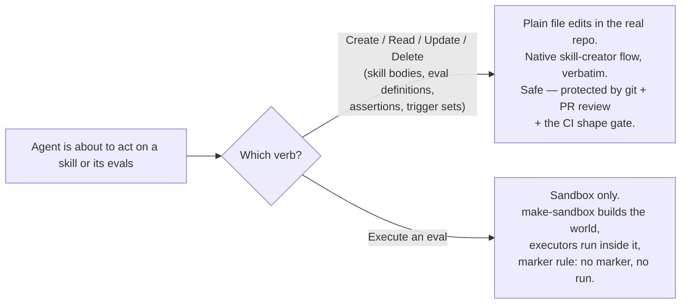
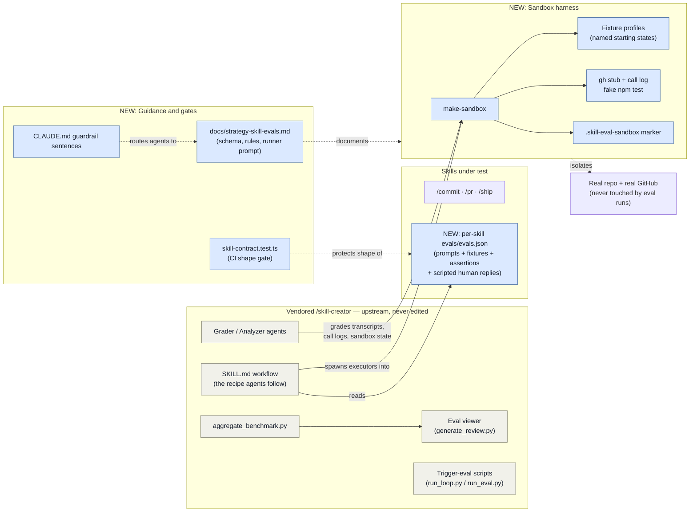
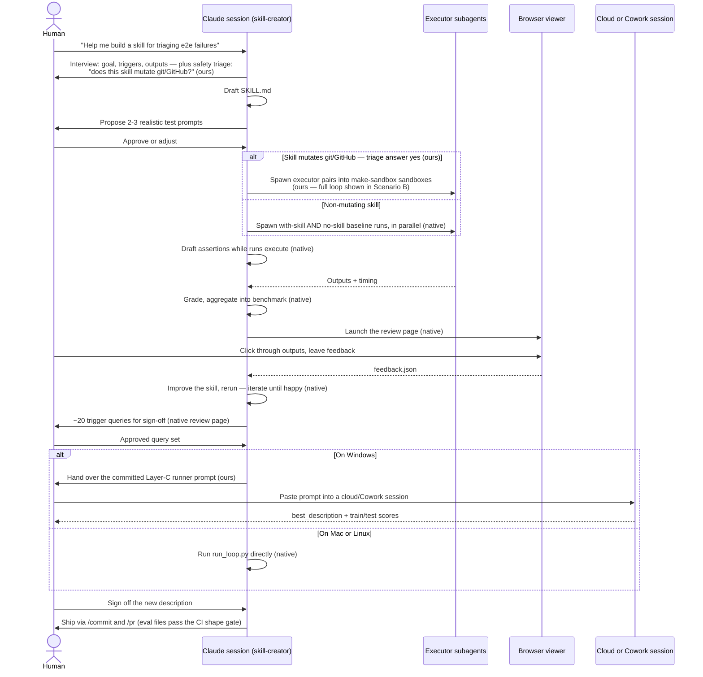
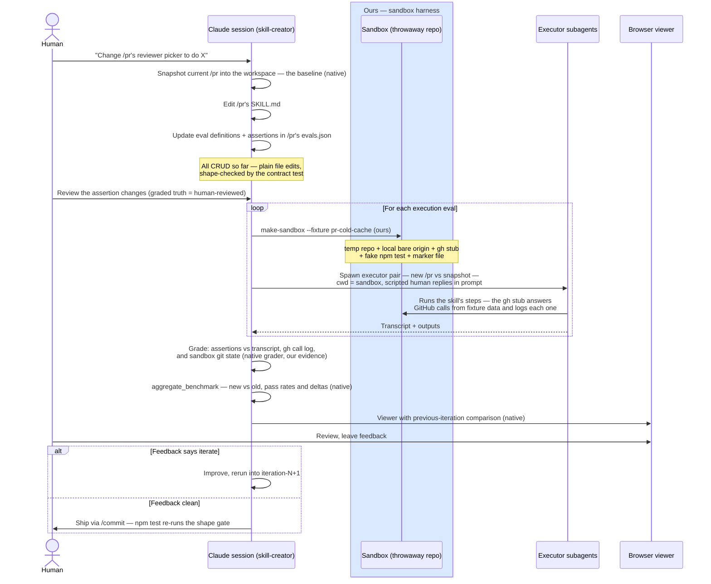
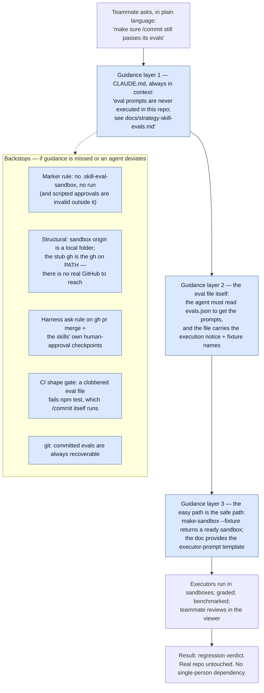

# Skill-Evals Baseline — Design & Architecture

> **Unified spec — the authoritative why/what/how for the skill-testing infrastructure.**
> Consolidates the design plan, architecture explainer, and Blake's requirements one-pager
> (a gitignored planning archive, ingested 2026-07-18 and retired). All
> baseline decisions are **decided** (Part IV decision log); open items are numbered in
> Part IV. Repo: `intentional-society/is-app`.

---

# Part I — Product requirements

## I.1 Executive summary & document map

**North star (Definition of Done):** The vendored `/skill-creator` skill is the center of
this system — all skill creation, testing, and maintenance happens by invoking it, slash
command or natural language, and following its stock workflow. What we build is the
supporting infrastructure underneath that front door: sandboxing, stubs, and platform
routing engage automatically, and the operator never learns a second system. The driver
is succession: today only Blake can verify a skill change, and the moment he returns to
full-time work, skills freeze for everyone else. **We're done when a skill change by
someone other than Blake is routine — through that front door.**

The problem: The team's three Claude Code Skills (`/commit`, `/pr`, `/ship`) encode the
repo's guarded commit → PR → merge workflow, and the vendored `/skill-creator` ships a
complete test kitchen for skills — but its runner assumes evals are harmless ("hand a
subagent a prompt, grade the files it produces"), and these three skills commit, push,
open PRs, and merge. Run their evals naively and the "test" makes real branches and PRs.

The design: Keep the vendored machinery 100% stock and wrap it in four thin additions —
**content** (runnable eval definitions), **environment** (a disposable sandbox),
**guidance** (docs + guardrails so agents find the safe path), and a **gate** (a CI shape
check) — so that the one dangerous verb, *execute*, always happens in a throwaway world.
Everything else skill-creator does (create/read/update/delete of skills and evals) stays
exactly as upstream describes.

Delivery: Phases 0–5 are the baseline (≈ 7–8 working sessions); post-baseline runs
6 → 7 → 8. Execution is a multi-agent program: clean-session agents implement phase by
phase from delegation packets, tracked on GitHub (Part III).

**Document map (one owner per question):**

| Artifact | Owns |
|---|---|
| This spec — `docs/spec-skill-evals-baseline.md` (the record of decisions; finalized and committed 2026-07-19 after the review cycles; archival Notion snapshot at end of program) | Why, what, and how-it's-designed |
| `docs/strategy-skill-evals.md` (committed, born Phase 1) | Operational runbook: schema reference, safety rules, run instructions, copy-paste prompts |
| GitHub parent issue (created at kickoff) | Execution state: current-status snapshot in the body, per-session updates as comments |

The requirements one-pager and the two `.scratch` design docs are retired/archived; this
spec supersedes them.

## I.2 Problem & context

Verifying a skill change today is a manual, AI-guided pass that only Blake knows how to
run — expensive in time and tokens, and a real single point of failure: this is a small
volunteer team with widely varying experience levels, and once Blake returns to full-time
work (which could be soon), skills would be effectively frozen for everyone else.

Specifically:

- **The vendored `/skill-creator` eval machinery can't run our skills as-is.** They're
  interactive, side-effecting git/GitHub workflows; its runner assumes "hand a subagent a
  prompt, grade its output files." Executing an eval prompt like `/commit "fix profile
  redirect"` performs real `git` operations and real `gh` calls; the skills stop mid-run
  for human approvals a subagent cannot obtain; and each eval assumes a starting world
  (dirty feature branch, open PR, cold reviewer cache…) that nothing builds.
- **E2E testing currently churns the real repo.** Because the skills talk to GitHub, past
  test passes needed throwaway branches/PRs/fixtures in the actual project repo.
- **There are no repo-safe patterns to follow.** The vendored `/skill-creator` documents
  the generic skill lifecycle, but nothing shows how to apply it to this repo's
  side-effecting skills — or how to run their evals as one cohesive, safe test suite.

## I.3 Success criteria

The north star (I.1) plus, concretely:

- **A non-Blake operator can test a skill change in a small fraction of a session's time
  and tokens:** Automated by default; manual steps only as documented, deliberate
  exceptions.
- **New-skill golden path, proven:** One acceptance walkthrough in which a dev or agent
  builds (or fully re-evals) a skill end-to-end by invoking `/skill-creator` — slash or
  natural language — and following its stock flow, without Blake's help.
- Layer A (structural validation — the vendored machinery tests skills in three layers:
  A structure, B behavior, C triggering; defined in II.1) recorded for all four skills
  (`commit` ✓, `pr` ✓, `ship` ✗-expected divergence, `skill-creator` ✓).
- All execution evals runnable end-to-end in sandboxes, graded via the native grader,
  aggregated by `aggregate_benchmark.py`, reviewed through `generate_review.py` — one full
  iteration per skill (Phase 3).
- The extended contract test green in CI and in `/commit`'s local `npm test` gate.
- Trigger eval sets (~20 queries each) exist for `/commit` and `/pr`; the
  description-optimization loop has run at least once per skill with before/after
  train/test scores reviewed (Phase 4).
- **Zero real-repo or real-GitHub mutations during any eval run.**
- The nine routing evals classified with documented manual runbooks (automation is
  Phase 8).

*(Numeric thresholds — e.g. suite runtime or token budgets — remain unset by design; a
Phase-3 exit task decides them from measured values — IV.2.)*

## I.4 Requirements & priorities

Priorities: **Must** / **Should** / **Could** ("MoSCoW" without the Won't tier — the
Won't-have bucket is the out-of-scope subsection immediately below). Priorities live on
requirements once; phases inherit them (a phase's acceptance = its Musts pass; Shoulds
tracked, non-blocking). For delegated agents: blocked on a **Must** → stop and escalate;
blocked on a **Should/Could** → flag and continue.

**Scope boundary (decided 2026-07-19):** These requirements attach when a skill is
committed to this repo's `.claude/skills/` — regardless of origin (written here, copied
from a teammate, imported from GitHub); the CI shape gate and PR review enforce at
exactly that line. Whether a skill mutates git/GitHub decides *which* evals it needs
(II.3 Scenario A's triage question), not whether it's governed. Personal user-level
installs and local-only uncommitted skills are **supported but not governed**: the stock
flow and the harness are available to them, but the schema, full-suite, and contract-test
obligations begin at the commit. The strategy doc phrases the execution rule generically —
never execute skill evals against the real repo, any skill, any origin.

### Must

- **Automated eval suite for all team skills, runnable on demand:** Catches regressions
  and verifies new/changed behavior via the vendored machinery's three layers (structure,
  behavior, triggering).
- **The one testing rule:** *When you change a skill (or refresh the vendored copy), you
  run the whole test suite. There is only one way to run the tests — the full batch — and
  the PR checklist shows whether you did it.* The batch is a single named, copy-pasteable
  operation; no lighter per-skill variant is documented anywhere. Runs are
  human-triggered (a person, or their session's agent) — never CI. A deliberate skip is
  an unchecked PR-template box with a stated reason, visible to reviewers.
- **Execution is always safe:** No eval run may ever touch the real repo or real GitHub.
  Scope of the guarantee (decided 2026-07-19, review escalation E1): **structurally safe
  against accidental mutation** — sandboxed world, default-deny stub, credential scrub —
  and **prompt-level against deliberate deviation** (C8's honest limit; the backstop
  stack makes that case recoverable and loud, never silent).
- **`/skill-creator` is the center:** All skill creation, testing, and maintenance runs
  through the vendored skill's stock workflow — our infra plugs in underneath it, never
  beside it as a second system to learn. Every divergence from upstream's instructions is
  documented with a reason.
- **Seamless invocation, slash or natural language:** The workflow engages whether someone
  types `/skill-creator` or just says "help me build a skill" / "make sure `/commit` still
  passes its evals" — and **safety engages by default on that path; no opt-in step is ever
  required of the operator.** *(Scope: satisfied by the guidance + structural design of
  II.2c — this is not a hard-enforcement promise; see constraint C8.)*
- **Runs locally on Windows and macOS:** Any team member can run it, with no special
  setup knowledge. *(Scope: applies to Layers A/B — true of the design; Layer C is
  platform-routed per decision DP3, II.2f.)*
- **Cheap enough to be routine:** See I.3's operator-cost criterion.
- **Self-cleaning:** Every run does its own setup and teardown, leaves no stray state; run
  artifacts are gitignored.
- **Docs and worked examples:** A person or agent can follow them — creating, updating,
  testing, and maintaining a skill and its evals — with no prior context.
- **Full fidelity of the existing 23 acceptance evals:** Converted, split, and made
  gradeable; never rewritten away.

### Should

- **Right-sized coverage:** Every skill's critical behaviors have evals and the suite
  stays lean. Deliberately post-baseline (Phases 6–7).
- **Full vendored-workflow parity on every OS:** Close or route around the Layer-C Windows
  gap without patching vendored files (routing decided; the upstream fix is the permanent
  close — IV.2 post-baseline action).
- **Description-optimization loop run at least once per NL-invocable skill:** For
  `/commit` and `/pr`, with before/after train/test scores reviewed.

### Could

- **Automated full-session runner for the routing/announcement evals:** Phase 8; the
  baseline keeps these as documented manual procedures.

### Won't have (baseline) — out of scope

- **Patching vendored skill-creator files.** It stays 100% stock; upstream sync is owned
  by the monthly drift workflow. Fixes it needs (like the Windows `select()` blocker) go
  upstream and arrive via the normal refresh.
- **CI-gating LLM-driven eval runs.** Eval runs stay human-triggered authoring-time
  checks; the deterministic Vitest skill-contract test remains the only CI gate (per the
  repo's PR-2 decision).
- **Blind comparison** (`agents/comparator.md`) — optional rigor; revisit after the first
  improve-loop iteration if grading results feel ambiguous.
- **New telemetry** — `scripts/skill-diag/` (usage diagnostics) is a separate effort.
- **The ship-2 "streamline" idea** — considered and dropped (Blake, 2026-07-18).
- **The sandbox-boundary PreToolUse hook** — specified and shovel-ready (II.4), not
  installed at baseline.

## I.5 Constraints & assumptions

Two hard boundaries shape every design choice: nothing we build ever modifies the vendored
`/skill-creator` or lets an automated run touch the real repo — and nothing we build
exceeds what a small volunteer team of mixed experience can use and maintain.

| # | Constraint / assumption | Status |
|---|---|---|
| C1 | The vendored `.claude/skills/skill-creator/` dir must remain verbatim upstream; only `UPSTREAM.md` is local. The refresh script clobbers anything else placed there (why `evals/skill-creator.evals.json` stays at repo root). | Decided repo policy |
| C2 | `run_eval.py` uses `select.select()` on a subprocess pipe — Unix-only. Crashes on native Windows (`OSError [WinError 10093]`); `run_loop.py` imports it, so the whole description-optimization loop (Layer C) is Unix-only. | **Verified empirically 2026-07-17** |
| C3 | Layer C scripts are used **only** in Phase 4. Layers A/B are plain file-processing and run fine on native Windows. | Verified in source |
| C4 | Cowork can run the Layer C scripts (`claude -p` via subprocess, Linux VM). | Per upstream SKILL.md's own Cowork section; not independently verified |
| C5 | Cloud Claude Code sessions are Linux; a nested `claude -p` inside the cloud sandbox is expected to work but needs a one-time 30-second smoke test at Phase 4 start. Layer C never touches `gh`, so the known cloud-no-`gh` gap does not apply. | **Unverified** — IV.2 tracked verification |
| C6 | The skills are interactive: subagents cannot use AskUserQuestion, so eval runs use scripted human responses (sandbox-only scoping rule, II.2c). | Design constraint |
| C7 | Upstream `quick_validate.py` rejects `/ship`'s `disable-model-invocation` key (strict allowlist). Accepted divergence — the repo's CI gate is the Vitest contract test. | Known, accepted |
| C8 | The agent-guidance layers (CLAUDE.md, eval-file notices, marker rule) are prompt-level, not hard enforcement. *Honesty refinement (2026-07-19, peer review):* the skills' human-approval checkpoints are also prompt-level in the eval context — an agent misrunning an eval in the real repo while holding its `human_script` satisfies the checkpoint from the script instead of stalling. The only gate that fires regardless is the checked-in `ask` rule on `gh pr merge` (guards merges, not pushes/PR creation). Residual protection for a misfired `/commit`/`/pr` eval is structural (default-deny stub, env scrub) plus post-hoc visibility and git recoverability. | Acknowledged limit; refined 2026-07-19 |
| C9 | The repo spec (`docs/spec-portable-ai-procedures.md` §3) needs a one-line clarification that `evals/` is upstream skill anatomy, not an "auxiliary doc". | Dependency (Phase 1) |
| C10 | Python 3 + PyYAML is an authoring-time prerequisite (nothing in CI or the app runs the Python). | Existing repo policy |
| C11 | Eval `ship-2` (advisory pending past the 5-minute wait) takes ≥5 real minutes by design. | Inherent; handling **decided 2026-07-19**: stays in the single batch, scheduled in the first parallel wave so the wait overlaps other evals (IV.1) |
| C12 | **Real-repo testing is exception-only and gated.** Automated runs never touch the real repo or real GitHub, full stop. The sole allowed touch is an occasional AI-guided, **human-run** e2e smoke test — gated by a recorded justification and a runbook with cleanup owed, so "occasional" can't drift into "whenever convenient". | Decided 2026-07-18 (from one-pager) |
| C13 | **Dead simple beats clever.** Usable and maintainable by 4–5 volunteer engineers at varying experience levels; when a design choice trades power against simplicity, take simplicity. Recorded tie-breaker for choices not yet made (fixtures as data not DSL; stub as lookup not simulator; tracker as issue not board; harness scripts in Node.js not shell). | Decided 2026-07-18 (from one-pager) |
| C14 | **One cohesive testing story.** The existing Vitest skill-contract CI gate keeps working; the harness may enhance it but never interfere — contract test and eval suite stay independently runnable and must read as one system, not rivals. *Scope precision (2026-07-19, peer review):* the SKILL.md-structural assertions pass unchanged; the eval-artifact assertions are **expected to be rewritten** for the per-skill layout (the current test hardwires root `evals/evals.json` and its `skills[]` wrapper). Root `evals/evals.json` is deleted at the end of Phase 1; `evals/skill-creator.evals.json` stays (C1). | Decided 2026-07-18; rescoped 2026-07-19 |

## I.6 Proposed solution

Four thin additions around the stock vendored machinery:

1. **Content** — per-skill runnable eval definitions (`.claude/skills/{commit,pr,ship}/evals/evals.json`,
   upstream's documented location) with additive fields: `kind`, `fixture`,
   `human_script`, `expectations`; `preconditions` prose kept.
2. **Environment** — a sandbox harness: `make-sandbox` builds a throwaway git repo per
   named fixture profile; a `gh` stub answers GitHub calls from fixture data and logs
   every call; a fake `npm test` returns instantly; a marker file identifies the sandbox.
3. **Guidance** — `docs/strategy-skill-evals.md` (schema reference, safety rules,
   executor-prompt template, a lifecycle map routing each create → test → maintain step
   through the `/skill-creator` front door, worked examples written so a future skill
   author — human or agent — can reuse the fixture/stub patterns for their own skill, and
   the batch/Layer-C/platform-validation copy-paste prompts) plus two CLAUDE.md guardrail
   sentences. Needed because the vendored SKILL.md cannot be edited — the "execution goes
   through the harness" knowledge must reach agents another way. *(Outline approved
   2026-07-19 — `docs/spec-skill-evals-outline.md`; Phase 1 builds the strategy doc from
   it, per III.2.)*
4. **Gate** — an extension of the existing Vitest contract test asserting the eval-file
   shape, running in the required CI check and in `/commit`'s local `npm test` gate.

### The organizing rule: separate the verbs



Scope: actions on skills and their evals. Everything else in the repo follows the normal
dev workflow, unchanged.

CRUD on skills and evals is plain file editing — safe anywhere, fully native. **Execute is
the one dangerous verb**, and it was never safe vanilla: the harness is what makes
skill-creator's central tenet *viable* for side-effecting skills, not a restriction on it.

### Where the design flexes (iteration knobs)

- **Fixture profiles are data, not code** — adding an eval usually means naming a new
  starting state, not touching the harness.
- **Assertions are the reviewable surface** — tightening what "pass" means is a JSON edit
  plus human review; the grader adapts automatically.
- **The PreToolUse hook is shovel-ready but not installed** — if a sandbox-boundary
  near-miss ever shows up, its spec is written and it promotes in one PR (II.4).
- **Phase 8 plugs in without rework** — the session runner reuses the same sandboxes,
  grader, and viewer; only the way sessions are launched is new.
- **The Windows gap is routed around, not designed around** — if the upstream `select()`
  fix lands, the Layer-C cloud/Cowork routing simply becomes optional.

---

# Part II — Design

## II.1 System context: what exists today

- `evals/evals.json` — 23 rich acceptance evals (commit 8, pr 9, ship 6) with
  `preconditions` and `expected_output` prose. Strong *intent* capture, but **not directly
  runnable**: several "prompts" are multi-scenario bundles (commit-3 a/b, commit-5 a/b/c)
  or two-turn dialogues (commit-6/7, pr-9), and no eval has machine-gradeable assertion
  lists.
- `evals/skill-creator.evals.json` — acceptance evals for the vendored copy itself
  (sc-1..3), already run manually at vendoring time.
- `tests/functional/skills/skill-contract.test.ts` — deterministic CI gate: frontmatter,
  section order, invocation policy, "each skill has ≥3 evals with resolvable skill_path".
- Prior **manual** proof runs (ship-proof runbook, red-path recipe) — the
  natural-language-invocation behaviors were verified by hand, not by a rerunnable
  harness.
- The vendored skill-creator is pinned and never hand-edited; a monthly drift workflow
  watches upstream.

### The vendored machinery's three test layers

| Layer | Question it answers | Native machinery (used verbatim) | Our additions |
|---|---|---|---|
| **A — Structural** | Is the skill well-formed? | `quick_validate.py` (reference only — C7: expected `/ship` divergence; the contract test is the gate) | `skill-contract.test.ts` (the CI gate; also covers the eval-file shape) |
| **B — Behavior** | Does the skill do the right things? | SKILL.md eval workflow, `agents/grader.md`, `aggregate_benchmark.py`, `eval-viewer/generate_review.py` | Runnable eval definitions + the sandbox harness |
| **C — Triggering** | Does the right wording fire the skill? | `run_eval.py`, `run_loop.py`, `improve_description.py`, `assets/eval_review.html` | Committed trigger sets + platform routing (Windows → cloud/Cowork) |

The pattern is identical in every layer: **the vendored machinery does the work; our
additions supply what it needs** — safe ground to run on, runnable inputs, or a route to a
platform where it functions.

### The enabling insight

**No vendored script reads `evals/evals.json`.** The Python machinery operates on
*workspace artifacts* Claude writes during a run — `<skill>-workspace/iteration-N/eval-X/`
containing `eval_metadata.json` (prompt + assertions), run outputs, `timing.json`,
`grading.json` (exact field names `text`/`passed`/`evidence`), then `benchmark.json` via
`aggregate_benchmark.py`. The committed evals file is just the source Claude reads to
generate those. So the nonstandard eval-file format is a small conversion problem — the
real work is the safe execution environment.

## II.2 The design



*Legend: blue tint = new in this design ("ours"); gray tint = vendored skill-creator
machinery, used verbatim; untinted = pre-existing repo elements.*

| Component | Native or new | What it is | Why it exists |
|---|---|---|---|
| skill-creator workflow (SKILL.md) | **Native, used verbatim** | The end-to-end recipe: draft → run evals → grade → benchmark → human review → improve | The blessed path; everything we add serves it |
| Grader / Analyzer / Comparator agents | **Native, used verbatim** | Instructions for the subagents that grade assertions and analyze results | Grading needs no changes — it reads whatever evidence we give it |
| `aggregate_benchmark.py`, eval viewer | **Native, used verbatim** | Turn graded runs into `benchmark.json` + a browser review page | The human-review loop; works on any workspace we produce |
| Trigger-eval scripts (`run_loop.py` etc.) | **Native, used verbatim** | Description-optimization loop | Layer C; crashes on native Windows, hence platform routing |
| Per-skill `evals/evals.json` | **New (content)** | Runnable eval definitions at upstream's expected path, with `fixture`, `expectations`, `human_script`, `kind` (+ retained `preconditions`) | Converts prose acceptance evals into things a runner can execute and a grader can score |
| Sandbox harness | **New (environment)** | make-sandbox + fixture profiles + logging gh stub + fake npm test + marker | Makes *execution* safe; the call log becomes grading evidence |
| Strategy doc + CLAUDE.md guardrails | **New (guidance)** | Schema reference, safety rules, executor-prompt template, the copy-paste prompts | The vendored SKILL.md can't be edited; agents must learn the safe path elsewhere |
| Contract-test extension | **New (gate)** | Vitest assertions on eval-file shape, in the required CI check and `/commit`'s local gate | Makes an accidental eval clobber fail loudly instead of shipping silently |
| Session runner (Phase 8) | **New (deferred)** | Full-session `claude -p` runner for the nine routing/announcement evals | Routing can't be tested by handing a subagent the skill; manual runbooks cover it until then |

### II.2a Eval content: schema, classification, layout

Classification of the 23 existing evals:

- **Execution evals** (after splitting): commit-1, -2, -3a, -3b; pr-1..7; ship-1, -3,
  -6. Subagent + sandbox works. Splitting rule: one eval = one executable prompt
  (execution evals only). *Exact counts and per-eval classifications are fixed by the
  **conversion manifest** — a pre-Phase-1 deliverable (peer review 2026-07-19, cluster
  C): an id-by-id table mapping every original eval to its resulting IDs + `kind` +
  disposition, authored by the tech lead, approved by the maintainer reviewer. The
  manifest also settles the flagged classification questions (commit-5's multi-scenario
  routing split; ship-6's announcement-assertion character; ship-2's explicit `kind`).*
- **Routing/announcement evals** (9): commit-4..8, pr-8, pr-9, ship-4, ship-5. These test
  whether/how the skill *fires* in a live session (Step 0 gates, `Using /commit`
  announcements, bare-"yes" affirmations, over-trigger controls). A subagent handed the
  skill path can't test these — routing is the thing under test. At baseline they stay
  `kind: routing` with documented manual runbooks; automation is Phase 8.
- **Special case:** ship-2 takes ≥5 real minutes by design (C11; decided 2026-07-19: it
  stays in the single batch, scheduled in the first parallel wave so its wait overlaps
  the other evals).

Layout (decided — DP1 Option B): per-skill `.claude/skills/{commit,pr,ship}/evals/evals.json`,
upstream schema plus additive fields; `evals/skill-creator.evals.json` stays at repo root
(C1); trigger sets follow the same principle
(`.claude/skills/{commit,pr}/evals/trigger-evals.json`). Each eval file carries an
execution notice in its `$comment` pointing at the strategy doc.

Schema (illustrative; the exact reference lands in `docs/strategy-skill-evals.md` in
Phase 1). `preconditions` prose is kept — it is the human-readable contract; the fixture
profile is its executable implementation (if they disagree, the profile is the bug):

```json
{
  "id": "commit-2-refusal-suspicious-file",
  "kind": "execution",
  "fixture": "feature-branch-dirty-with-env-local",
  "prompt": "/commit \"add user endpoint\"",
  "preconditions": "(retained human-readable prose — the contract the fixture implements)",
  "human_script": "At the approval block, the human replies: remove it from the payload.",
  "expected_output": "(retained prose summary)",
  "expectations": [
    "The response names .env.local as a suspicious-file match before any staging occurs",
    "No new commit exists in the sandbox git log",
    "The command log contains no `git add -A` and no `git add .`"
  ]
}
```

### II.2b Sandbox execution environment

- `make-sandbox`: creates a temp git repo + local bare "origin", applies a named fixture
  profile, writes the `.skill-eval-sandbox` marker. Sandboxes live under the session
  scratchpad/temp dir — the real repo is physically untouchable.
- Fixture profiles (plain data, per C13) for each precondition set: dirty feature branch,
  open PR, cold/warm reviewer cache, open issue, staged check states… Fixtures must never
  rely on case-distinct filenames (macOS's default filesystem is case-insensitive —
  implementer note).
- `gh` stub: A shim directory prepended to `PATH` — `gh.ps1` + `gh.cmd` for PowerShell and
  a `gh` shell script for Git Bash — answering `gh auth status`, `gh issue view`,
  `gh pr view/create/checks/merge`, `gh api repos/…/collaborators`, `gh api user`,
  `gh api users/<login>` from per-eval fixture JSON, **logging every call** (the call log
  is primary grading evidence). **Default-deny (peer review 2026-07-19):** any subcommand
  outside the stubbed surface hard-fails (non-zero exit, logged) — the stub never passes
  through to real `gh`. Stub response schemas are traced from the three team SKILL.md
  files' actual usage, never guessed. make-sandbox additionally **scrubs credentials**
  from executor environments (unset `GH_TOKEN`/`GITHUB_TOKEN`; `GH_CONFIG_DIR` pointed
  inside the sandbox).
- Fake `npm test`: the sandbox's `package.json` test script passes (or fails, for
  red-path evals) in milliseconds.
- **Harness scripts are written in Node.js, not shell** (decided 2026-07-18, under C13):
  shell behaves differently per OS; Node runs identically on Windows/macOS/Linux, and this
  is a Node repo. Only the three thin `gh`-stub wrapper files stay as shell — which is why
  macOS verification shrinks to a single smoke test (Part III, Phase 2). Pin a Node
  `engines` floor.

### II.2c Safety & discovery model

**Trust boundary:** Everything inside a marker-bearing sandbox is disposable and may be
mutated freely; everything outside it is the real repo, where eval execution is forbidden
and only normal human-approved workflows (`/commit`, `/pr`, `/ship`) change state.

The vendored SKILL.md cannot be edited, so the safe path reaches agents in layers:

1. **CLAUDE.md** (always in context, every session including natural-language entries):
   Two sentences — skill-eval prompts are never executed in this repo (any skill, any
   origin); execution routes through the harness per the strategy doc. Lands in Phase 1
   ("evals not yet executable" wording until the harness ships in Phase 2).
2. **The eval files themselves** (just-in-time; covers subagents and odd contexts): an
   executing agent must read `evals.json` to get the prompt, and the file carries the
   execution notice plus per-eval `fixture` fields whose documented meaning is "requires
   a harness-built sandbox."
3. **Turnkey safe path:** `make-sandbox --fixture <name>` returns a ready sandbox path;
   the strategy doc provides the exact executor-subagent prompt template.

**Invariant — "no marker, no run":** Harness sandboxes contain `.skill-eval-sandbox`; eval
runs (and `human_script` use) require the marker. Converts "am I in the right place?" into
a file-existence check.

**`human_script` scoping rule:** Scripted approvals are valid ONLY inside a marker-bearing
sandbox; in the real repo, approvals always come from a real human.

**Safety is default-on** (requirement, I.4): it engages because the agent follows the
documented path — the operator never performs an opt-in step. Honest limit (C8): these
layers are prompt-level, not hard enforcement; the hard gates that fire regardless are the
checked-in `ask` rule on `gh pr merge` and the skills' own human-approval checkpoints
(which stall rather than push when no real human answers).

**Real-repo exception lane (C12):** The automated-never rule is absolute. The one
sanctioned exception is a **human-run**, AI-guided e2e smoke test, gated by a recorded
justification and a runbook with cleanup owed (runbook authored in Phase 5). This lane is
for rare end-to-end confidence checks — never a substitute for sandbox eval runs.

### II.2d Guidance & gates

- `docs/strategy-skill-evals.md` (born Phase 1, grown through Phase 5): eval-schema
  reference (incl. the `human_script` scoping and "no marker, no run" rules), harness
  safety model, a **lifecycle map** (each create → test → maintain step routed through
  the `/skill-creator` front door, naming what our overlay adds at each step — including
  the new-skill safety-triage question and a worked example of adding a fixture profile),
  worked examples written so a future skill author — human or agent — can **reuse the
  fixture/stub patterns for their own skill** (e.g. one whose evals need a mock repo with
  PRs and commits to check against), the expected `quick_validate.py` behaviors on our
  skills (C7's `/ship` divergence — what the failure means and why
  `skill-contract.test.ts` is the real gate), the "edit skills in place; never
  delete-and-recreate" rule, and **three copy-paste prompts** (skill-diag `PROMPT.md`
  pattern):
  1. **The batch prompt** — the single documented regression operation: "run the full
     skill eval suite" → every execution eval across all three skills (sandbox per eval,
     executor pairs in parallel batches), graded, aggregated per skill, one combined
     summary + viewer. No lighter per-skill variant exists in any doc or template.
     *Committed in Phase 2 with the executor template (moved from Phase 4, peer review
     2026-07-19) so Phase 3 consumes the canonical operation instead of improvising.*
  2. **The Layer-C runner prompt** — drives a cloud/Cowork session end-to-end for
     description optimization (II.2f).
  3. **The platform validation prompt** (macOS first) — runs one designated eval
     end-to-end, emits a small pass/fail + environment artifact, and **auto-posts the
     artifact to the named issue** (`gh issue comment <N> --body-file …`; if `gh` isn't
     authenticated, it prints the artifact for the runner to paste). Carries an explicit
     issue-number placeholder filled per run. Retained past baseline for re-validation
     when harness shell wrappers or path handling change, and for onboarding teammates on
     a new OS — retention to be revisited after the first run (decided 2026-07-19; repo
     memory set).
- Two CLAUDE.md guardrail sentences (staged wording: Phase 1 "not yet executable" →
  Phase 2 final).
- **PR-template checklist line:** PRs touching `.claude/skills/**` show whether the full
  eval batch ran; a deliberate skip is an unchecked box with a stated reason.
- Contract-test extension: allowed `kind` values; `execution` evals carry `fixture` + ≥1
  expectation; SKILL.md-structural assertions pass unchanged, eval-artifact assertions
  rewritten for the per-skill layout (C14, rescoped 2026-07-19); **pins each skill's
  expected execution-eval IDs (or a per-skill minimum execution count)** so a
  regeneration that drops or downgrades evals fails loudly (R1 hardening). Failure
  messages are prescriptive — they name the offending eval, the missing field, and point
  at `docs/strategy-skill-evals.md` (Phase-1 acceptance detail, decided 2026-07-19).
- `.gitignore`: the `.claude/skills/*-workspace/` line (pulled forward, committed
  2026-07-19 — fb5ac93; Phase 0 verifies it on `main`).
- Trigger evals (Phase 4): ~20 queries per skill for `/commit` and `/pr` (8–10
  should-trigger, 8–10 tricky near-miss negatives), from the routing-eval material.
  `/ship` is skipped: explicit-only (`disable-model-invocation: true`), so description
  optimization doesn't apply; its should-NOT-trigger behavior is covered by ship-4/-5.

### II.2e Grading, benchmarking, and data flow

Grading evidence triad: the **transcript** (what the skill said/did), the **gh call log**
(what it asked GitHub to do, in what order — e.g. "no `gh pr create` before the approval
block"), and **sandbox git state** (what actually changed). Script-checkable assertions
get scripts (e.g. grep the call log) per the native grader guidance. **Liveness rule
(peer review 2026-07-19):** before any negative assertion ("log contains no X") is
trusted, the run must show positive evidence the stub was exercised (non-empty call log /
sentinel call) — otherwise a mis-wired PATH scores a real side effect as a clean pass.
**Red-control rule:** Phase 3 must demonstrate, once per skill, an eval failing against a
deliberately mutated skill — proof the assertions can go red.

Baseline-comparison semantics: for skill *updates*, baseline = the snapshot of the old
skill; for *new* skills, baseline = no skill (native convention). Routing behavior is
probabilistic — N repetitions per query (upstream uses 3), reported as trigger *rates*.

Data flow (one Layer-B run): committed eval file → orchestrating agent reads it →
`make-sandbox --fixture <name>` per eval → executor subagents run in the sandbox
(with-skill vs baseline) → evidence (transcript, call log, git state, outputs,
`timing.json`) → grader writes `grading.json` → `aggregate_benchmark.py` writes
`benchmark.json`/`.md` → `generate_review.py` serves the review page → human feedback in
`feedback.json` → next iteration. All run artifacts live in gitignored
`.claude/skills/<name>-workspace/` dirs (upstream's default; DP2). These native artifacts
are also the observability story — no extra telemetry (Won't-have).

### II.2f Layer-C platform routing (decided DP3)

Layer C — the description-optimization loop — is the one piece of vendored machinery that
cannot run on native Windows: its runner crashes on a Unix-only system call (C2). This
section says where Layer C runs instead, per platform.

- **macOS/Linux:** Run the documented commands directly (needs Python 3 + PyYAML +
  logged-in `claude` CLI).
- **Cowork:** Works per the vendored SKILL.md's own Cowork section (not independently
  verified).
- **Cloud Claude Code session:** Linux, so the crash vanishes; one 30-second smoke test at
  Phase 4 start confirms nested `claude -p` (C5). Layer C never touches `gh`.
- **Windows:** Never run natively. The committed Layer-C runner prompt (II.2d) drives a
  cloud/Cowork session: prereq checks, `run_loop.py` per skill, report `best_description`
  + train/test scores back; the description change lands locally via the normal PR flow.
- **WSL-Ubuntu:** Optional alternative only (not planned).
- **Upstream fix:** Platform-agnostic rewrite is feasible (reader thread instead of
  `select`); recorded as a project memory — a PR to anthropics/skills would arrive via
  the drift/refresh flow and make Windows routing optional (IV.2 post-baseline action).

## II.3 How it runs — end-to-end workflows

### Scenario A — Create a brand-new skill from scratch, through description optimization

**Mutation profile:** The new skill may or may not touch git/GitHub — the sandbox engages
only if it does (the interview's triage question decides; the I.4 commit boundary decides
when team obligations attach).

For a new skill that doesn't mutate git/GitHub, this is **almost entirely the native
flow** — our components appear only at the edges (a safety triage question, the eval
schema at commit time, platform routing for the optimization loop). If the triage answer
is "yes, it mutates git/GitHub," the new skill also gets fixture profiles and its
execution evals run in the sandbox exactly like Scenario B.



*Legend: steps marked "(ours)" are this design's additions; "(native)" steps are the
stock skill-creator workflow.*

The human steers at every review point (prompts, viewer feedback, trigger queries,
description sign-off); the agent does everything else.

### Scenario B — Update an existing skill, then update and run its evals as regression tests

The harness's home game (example: changing `/pr`'s reviewer picker).

**Mutation profile:** The skill under test mutates git/GitHub; every execution eval runs
sandboxed.

Every eval in the loop below is `kind: execution` — its prompt makes `/pr` actually do
its work. Because `/pr` mutates git and GitHub, each execution eval runs inside a fresh
sandbox, and the eval's `fixture` field names the starting world make-sandbox builds.
Routing evals never enter this loop — they are tested separately (II.2a).



Per the one testing rule (I.4), a real regression pass runs the **full batch across all
three chain skills**, not just the edited one — the diagram shows one skill's loop for
readability. The **snapshot** is the old behavior, the **fixtures** make every run start
from the same world, the **call log** proves what the skill did, and the benchmark shows
new-vs-old side by side. Sandboxes are created per run and discarded.

### Scenario C — Another developer verifies a skill, entering by natural language (succession scenario)

**Mutation profile:** Same as B — the skills under test mutate git/GitHub; the difference
is the natural-language entry with no prior context.

A teammate says: *"I tweaked /commit's devjournal triggers — make sure it still passes its
evals."* No slash command, no prior context. The safety architecture in action:



*Legend: blue tint = this design's guidance layers and backstops ("ours"); untinted =
the teammate's request and the native run/review flow.*

Each guidance layer is redundant with the next on purpose: layer 1 covers every session,
layer 2 covers any agent that reaches for the prompts (including subagents), layer 3 makes
compliance cheaper than improvisation. The backstop stack means even a missed layer
degrades to "recoverable and loud," never "silent damage."

The nine **routing** evals are *not* in this automated path at baseline — they stay
documented manual runbooks until the Phase 8 session-runner, because routing is only
testable from a fresh full session, not from a subagent that's been handed the skill.

## II.4 Deferred work (specified, not baseline)

### The sandbox-boundary PreToolUse hook (shovel-ready)

Two hooks get conflated; only one is buildable:

- **Real-repo guard** (block an eval run mutating the actual repo): NOT deterministically
  possible — an executor's `git push` and a developer's legitimate `/commit` push are the
  same command in the same working directory; any guess false-positives on the team's
  core workflow or fails open. Revisit only if Phase-3 transcripts reveal a keyable
  signature.
- **Sandbox-boundary guard** (deterministic): `.claude/settings.json` PreToolUse matcher
  on `Bash|PowerShell` → `node <harness-dir>/guard-hook.mjs`; stdin JSON (command, cwd —
  the current working directory the command runs in); exit 0 allow / exit 2 block (stderr
  fed back to the model). Logic: no `.skill-eval-sandbox` marker in cwd or any parent
  directory → exit 0 immediately; marker present → block `gh` not resolving to the
  sandbox stub, `git push` to non-local-path remotes, and destructive commands with
  absolute paths escaping the sandbox tree.
- **Deferral conditions (decided 2026-07-19, review escalation E2 — Blake-approved):**
  the deferral is **conditioned on Phase 2's safety checklist actually delivering** the
  in-harness hardenings (default-deny stub, credential scrub, call-log liveness). If the
  checklist cannot be satisfied, or Phase 3's transcripts show even one sandbox-boundary
  near-miss, the hook promotes immediately (its spec below is shovel-ready; promotion is
  one small PR). Rationale scale-check (Blake, 2026-07-19): eval runs happen only when
  skills change — rare events; the hook taxes every shell command in every session, so
  its cost-per-protected-event worsens as eval runs get rarer, while Tier-1 hardenings
  cost only during the runs themselves.
- **Why deferred from baseline (decided 2026-07-18):** It guards a boundary that doesn't exist
  until Phase 2; hooks can't be scoped by directory, so every shell call in every session
  pays a Node-spawn tax plus a new failure mode; and most of the protection is structural
  in the harness at zero session cost. Structural-in-harness is the Phase-2 baseline; the
  hook is the first hardening step if Phase 3 ever shows a near-miss.

### The Phase-8 routing session-runner (sketch)

For the nine routing evals (2–3 sessions; hard dependency on the Phase-2 harness):

- **Reuses the sandbox + gh stub**; additionally copies the three team skills into the
  sandbox project so a fresh session discovers them naturally (routing is the thing under
  test — the skill must be *found*, not handed over).
- **Own runner script** — Windows-native by construction (threaded pipe reader, not
  `select`; the vendored-patch prohibition doesn't apply to our code). Single-turn cases:
  `claude -p "<query>" --output-format stream-json --verbose` with cwd = sandbox;
  transcript captured to the eval's workspace dir.
- **Multi-turn cases** (commit-6/7, pr-9 — "assistant offers, human says yes"): the main
  technical risk. Eliciting the offer organically is flaky; the proposed path is the
  Claude Agent SDK, constructing the prior turns programmatically, then sending the bare
  "yes" (IV.2 Phase-8 kickoff gate).
- **N repetitions per query**; results are trigger *rates*.
- **Grading:** Transcript + expectations to a grader subagent per `agents/grader.md` →
  `grading.json`; the standard benchmark/viewer machinery works unchanged from there.
- **Known limit:** ship-4's harness `ask`-rule assertion can't fire headless; assert the
  observable instead (gh-stub call log empty of `pr merge`).

## II.5 Risks & data-loss analysis

| # | Risk | Mitigations | Residual |
|---|---|---|---|
| R1 | **Eval overwrite via skill-creator's authoring flow.** Upstream SKILL.md says "Save test cases to `evals/evals.json` … just the prompts" and sanctions modifying existing evals; under the per-skill layout our runnable evals sit at exactly that path. A verbatim improve-session could regenerate 2–3 bare prompts over a 9-eval file. | Files are committed (clobber = visible diff, recoverable); contract-test shape assertions make a clobbered file **fail `npm test` — `/commit`'s own gate**; execution-notice `$comment`. | A *shape-valid* destructive "modification" (e.g. weakened assertions) passes machine checks — human diff review is the guard. No unrecoverable path short of history rewrite (prohibited). |
| R2 | **Folder delete-and-recreate loses evals** (per-skill layout consequence). | Strategy-doc rule: edit skills in place; never delete-and-recreate. Git recovers. | Low |
| R3 | **Guidance is prompt-level** — an agent could miss all discovery layers and try to execute evals in the real repo. | Three redundant guidance layers + marker rule (II.2c); structural sandbox protections; hard backstops (`ask` rule on `gh pr merge`, approval checkpoints that stall rather than push); CI shape gate; git recoverability. Hardening path: the hook (II.4). | Degrades to "recoverable and loud," never "silent damage" |
| R4 | **Phase 8 multi-turn driver** is the main technical risk — eliciting the offer organically is flaky. | Proposed path: Agent SDK constructs prior turns. | **Proposed, unvalidated** — IV.2 Phase-8 kickoff gate |
| R5 | **Routing behavior is probabilistic.** | N repetitions; report trigger *rates*, never binary. | Inherent |
| R6 | **Layer C platform dependency**: native Windows cannot run it; cloud nested-`claude -p` unverified. | Platform routing (DP3); 30-second smoke at Phase 4 start; fallback = defer Layer C. | IV.2 tracked verification (C5) |
| R7 | **Simulated-human compromise**: scripted approvals test step-following, not the live prompt UX. Grading checks the approval block was *presented before* the side effect. | Accepted, documented limitation; the live UX was proven in earlier manual runs. | Accepted |
| R8 | **ship-4's `ask`-rule assertion can't fire headless** (Phase 8). | Assert the observable: call log contains no `pr merge`. | Accepted |

**Data-loss audit of the vendored skill (2026-07-18):** Audited upstream SKILL.md + all
bundled scripts. The **only destructive operation** in the bundle is `run_eval.py`
unlinking its own temp command file in `.claude/commands/`; snapshot steps are copy-only.
**Package and Present is benign:** Gated on a `present_files` tool Claude Code lacks
(verbatim = skip); if run anyway, `package_skill.py` is read-only w.r.t. sources —
validates first (packaging `/ship` refuses), zips to a gitignored `.skill` artifact, and
`ROOT_EXCLUDE_DIRS = {"evals"}` explicitly EXCLUDES the skill-root evals/ dir from the
archive. The real loss vector is instruction-side (R1).

---

# Part III — Delivery

## III.1 Program model (how the build runs)

The build-out runs as a **multi-agent program**: Fable owns the plan; clean-session agents
(Opus or Sonnet, assigned per task) execute it phase by phase from **delegation packets**
complete enough to need no outside context. Every phase is independently verifiable and
resumable — **no phase may depend on a particular session's context surviving.**

- **Testable acceptance criteria per phase** — a phase is done when its criteria pass,
  not when it feels done. Phase acceptance = its Musts pass; Shoulds tracked,
  non-blocking.
- **GitHub issue skeleton:** One parent issue (program goal, north star, link to this
  spec) + one sub-issue per phase, each a delegation packet: objective, inputs
  (spec-section links), **acceptance criteria only — no step lists**. Issues state *what
  done means*; this spec states *how*; the tracker states *current state* — so
  implementation-time changes update spec/tracker without invalidating issues.
- **Tracker = the parent issue itself:** The issue body is the current-state snapshot
  ("resume from here"); comments are the append-only per-session log. Agents update it
  via `gh` locally or the GitHub MCP in cloud sessions. (`.scratch` files don't travel —
  they're gitignored, invisible on GitHub and absent from fresh clones.)
- **Fresh-session delegation protocol (added 2026-07-19, Blake review follow-up):** Any
  capable clean-session agent — Opus-class assumed by default — must be able to pick up
  any phase with zero prior context and no dependence on the design-session's memory.
  The enablers, in order:
  1. **The spec is committed before Phase 0 starts** (`docs/spec-skill-evals-baseline.md`)
     so every sub-issue's spec-section links resolve in any clone or cloud session —
     `.scratch` is never load-bearing for implementers.
  2. **The packet is the entry point.** Each sub-issue = objective + inputs
     (spec-section links) + acceptance criteria. If an agent cannot determine "done"
     from the packet alone, that is a packet bug: fix the issue text (comment the
     correction), don't improvise.
  3. **Read-first sequence, stated in every packet:** the sub-issue → the parent-issue
     body (current state) → the linked spec sections → `docs/strategy-skill-evals.md`
     (once born, Phase 1+). CLAUDE.md is ambient in-repo context.
  4. **Kickoff prompt template lives in the parent-issue body** — copy-paste, fill in
     the phase number; Blake or any teammate can launch a phase agent without briefing
     it.
  5. **Session-end protocol:** append a parent-issue comment (done / verified /
     remaining / next step) and update the body's state snapshot before ending the
     session.
  6. **Escalation:** blocked on a Must → stop and escalate via issue comment; blocked on
     a Should/Could → flag and continue (I.4).
  7. **The maintainer reviewer** (decided 2026-07-19, review escalation E4): every human
     checkpoint names this role, not a person. Any maintainer with repo write access may
     fill it (the same trust line that already gates PR approval); Blake is the default.
     A per-checkpoint narrowing (e.g. reserving Phase 2's harness safety review to Blake
     or a named delegate) remains available if ever wanted — none is currently set.
  non-closing references (`(#N)`) — never `Closes #N` — except on the PR that truly
  completes the phase, matching the repo's existing convention. GitHub's auto-close
  keywords are the hazard.
- **Front-door usage by phase (recorded 2026-07-19):** Phases 0 and 2 *build under the
  door* — infrastructure work; `/skill-creator` is not invoked (Phase 0 runs its bundled
  validator directly, which upstream sanctions). Phase 1 is middle ground: spec-driven
  conversion checked by the contract test. Phases 3–5 *go through the door*: Phase 3 is
  deliberately the first true front-door exercise (invoke `/skill-creator`, follow its
  stock eval workflow, sandbox underneath), Phase 4 runs its Layer-C loop via platform
  routing, and Phase 5's golden-path walkthrough is the acceptance test of the front door
  itself (I.3).
- **Multi-agent peer review of the plan before execution** — including Codex — with
  reviewers assigned personas: dev architect, SDET/test lead, technical product/program
  manager, and a new teammate with limited agentic-AI experience. Coordination decided
  2026-07-19 — **hub-and-spoke**: the tech-lead session spawns the four persona reviewers
  as subagents (round 1), runs one dedicated Codex turn (round 2; Codex CLI available
  locally — find it via `where codex`), then consolidates. The lead disposes every
  finding (accept / reject / defer, one-line rationale) and escalates to Blake only
  scope or requirement-priority changes, contradictions of dated IV.1 decisions, and
  conflicts a ruling can't honestly settle; two rounds maximum. Playbook + role prompts:
  `.scratch/peer-review-playbook-skill-evals.md` (gitignored planning archive on
  Blake's machine; the review completed 2026-07-19 — see IV.1 — so no successor needs
  this file).

## III.2 Phases

**Prerequisites:** Python 3 + PyYAML (authoring-time only); `gh` authenticated for normal
workflows; for Layer C — a logged-in `claude` CLI on the platform that runs it; the
one-line spec §3 clarification (C9, Phase 1).

| Phase | Scope | Who | Acceptance (summary) |
|---|---|---|---|
| **0 — Smoke** | `quick_validate.py` on all four skills recorded (expected: `/ship` fails on `disable-model-invocation` — a drift baseline, not a gate; C7); `.claude/skills/*-workspace/` gitignore line (pulled forward 2026-07-19 — verify it landed); Python/PyYAML verified | Agent | Results recorded; gitignore verified |
| **1 — Eval conversion** | Split `evals/evals.json` into per-skill files per the **approved conversion manifest** (pre-Phase-1 deliverable; II.2a); add `expectations`/`kind`/`fixture`/`human_script`; keep `preconditions`; delete root `evals/evals.json` at completion (C14 rescope; `skill-creator.evals.json` stays); create `docs/strategy-skill-evals.md` (schema + rules, from the approved committed outline); execution-notice `$comment`s; CLAUDE.md guardrails (staged wording); extend contract test (per-skill layout, pinned execution-eval IDs, prescriptive failure messages); spec §3 clarification | Agent builds; **maintainer reviews assertion lists** (the graded truth) | `npm test` green; SKILL.md-structural contract assertions unchanged, eval-artifact assertions rewritten (C14 rescope); every manifest row traceably delivered; assertions maintainer-approved |
| **2 — Sandbox harness** | make-sandbox (+ marker, credential scrub), fixture profiles, logging default-deny gh stub (ps1/cmd/sh wrappers; schemas traced from the three team SKILL.md files — required inputs), fake `npm test`, README; **the batch prompt + executor-prompt template** (moved from Phase 4); final CLAUDE.md wording. Harness core in Node.js (II.2b), at `scripts/skill-evals/` (decided 2026-07-19) | Agent builds; **maintainer safety-reviews** | Windows-local + cloud-Linux runs green; safety checklist passes (default-deny incl. unknown-command refusal, missing-marker refusal, env scrub, teardown, call-log liveness); a fixture profile exists for every `fixture` name referenced in the eval files; post-run zero-mutation audit clean. **macOS: one smoke via the platform validation prompt (auto-posts its artifact to the phase issue) — blocks *baseline completion*, never this phase's PR** |
| **3 — First real iteration per skill** | `/commit` → `/pr` → `/ship`: executor pairs into `<skill>-workspace/iteration-1/`, grade per `agents/grader.md`, `aggregate_benchmark.py`, analyst pass, viewer | Agent runs; **maintainer reviews in viewer** | One full graded, benchmarked, maintainer-reviewed iteration per skill with **all Must assertions passing or explicitly dispositioned**; **red control:** ≥1 eval per skill demonstrated failing against a deliberately mutated skill; post-run zero-mutation audit clean (real-repo reflog + `gh` show no eval artifacts); measured wall-clock + token cost recorded; ship-2 runs in the first parallel wave. Phase completes via the issue record (its outputs are gitignored workspaces — no PR) |
| **4 — Trigger evals + description optimization** | Per-skill `trigger-evals.json` (~20 queries each); the batch + Layer-C prompts committed; cloud smoke test (C5); `run_loop.py` per skill via platform routing | Agent authors; human approves query sets; cloud/Cowork session runs | Query sets human-approved; before/after train/test scores reviewed; `best_description` applied locally with sign-off |
| **5 — Wire into repo** | Finish strategy doc (run instructions, safety model, platform notes with PowerShell + bash, real-repo exception runbook); PR-template line; `docs/doc-skill-creator.md` update; devjournal; ship via the Skills themselves (self-hosting) | Agent; maintainer final review | Docs merged; **golden-path walkthrough passed** (I.3) — scripted: named starting state, representative change, expected artifacts, run by a non-author operator/agent, evidence on the issue; platform-validation artifact recorded |
| **6 — Eval gap-fill** *(post-baseline)* | Fill missing critical-behavior evals surfaced by Phase 3's benchmark/analyst output | Agent + human review | Gap list dispositioned |
| **7 — Right-sizing** *(post-baseline)* | Optimization/prioritization pass over the eval set; lean suite, no redundant or low-value evals | Agent + human review | Suite reviewed against the coverage Should |
| **8 — Routing session-runner** *(post-baseline)* | Per II.4 sketch | Agent | Runner produces graded trigger rates for the nine routing evals |

**Post-baseline execution order: 6 → 7 → 8** (order decided 2026-07-18; phases renumbered
2026-07-19 to match execution order). Only hard dependency is 6 → 7; Phase 8 is
independent.

## III.3 Rollout and backout

- **Rollout:** Strictly phased; every phase ships through the team's own guarded workflow
  (`/commit` → `/pr`, human approval at each), which doubles as the self-hosting
  acceptance check.
- **Backout:** Every addition is additive and committed — reverting a phase is a git
  revert. Eval definitions are always recoverable from history (R1). The hook, if ever
  promoted, is a single settings entry to remove. Sandboxes are disposable by
  construction; there is no persistent runtime state to unwind.
- **External dependency (optional):** An upstream PR to anthropics/skills fixing the
  `select()` portability would, once merged and picked up by the monthly drift refresh,
  make Windows Layer-C routing optional.

---

# Part IV — Ledger

## IV.1 Decisions & alternatives

| Date | Decision | Chosen | Alternatives rejected — and why |
|---|---|---|---|
| (earlier repo decisions) | CI gate; hooks posture; vendored sync | Vitest contract test is the only CI gate; NL-invocation guardrails are prompt-level (hooks deferred); vendored dir never hand-edited, drift workflow owns sync | Inherited context this design builds on |
| 2026-07-11 | Baseline plan drafted (read-only study session) | — | — |
| 2026-07-17 | Schema documentation home | `docs/strategy-skill-evals.md`, created Phase 1; `$comment` pointer; machine-checkable shape in contract test | `$comment`-only or deferring the doc to Phase 5 — the schema must be documented the moment the fields exist |
| 2026-07-17 | **DP2** — workspace location | Upstream default `.claude/skills/<name>-workspace/` + gitignore line | `evals/workspaces/` — a standing deviation from vendored instructions vs a one-time gitignore line |
| 2026-07-17 | **DP4** — routing evals at baseline | Classify + documented manual runbooks; automation is Phase 8 | Build the runner now — hard dependency on Phase-2 harness anyway; behaviors already proven manually |
| 2026-07-17 | Windows `select()` crash verified empirically; WSL status checked (only `docker-desktop` distro) | Evidence for DP3 | — |
| 2026-07-17→18 | **DP1** — eval file layout | **Option B**: per-skill `evals/evals.json` inside each skill dir (upstream's documented layout); cascade evals live with the skill whose invocation is the eval's prompt; `evals/skill-creator.evals.json` stays at repo root; contract test iterates per-skill files | **Option A (deprecated)**: convert repo-root file in place. Reversed on the named criterion — *upstream instructions must work verbatim*; under A the bridging pointer would live in CLAUDE.md, itself a local translation layer |
| 2026-07-18 | **DP3** — Layer C runtime | Platform-conditional routing (II.2f) | WSL-Ubuntu (setup burden; demoted to optional); hand-patching vendored scripts (prohibited); defer Layer C (retained as fallback) |
| 2026-07-18 | Preconditions prose retained alongside `fixture` | Profile = executable truth; prose = human contract | Dropping prose — loses the reviewable contract |
| 2026-07-18 | CRUD/discovery safety model | Guidance layers + marker invariant + `human_script` scoping | — |
| 2026-07-18 | Data-loss audit completed | Package-and-Present confirmed benign; R1 is the real vector | — |
| 2026-07-18 | **Hook** | Structural-in-harness is Phase-2 baseline; PreToolUse hook shovel-ready, not installed | Install from the start — per-shell-call tax on every session; boundary doesn't exist until Phase 2; real-repo guard impossible |
| 2026-07-18 | Notion spec created by consolidating the two `.scratch` design docs | — | Superseded "convert in place" passage folded into DP1's record |
| 2026-07-18 | **One-pager ingested; one-pager retired.** New from it: north star DoD; operator-cost criterion; the one testing rule (when = skill touch or vendored refresh; what = single batch entry point; hard-to-skip = no lighter documented mode + PR-template line); golden-path acceptance; real-repo exception lane (C12); dead-simple (C13); cohesive testing story (C14); program model (III.1); Phases 6–7 | Requirement priorities adopted (Must/Should/Could; Won't = out-of-scope subsection adjacent to requirements) | ship-2-streamline item: **do not integrate** (Blake). CI-evidence-check variant of hard-to-skip: available as hardening only |
| 2026-07-18 | **Tracker lives in GitHub** (parent-issue body = state snapshot; comments = session log) | `.scratch` is gitignored — invisible on GitHub, absent from fresh clones; issue-based tracker reachable via `gh` and GitHub MCP | Committed tracker file — churning state as commits; `.scratch` file — doesn't travel |
| 2026-07-18 | **macOS gate** | Mac smoke blocks *baseline completion*, never the Phase-2 PR; harness core in Node.js shrinks the OS surface to three shell wrappers | Hard-blocking Phase-2 PR on Mac hardware availability |
| 2026-07-18 | **Post-baseline order 6 → 7 → 8** | Improve the suite you have before building new runner machinery | — |
| 2026-07-19 | **Post-baseline phases renumbered to match execution order** | Eval gap-fill → Phase 6, Right-sizing → Phase 7, Routing session-runner → Phase 8; every reference scrubbed; phase pointers inside older dated rows updated in place (Blake-authorized, review thread III.2-02) | Keeping historical numbering — confusing for every future reader |
| 2026-07-19 | **Spec home** | Local working markdown stays the authority until the plan is final; then committed to `docs/spec-skill-evals-baseline.md`; Notion becomes an end-of-program archival snapshot only | Notion as the living record — audience of one, standing staleness risk |
| 2026-07-19 | **Team-skill scope boundary** | Obligations attach at commit to `.claude/skills/` (any origin); personal/local-only skills supported, not governed; execution rule stated generically (never against the real repo — any skill, any origin) | Governing external/personal installs — unenforceable, nothing depends on it |
| 2026-07-19 | **Harness directory** | `scripts/skill-evals/` | `evals/harness/` — muddles eval data with executable code; `scripts/` is the repo convention |
| 2026-07-19 | **ship-2 handling** | Stays in the single batch, scheduled in the first parallel wave (the 5-minute wait overlaps the batch) | `slow` tag + on-demand — a second documented mode, contradicting the one-testing-rule |
| 2026-07-19 | **E2 — hook stays deferred, now conditioned (Blake-approved)** | PreToolUse hook remains out of baseline; deferral conditioned on Phase-2 safety checklist delivering the in-harness hardenings; promotion triggers: checklist failure or any Phase-3 near-miss (II.4) | Install at Phase 2 — every-command tax on every session to guard rare eval-run events; the buildable (sandbox-boundary) half mostly duplicates Tier-1 prevention, and the real-repo half is not deterministically guardable |
| 2026-07-19 | **E3 — adversarial-hardening remainder rejected at baseline (Blake-approved)** | OS egress blocking, path jails, and adversarial escape tests are out of scope; adopted subset (credential scrub, default-deny stub, liveness) + E1's honest guarantee cover the accident threat model | Building the OS cage — standing platform-specific machinery for a rarely-exercised path; threat model is accident, not malice (C13; Blake's proportionality call: risk spend must match skill-change frequency) |
| 2026-07-19 | **E4 — maintainer reviewer role (Blake-approved)** | Any maintainer with repo write access may fill every human checkpoint (Blake default); role, not person — III.1 protocol item 7 | Blake-only sign-off — re-created the single-point-of-failure this program exists to remove; named-person lists — rot as the team changes |
| 2026-07-19 | **E1 — safety-Must scope (Blake-approved)** | The always-safe Must is scoped honestly: structural against accidental mutation; prompt-level against deliberate deviation (C8) | Keeping the unscoped "structurally, not just by instruction" claim — overpromised for the adversarial case (Codex finding) |
| 2026-07-19 | **Peer review round 1 applied** (4 Opus personas + Codex; 40 findings → 11 clusters) | Accepted: owned pre-Phase-0 commit steps for spec/outline; C14 rescope + root-file deletion + pinned eval IDs; conversion manifest (pre-Phase-1); default-deny stub + credential scrub + liveness rule + red control + zero-mutation audits; batch prompt moved to Phase 2; maintainer-reviewer naming; Phase-2 safety checklist + SKILL.md inputs + fixture binding; scripted golden path; measured-cost evidence; packet clarity fixes. Escalated to Blake: E1 safety-Must wording, E2 hook promotion (rec: keep deferred), E3 full adversarial hardening (rec: reject at baseline), E4 sign-off alternates. Record: `.scratch/peer-review-roundtable-skill-evals.md` (gitignored planning archive) | — |
| 2026-07-19 | **Blake review cycle applied (29-thread roundtable)** | Full edit set applied per dispositions: exec-summary driver sentence; repo-safe-patterns wording; layer forward-reference; MoSCoW H3s + run-in styling sweep; strategy-doc scope extended (lifecycle map; fixture/stub patterns reusable by future skill authors — human or agent; C7 quick-validate guidance); prescriptive contract-test messages (Phase 1); platform validation prompt auto-posts + retained (revisit after first run — repo memory); diagram tint convention; workspace gitignore line pulled forward; hub-and-spoke peer-review playbook; front-door phase map recorded (III.1) | — |

## IV.2 Open questions, verifications, and deferred gates

All six former open questions were dispositioned 2026-07-19 (review thread Blake-IV.2-01).
No open design questions remain. The items below carry their new classifications; they
move to the GitHub parent-issue tracker the moment it exists.

- **Tracked verification — cloud nested `claude -p` (C5):** 30-second smoke test at
  Phase 4 start; the fallback is already decided (Cowork, or a Mac/Linux teammate runs
  Layer C).
- **Phase-3 exit task — numeric thresholds:** Decide whether numeric targets (suite
  runtime, token budget, pass rates) are wanted, using Phase 3's measured values; none
  are set today by design.
- **Phase-8 kickoff gate — multi-turn driver:** Phase 8 begins with a ≤1-session Agent
  SDK spike; fallback: the routing evals stay documented manual runbooks. (The named main
  technical risk, R4.)
- **Post-baseline action — upstream `select()` fix:** File a PR to anthropics/skills
  replacing `select()` with a thread-based reader (owner: Blake/TBD); once merged and
  picked up by the monthly drift refresh, Windows Layer-C routing becomes optional.

Decided and closed (recorded in IV.1): harness directory = `scripts/skill-evals/`;
ship-2 stays in the single batch, first parallel wave. *(The separate "streamline ship-2"
idea remains decided: not integrated.)*
