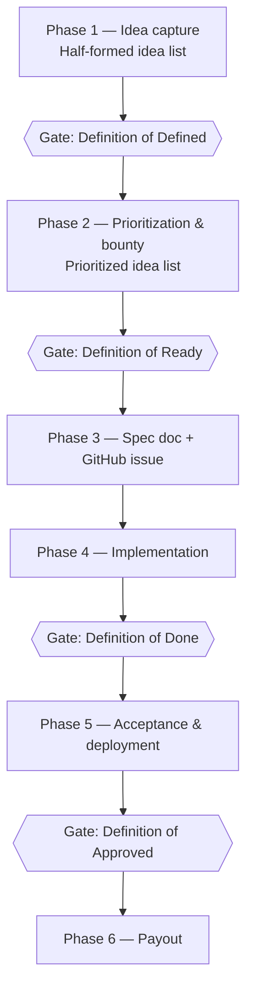

# Feature Development Process

> Items marked **[PROPOSED — confirm]** are recommendations filling gaps in the
> original process notes. They are not yet team decisions. Resolve them, then
> delete the markers. Items marked **[Revisit]** are decided for now but
> expected to change — see §14.

---

## 1. Purpose and audience

This document describes how a feature goes from a rough idea to deployed code
and a paid bounty in the `is-app` project.

It is written for three readers:

- **Core team developers** — the small in-house team who own the codebase, set
  direction, and review contributions.
- **Bounty contributors** — outside developers who claim a scoped piece of work,
  implement it, and get paid on acceptance.
- **AI coding agents** — agents working from a spec doc, which need explicit
  entry conditions, exit conditions, and definitions of quality rather than
  tribal knowledge.

The load-bearing idea is this: **work is handed outward, so the handoff has to
carry everything.** A contributor who has never met the team should be able to
read a spec doc and build the right thing. Every gate below exists to make that
true.

---

## 2. How the work model fits together

A **core tech team** of a few developers holds the architecture, review
standards, and release process. Around it, discrete features are **posted with a
bounty** and claimed by outside developers.

That split has two consequences that shape everything else:

1. **Definition happens before money.** A bounty can only be priced fairly if
   the work is already understood. So an idea must be *defined* before it can be
   *prioritized and priced*, and *priced* before it can be *claimed*.
2. **Acceptance is explicit.** A contributor needs to know in advance what
   "finished" means, because finished is what triggers payment. Vague acceptance
   criteria are a payment dispute waiting to happen.

---

## 3. Roles

| Role | Who | Responsibility |
| --- | --- | --- |
| **Product Owner (PO)** | James | Approves ideas into the prioritized list; sets bounty pricing; performs UX review; final sign-off on acceptance; arranges payout. |
| **Idea author** | Anyone | Proposes an idea; typically shepherds it through definition. |
| **Definer** | Core team member or idea author | Writes the idea up to the Definition of Defined. |
| **Spec author** | Core team member *or* contributor | Writes the spec doc and opens the GitHub issue. Contributors are welcome to write their own — discuss it with the team first. |
| **Implementer** | Core dev or bounty contributor | Claims the issue, builds it, opens the PR. |
| **Code reviewer** | Core team member | Reviews for code quality and requirements. |
| **UX reviewer** | PO | Reviews for UX quality and approval. |
| **Deployer** | Core team | Merges and deploys. |

One person can hold several roles. The rule that matters: **the implementer is
never the sole approver of their own work.**

---

## 4. The pipeline at a glance



| Phase | Artifact | Lives in | Exit gate |
| --- | --- | --- | --- |
| 1. Idea capture | Half-formed idea | Idea Backlog (Google Doc) | Definition of Defined |
| 2. Prioritization & bounty | Defined idea, priced | Idea Backlog (Google Doc) → issue tracker | Definition of Ready |
| 3. Spec | Spec doc + GitHub issue | `docs/spec-<feature-name>.md` + GitHub | Claimed by an implementer |
| 4. Implementation | Branch + pull request | GitHub | Definition of Done |
| 5. Acceptance & deployment | Deployed feature | Production | Definition of Approved |
| 6. Payout | Payment record | Finance | — |

Work only ever moves forward through a gate. Work that fails a gate moves
**back** to the previous phase with a written reason — it does not sit in limbo.

The GitHub Projects board tracks issue status through these phases automatically
via its configured automations — see `docs/strategy-project-management.md` for
board mechanics.

---

## 5. Phase 1 — Idea capture

**Input:** anything. A user complaint, a program need, a refactoring itch.
**Output:** an idea written up well enough to be prioritized.
**Where it lives:** the **Idea Backlog** Google Doc — not this repo.
**[PROPOSED — paste the link here]**

Ideas start half-formed and that is fine. The half-formed list is a holding pen,
deliberately low-friction: capture the thought before it evaporates. Nothing in
it is a commitment.

An idea leaves Phase 1 when someone does the work of *defining* it.

### Gate: Definition of Defined

An idea is **Defined** when it has all five of these:

- **Name** — a single phrase.
- **What** — one sentence describing what the feature is.
- **Why** — one to two sentences on why it matters: the goal, outcome, and
  motivation.
- **How** — one to three paragraphs on how the feature works, covering:
  - **User perspective:** what people see, do, and experience — the UX flow.
  - **Implementation notes:** what matters about *how* it is built, where
    relevant.
  - **Data model:** touched on where relevant.
- **Users** — who the feature is for (end user, program administrator, admin).
  **[PROPOSED — confirm; the partly-defined ideas already do this and it is the
  single most useful line for a contributor]**

Anything shorter than this is still Phase 1. Notably, a Defined idea does *not*
need wireframes, a schema, an estimate, or a bounty amount — those come later.

---

## 6. Phase 2 — Prioritization and bounty

**Input:** Defined ideas.
**Output:** an ordered list of ideas, each with an approved bounty.
**Owner:** PO.

The PO reviews Defined ideas and does two things at once: decides whether the
idea is worth doing now, and attaches a price to it. Pricing and prioritization
are the same decision — the bounty *is* the statement of how much the idea is
worth to the project.

The prioritized list includes refactoring and infrastructure work, not only
user-facing features. Those compete on the same list.

The PO sets the bounty amount on each approved idea. The amount is recorded on
the idea, carried onto the GitHub issue in Phase 3, and is what the contributor
sees before deciding whether to claim.

### Gate: Definition of Ready

An idea is **Ready** — i.e. can be turned into a claimable issue — when:

- The **PO has approved it** and set its **bounty price**.
- It has **enough definition that someone outside the core team can claim it and
  implement it** without needing to interview anyone.
- Its **acceptance criteria are written and testable.** **[PROPOSED — confirm.
  This is the addition most likely to prevent payout disputes: if you cannot
  write down how you would check the work, the work is not ready to be
  claimed.]**
- It is **small enough to complete in one pass.** Work larger than that is split
  into smaller issues before it is posted.

---

## 7. Phase 3 — Spec doc and GitHub issue

**Input:** a Ready idea.
**Output:** a spec doc plus a GitHub issue linking to it. At this point the work
becomes *ownable*.

Two artifacts, deliberately:

- The **spec doc** is the durable description of the feature. It is the thing an
  AI agent or a new contributor reads to understand what to build. Specs live in
  the repo so they version with the code, at `docs/spec-<feature-name>.md`.
  **[Revisit — whether shipped specs are archived, updated to match what was
  built, or left as-written]**
- The **GitHub issue** is the coordination surface: it carries the bounty
  amount, the claim, the status, and the discussion. It links to the spec doc
  rather than duplicating it.

Maintaining both means the spec stays readable and the issue stays current.

**Contributors may write their own spec docs.** If you want to spec something
before claiming it, talk to the team first — a spec that lands without a
conversation risks being written against the wrong assumptions, and the PO still
approves and prices the work before it becomes claimable.

### Spec doc contents

The spec doc extends the Defined idea rather than replacing it:

1. **Name, What, Why, How** — carried over from the Defined idea.
2. **Users** — who this is for.
3. **UX flow** — screen by screen, including empty and error states.
4. **Data model changes** — tables, fields, migrations.
5. **Acceptance criteria** — a checklist someone else can verify. This is the
   contract for payout.
6. **Out of scope** — what this issue explicitly does *not* include.
7. **Bounty** — the approved amount.
8. **Open questions** — and who answers them.

### Claiming **[PROPOSED — confirm this whole subsection]**

- Issues open for claiming carry the labels `bounty` and `available`.
- A contributor claims an issue by commenting on it. A core team member confirms
  by assigning them and switching the label to `claimed`.
- Each issue states a claim window when it is posted. If no draft PR is open by
  then, the claim lapses back to `available` — with a comment, not silently.
  Contributors who need more time ask before the window closes.
- One open claim per contributor at a time, until they have completed one.

---

## 8. Phase 4 — Implementation

**Input:** a claimed issue with a spec doc.
**Output:** a pull request that meets the Definition of Done.

The implementer works on a branch and opens a pull request that references the
issue. Follow the branch and commit conventions in
[`docs/strategy-branching.md`](strategy-branching.md) and
[`docs/strategy-committing.md`](strategy-committing.md). **[PROPOSED — confirm
these additional conventions]** Name branches
`feature/<issue-number>-<short-name>`; open the PR as a **draft** early so
reviewers can see direction before the work is finished.

Questions that expose a gap in the spec go **on the issue**, not into private
messages. The answer becomes part of the record, and the spec is updated if the
answer changes scope.

If implementation reveals that the spec is wrong — not merely incomplete — the
work goes back to Phase 3 and **the bounty is renegotiated with the PO.** Raise
it as soon as you see it, not at review time. That is a normal outcome, not a
failure.

### Gate: Definition of Done

A pull request is **Done** when:

- **Requirements are fulfilled** — every acceptance criterion in the spec doc is
  met.
- **UX quality** — the interface matches the described flow, handles empty,
  loading, and error states, and is usable on the devices the app targets.
- **Code quality** — it follows the conventions in this repo, is readable, and
  does not leave the codebase worse than it found it. **[Revisit — the repo's
  coding standards are not yet written down; link `CONTRIBUTING.md` here once
  they are]**
- **[PROPOSED — confirm these additions]** Tests covering the new behavior pass
  in CI, and no unrelated changes are bundled into the PR.

---

## 9. Phase 5 — Acceptance and deployment

**Input:** a Done pull request.
**Output:** the feature deployed, and the issue signed off.

Two reviews happen here, and they are different jobs:

- **Code review** — a core team member reads the diff for correctness and code
  quality.
- **UX review** — **the PO** exercises the feature as a user and judges whether
  it actually delivers the *Why*. Code can be correct and still miss the point.

Review outcomes are one of three: **approve**, **request changes** (with
specifics, back to Phase 4), or **reject** — the spec was wrong, so the work
goes back to Phase 3 and the contributor renegotiates the bounty with the PO
rather than absorbing the cost of the team's mistake.

### Gate: Definition of Approved

The feature is **Approved** when:

- **UX is approved** by the PO.
- Code review is approved, the PR is merged, and the change is deployed and
  verified in production. The PO records sign-off on the issue.

Sign-off is written on the issue, because it is what authorizes payment.

---

## 10. Phase 6 — Payout

**Input:** an Approved feature.
**Output:** the contributor is paid and the issue is closed.

**Payout is arranged directly with the PO.** Contact the PO once the issue is
signed off; they handle payment method, invoicing, and timing case by case.

- Payout is triggered by the PO's recorded sign-off on the issue, not by the
  merge itself.
- The amount is the bounty stated on the issue at claim time. If scope changed
  mid-flight, it was renegotiated with the PO in Phase 4 and noted on the issue —
  bounties are not reopened after acceptance.
- The issue is closed with a comment recording the amount and date.

---

## 11. Worked example

A short illustration of one idea moving through the gates. The feature below is
generic on purpose — it is not on the roadmap.

### Phase 1 — Half-formed

> "People keep asking who's actually coming to things. Maybe some kind of RSVP?"

Captured in the Idea Backlog. Not actionable yet: no user, no flow, no reason.

### Gate: Defined

> **Name:** Event RSVP
>
> **What:** Let members mark that they are attending an event, and let everyone
> see who else is attending.
>
> **Why:** Members decide whether to come to an event largely based on who else
> will be there, and organizers currently guess at headcount by hand. Showing
> attendance raises turnout and removes a manual step for organizers.
>
> **How:** On an event's detail screen, a member sees a "Going / Not going"
> control and a list of the members who have said they are going, shown as
> avatars with names. Tapping the control records the response immediately and
> updates the list without a page reload; tapping it again clears the response.
> An organizer viewing the same screen additionally sees a headcount and can
> export the attendee list.
>
> Responses are stored as a join between member and event with a status field,
> so a member has at most one response per event and changing a response is an
> update rather than a new row. The attendee list is read frequently and written
> rarely, which is worth keeping in mind for caching.
>
> **Users:** members (respond and view), event organizers (view and export).

That passes the Definition of Defined: name, what, why, a how that covers user
experience, implementation, and data model, and a named user.

### Gate: Ready

PO approves it, sets a bounty amount, and it goes onto the prioritized list with
acceptance criteria written:

- A member can set, change, and clear their response on an event.
- The attendee list updates without a reload and shows every "going" member.
- A member's own response survives closing and reopening the app.
- An organizer sees a headcount and can export the list as CSV.
- A member with no response sees the control in a neutral state, not "not going".

Notice what those criteria have in common: someone who did not write the feature
can check every one of them in under five minutes.

### Phase 3 — Spec and issue

`docs/spec-event-rsvp.md` is written out with the flow screen by screen, the
schema change, the acceptance criteria above, and an explicit **out of scope**
line: *no waitlists, no capacity limits, no email notifications.* GitHub issue
#142 links to it and carries the bounty amount and the labels `bounty` and
`available`.

A contributor claims it. It becomes `claimed` and assigned.

### Phase 4 — Implementation

Draft PR opens on day 2 with the schema migration, so a reviewer can catch a
modeling problem before the UI is built on top of it. A question comes up — what
happens to responses when an event is deleted? — and is asked *on the issue*.
Answer: responses cascade-delete; the spec is updated to say so.

PR marked ready for review on day 9. Requirements met, states handled, tests
pass. **Done.**

### Phase 5 — Acceptance

Code review requests two changes (an N+1 query on the attendee list, a missing
loading state). Fixed. On UX review the PO notices that the avatar list has no
empty state — "Be the first to RSVP" is added. Approved, merged, deployed,
verified. The PO signs off on issue #142.

### Phase 6 — Payout

The contributor contacts the PO, who arranges payment at the amount stated at
claim time. Issue closed with the amount and date recorded.

---

## 12. Templates

### Defined idea (Phase 1 exit)

```markdown
**Name:**
**What:** (1 sentence)
**Why:** (1–2 sentences — goal, outcome, motivation)
**Users:**
**How:**
  - User perspective / UX flow:
  - Implementation notes (if relevant):
  - Data model (if relevant):
```

### Spec doc (Phase 3)

```markdown
# <Feature name>

**Issue:** #<n> · **Bounty:** <amount> · **Status:** <available|claimed|in review|approved>

## What
## Why
## Users
## UX flow
## Data model changes
## Acceptance criteria
- [ ] …
## Out of scope
## Open questions
| Question | Owner | Answer |
```

---

## 13. Notes for AI agents

If you are an agent picking up work in this repo:

- **The spec doc is the source of truth**, not the issue title and not this
  document. Read `docs/spec-<feature>.md` in full before writing code.
- **The acceptance criteria are the definition of finished.** Meeting them is
  the job; exceeding them is scope creep and makes review harder.
- **Respect "Out of scope."** If a nearby improvement seems obvious, note it on
  the issue instead of building it.
- **If the spec is ambiguous, say so on the issue and stop.** Do not resolve
  ambiguity by guessing — a wrong guess costs more to review than a question
  costs to answer.
- **Definition of Done includes UX quality**, which means empty, loading, and
  error states are part of the work, not follow-ups.

---

## 14. To revisit

Settled for now, but deliberately left thin — worth returning to once the
process has run a few times:

1. **Spec doc organization.** Specs live in the repo at
   `docs/spec-<feature-name>.md` and are referenced from their GitHub issue.
   Still to decide: whether shipped specs are archived, updated to match what
   was built, or left as-written.
2. **Coding standards.** The Definition of Done leans on "the conventions in
   this repo," which are not yet written down anywhere. They need to become a
   `CONTRIBUTING.md` that this document can link to — until then, code quality
   is judged by reviewer taste, which is hard to hand to an outside contributor.

Also still open, at a smaller scale: the `[PROPOSED — confirm]` markers left
inline on the Users field (§5), the acceptance-criteria requirement (§6), the
claiming rules (§7), branch and PR conventions (§8), and the CI/tests additions
to the Definition of Done (§8).
