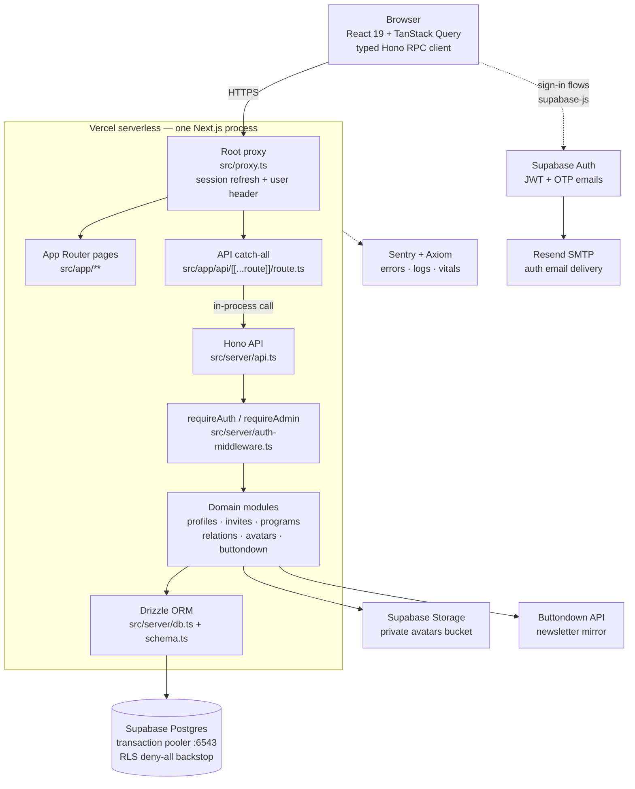
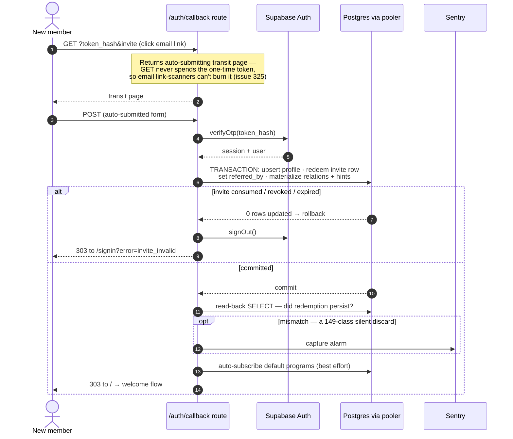
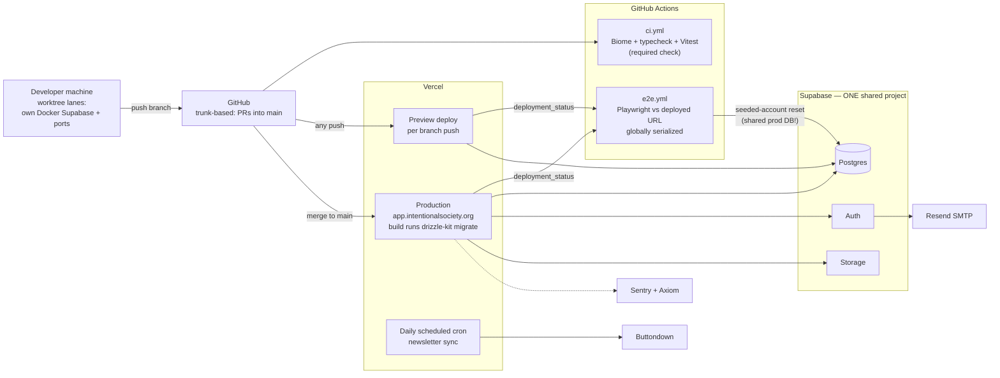
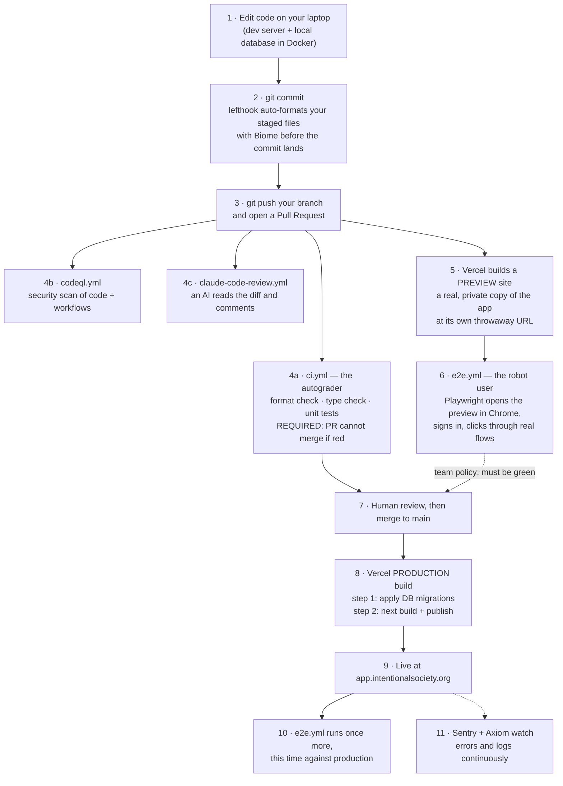
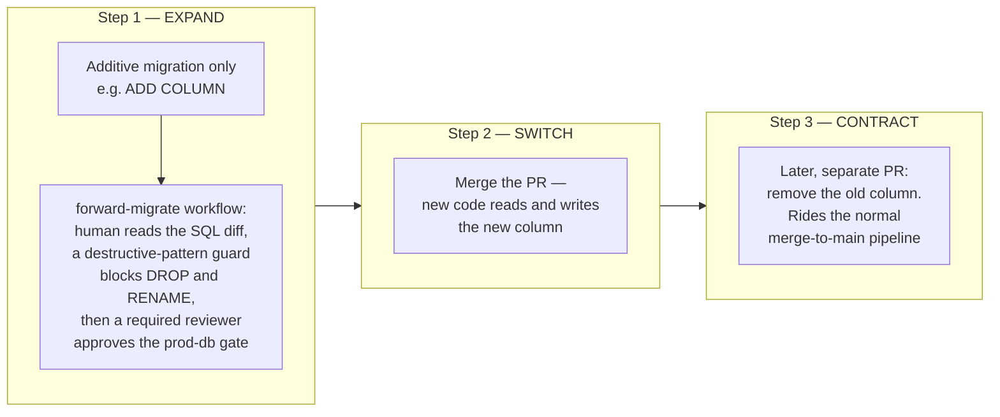
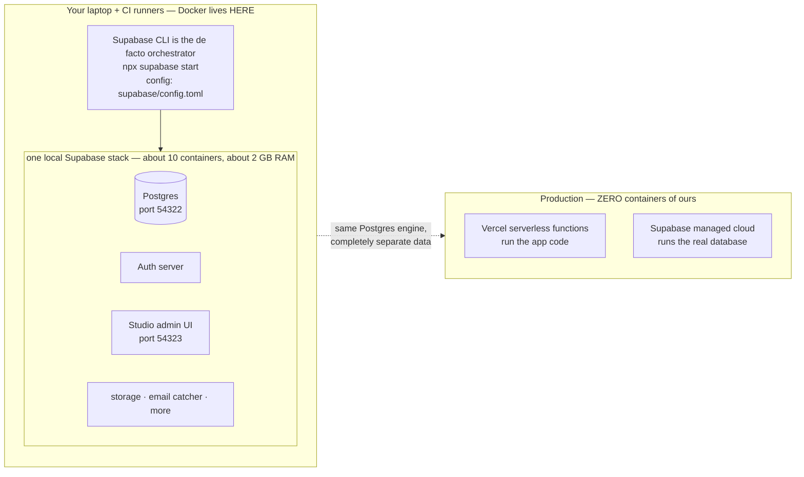

# is-app — TPM Ramp-Up Briefing (5-Pass)

*Prepared from the repo's code, docs, and git history as of 2026-07-22 (1,087 commits, 2026-04-04 → 2026-07-20). Every claim cites a real file; inferences and open questions are flagged as such.*

> **Scrubbed distribution copy.** Machine-endpoint paths, secret and environment-variable names, diagnostic header names, and contributor names are redacted relative to the internal version (`is-app-briefing.md`). Architecture and process content is unchanged.

---

## How I'd explain this system in 2 minutes

is-app is the members-only web app for Intentional Society — a small, globally distributed membership community — live at **app.intentionalsociety.org** (`README.md`). Members sign in (passwordless email links by default), maintain a profile, browse a member directory, join "programs" (cohorts/pods), and — the distinctive feature — record who they know and how well in a visual **relationship web** (`docs/design-relations.md`, `src/app/myweb/`). New members can only join via **invites** issued by existing members.

Technically it's one codebase deployed as one thing: a **Next.js 16** app on **Vercel** that renders the React frontend *and* hosts the entire backend — a **Hono** API mounted behind a catch-all route (`src/app/api/[[...route]]/route.ts` → `src/server/api.ts`). Data lives in **Supabase**: managed Postgres (accessed only through **Drizzle ORM** — Supabase's own data API is deliberately disabled), plus authentication and avatar file storage. Around the edges: **Resend** delivers auth emails, **Buttondown** is the newsletter system (kept in sync by a daily cron), and **Sentry**/**Axiom** watch errors and logs. Merging to `main` auto-deploys to production; there is no staging environment — previews and production share one Supabase database, which is the single most important operational fact to hold in your head (comment in `src/server/api.ts`, and `.github/workflows/e2e.yml`).

The team is tiny (three regular contributors in the decision journal — `docs/devjournal.md`), moves fast (~9 commits/day average), and invests unusually heavily in engineering process: extensive strategy docs, a decision journal, and even sandboxed evals for their AI-assistant workflows (`docs/strategy-skill-evals.md`).

---

## Pass 1 — ORIENT

### What it is and what problem it solves

An authenticated community platform replacing (inference: judging by feature set) spreadsheets/ad-hoc tools for a membership network: who's a member, how to reach them, what programs they're in, who invited whom, and the social graph between members. It also mirrors program membership into the Buttondown newsletter so mailing-list tags never drift from app reality (`docs/design-buttondown.md`).

### Tech stack (from `package.json`, `README.md`)

| Layer | Choice |
|---|---|
| Runtime | Node.js 24, TypeScript 6 |
| Framework | Next.js 16 (App Router) + React 19 |
| API | Hono 4 (mounted inside Next.js; typed RPC client `hc<ApiRoutes>` in `src/lib/api.ts`) |
| Data | Drizzle ORM 0.45 + `postgres` driver → Supabase Postgres |
| Auth/Storage | Supabase (`@supabase/ssr`, `@supabase/supabase-js`) |
| Client state | TanStack Query 5 |
| Styling | Tailwind CSS v4, shadcn-style components, lucide icons |
| Graph UI | `@xyflow/react` + `d3-force` (the relationship web) |
| Quality | Biome (lint/format), Vitest (functional), Playwright (e2e), lefthook (git hooks) |
| Observability | `@sentry/nextjs`, `next-axiom` |

### The 5 things to understand first

1. **One deployable, two routers.** Next.js file-routing serves pages; *all* API logic lives in a single Hono app (`src/server/api.ts`, ~920 lines). The catch-all route is 8 lines — Hono is the real backend. The Hono RPC client gives the frontend end-to-end type safety with no codegen (`docs/architecture-appstack.md`).
2. **Auth is enforced in exactly two places.** A root proxy (`src/proxy.ts` → `src/lib/supabase/middleware.ts`) refreshes the Supabase session on every page request and stamps a validated user header; Hono's `requireAuth` middleware (`src/server/auth-middleware.ts`) trusts that header (or falls back to cookie verification) and 401s everything not on a short `PUBLIC_PATHS` allowlist. Admin routes avoid advertising themselves to non-admins.
3. **The database has one door.** Supabase's auto-generated REST/GraphQL API is turned off and RLS (row-level security — per-row database permissions) is enabled on every table *with no policies*, i.e. as a pure deny-all backstop. All access goes app → Drizzle → Postgres via the transaction pooler (`src/server/schema.ts` header comment, `docs/doc-supabase.md`).
4. **Multi-statement DB transactions are treated as hazardous by policy.** A 2026-05 incident (#149) showed `db.transaction(...)` over Supabase's transaction pooler *silently losing writes*. The team's rule: single autocommit statements are safe; multi-statement transactions need special patterns. Read `docs/strategy-db-transactions.md` before touching anything transactional.
5. **Trunk-based, continuous deployment, no staging.** PRs into `main`; every merge auto-deploys to production; migrations run inside the production Vercel build (`vercel.json` `buildCommand`). E2e tests run *against the deployed URL* using two seeded accounts in the **shared production database**, serialized globally (`.github/workflows/e2e.yml`).

### Component list

- **Pages** — `src/app/` (directory: `members/`, web: `myweb/`, `programs/`, `invites/`, `welcome/` onboarding, `admin/`, auth pages)
- **API** — `src/server/api.ts` + domain modules: `profiles.ts`, `invites.ts`, `programs.ts`, `relations*.ts`, `avatars.ts`, `members-admin.ts`, `system-metrics.ts`
- **Buttondown sync** — `buttondown.ts` (client), `buttondown-sync.ts` (reconciler), `buttondown-runner.ts` (locking/logging wrapper), `sync-locks.ts`
- **Auth plumbing** — `src/proxy.ts`, `src/lib/supabase/*`, `src/server/auth-middleware.ts`, `src/app/auth/callback/route.ts`
- **Schema & migrations** — `src/server/schema.ts`, `drizzle/`
- **Dev/CI tooling** — `scripts/` (setup, lane isolation, seeding, prod migration), `.github/workflows/`, `.claude/skills/` (AI workflow skills + evals)

---

## Pass 2 — LANDSCAPE

### Glossary (domain terms, from schema and design docs)

- **Profile / Member** — one row per authenticated user, keyed by the Supabase auth user id (`profiles` table, `src/server/schema.ts`). Carries display name, URL **slug** (stable once set — renames don't break links), bio, keywords, current **intention** (a short "what I'm focused on" statement shown in an `/intentions` cloud), and workflow timestamps (`lastSignedAgreements`, `lastUpdatedProfile`, `lastReviewedPrograms`, `lastUpdatedWeb`) that drive the **welcome flow** — the multi-step onboarding checklist (`docs/design-welcome.md`).
- **Hidden vs. deactivated** — two distinct invisibility flags: `hidden` is an admin-set test-account flag; `deactivatedAt` is member-initiated self-deactivation (`schema.ts` comments).
- **Invite** — a single-use code created by a member with a personal note; expires, can be revoked, and records who redeemed it (`invites` table; redemption invariants enforced by DB `check` constraints). Members have an active-invite limit (`src/lib/invite-limits.ts`).
- **Relation / the Web** — a directed edge "relator → relatee" with a closeness **value 1–4**, or a **hint** (an admin/inviter suggestion that two people might know each other, value NULL until confirmed). One row per direction; constraints forbid self-relations (`relations` table). Rendered as a force-directed graph in `/myweb`; each profile page shows a **mini-map** (member's strong ties + your shortest path to them, `src/server/relations-mini-map.ts`).
- **Invite hints** — when inviting someone, you can hint who else they know; on redemption these materialize into relation hints (`invite_hints`, `materializeInviteRelations` in `src/server/relations.ts`).
- **Program** — a named cohort/pod with slug, blurb, `signupsOpen` gate, archive timestamp, and an optional **buttondownTag** (the per-program opt-in to newsletter sync). Membership is soft-deleted (`profilePrograms.leftAt`) so join history survives (`schema.ts`).
- **Buttondown sync** — daily reconciliation making Buttondown subscribers/tags mirror app state; "the cron is the safety net" for best-effort inline resyncs after joins/leaves/renames (`docs/design-buttondown.md`, `src/server/api.ts`).
- **Sync lock** — a lease-style DB lock (`sync_locks` table) so cron, admin-button, and inline syncs never run concurrently.
- **Update banner / Skew Protection** — active browser tabs poll `/api/version` to detect new deployments and prompt refresh, tiered by urgency (`docs/strategy-deployment.md`, `src/lib/update-tier.ts`).
- **Lane** — a fully isolated local dev environment per git worktree (own Docker Supabase stack + ports) for parallel work (`docs/strategy-worktree-lanes.md`).
- **Skills / skill-evals** — versioned AI-assistant procedures (`/commit`, `/pr`, `/ship` under `.claude/skills/`) with a sandboxed eval harness (`scripts/skill-evals/`). Process tooling, not app features — but a large share of recent commits.

### Public interfaces

The Hono API under `/api` (all routes in `src/server/api.ts`) is the only programmatic interface. Route families:

- **Self**: `GET/PUT /me`, avatar upload/delete, deactivate/reactivate, password flag, welcome-step timestamps
- **Community**: `/members`, `/members/:id`, `/intentions`, `/metrics`
- **Invites**: create/list/revoke; `GET /invites/:code/check` is public (pre-signup validation)
- **Programs**: list, `by-slug`, join/leave
- **Relations**: suggestions feed, personal subgraph, mini-map, get/set/delete own edge values; hint create/delete (admin)
- **Admin** (`/api/admin/*`, hidden from non-admins): members, sign-ins, programs + participants, hidden profiles, invites, app settings, Buttondown dry-run/write sync
- **Machine endpoints**: a public deploy-identity probe polled by the update banner, a CI-only test-reset endpoint (shared-secret gated; path withheld in this copy), and the scheduled newsletter-sync endpoint (secret-gated; path withheld in this copy)

### External dependencies

| Service | Role | Where wired |
|---|---|---|
| **Supabase** | Auth (JWT/OTP), Postgres, Storage (private `avatars` bucket, signed URLs) | `src/lib/supabase/*`, `src/server/db.ts`, `src/server/avatars.ts` |
| **Vercel** | Hosting, previews, cron scheduler, Runtime Cache (avatar URL cache), Skew Protection | `vercel.json`, `docs/doc-vercel.md` |
| **Resend** | SMTP relay for Supabase auth emails (`mail.intentionalsociety.org`) | `docs/doc-resend.md`, `docs/design-emails.md` |
| **Buttondown** | Newsletter; subscriber/tag mirror of members and programs | `src/server/buttondown*.ts`, `docs/design-buttondown.md` |
| **Sentry** | Error tracking (with PII scrubbing, `src/lib/sentry-scrub.ts`) | `sentry.server.config.ts`, `docs/doc-sentry.md` |
| **Axiom** | Structured logs + Web Vitals (`next-axiom`; note the `waitUntil(log.flush())` pattern to survive serverless freezes) | `src/server/api.ts`, `docs/doc-axiom.md` |
| **GitHub Actions** | CI (lint+unit), e2e vs deployed URL, CodeQL, prod schema-expansion workflow, AI review bots | `.github/workflows/` |

No queues or caches beyond Vercel's — the architecture is deliberately minimal ("low operational complexity", `docs/architecture-appstack.md`).

---

## Pass 3 — FLOWS

### Flow A — any authenticated API call (the everyday path)

Example: the profile page calls `apiClient.api.me.$get()`.

1. **Browser** — components use TanStack Query wrapping the typed Hono client (`src/lib/api.ts`), cookies included.
2. **Root proxy** (`src/proxy.ts`, matcher excludes static assets and `/api/version`) → `updateSession` (`src/lib/supabase/middleware.ts`): deletes any inbound forged user header, refreshes the Supabase session cookie, calls `supabase.auth.getUser()` (a network call to Supabase Auth), and — if valid — stamps the serialized user into `SUPABASE_USER_HEADER` for downstream handlers. This is the per-request auth cost, paid once.
3. **Next.js catch-all** (`src/app/api/[[...route]]/route.ts`) hands the request to Hono in-process — a function call, not a network hop.
4. **Hono middleware chain** (`src/server/api.ts`): request-logging middleware (Axiom, with the flush-keepalive), then `requireAuth` (`src/server/auth-middleware.ts`) — fast path decodes the proxy's header; fallback re-verifies cookies (used by functional tests that call `app.request()` directly).
5. **Handler** `GET /me`: reads the profile via `getProfileForSelf` (`src/server/profiles.ts`); if missing, **self-heals** by upserting one (profiles are normally created at sign-in, but the API defends against that having failed). Note a header-triggered diagnostic probe still wired in from the #149 investigation (trigger withheld in this copy).
6. **Drizzle → Postgres** through the transaction pooler (`src/server/db.ts`, `prepare: false`), response typed end-to-end back to the component.

**Complexity concentration:** steps 2 and 4–5 — session refresh semantics, the header trust chain, and self-healing writes hidden inside reads.

### Flow B — invited sign-up (the highest-stakes write path)

Traced through `src/app/auth/callback/route.ts` (~290 lines, one of the most careful files in the repo):

1. Prospect validates their invite code on `/signup` (public `GET /api/invites/:code/check`), enters email; Supabase Auth sends an OTP link via Resend.
2. **GET `/auth/callback?token_hash=…&invite=…`** does *not* verify the token. It returns a self-submitting "transit page" — because corporate email link-scanners prefetch links with GET and would otherwise consume the single-use token before the human clicks (issue #325; the fix is documented inline).
3. The page **POSTs back**; the route calls `supabase.auth.verifyOtp()`.
4. **One `db.transaction`** (a deliberate, documented exception to the no-transactions policy): insert/upsert the profile, redeem the invite (single-row `UPDATE` guarded by not-redeemed/not-revoked/not-expired predicates — row locks make exactly one concurrent redeemer win), set `referredBy`, and materialize invite relations + hints into the web. Any failure rolls the whole thing back and signs the user out.
5. **Post-commit read-back**: a fresh SELECT verifies the redemption actually persisted; a mismatch fires a Sentry alarm tagged as a "#149-class silent discard". This is a live tripwire for the pooler hazard.
6. Best-effort, non-transactional tail: auto-subscribe to default programs (`autoSubscribeNewMember`); failures go to Sentry but never break sign-in.
7. 303 redirect to `/` → the welcome flow takes over (profile save later fires the Buttondown first-save hook in `PUT /me`).

**Complexity concentration:** atomicity vs. the pooler hazard, scanner-defense, and the many "best-effort with cron safety net" side effects. Also the third notable flow — the **daily Buttondown cron** (`vercel.json` daily schedule → secret-gated cron endpoint → lease lock → reconciler) — shares this "inline best-effort + cron reconciles" pattern.

---

## Pass 4 — STRESS (hotspot / risk map)

### Highest-churn files (all-time, from `git log --name-only`)

| File | Commits | Reading |
|---|---|---|
| `src/server/api.ts` | 74 | Every feature touches the monolithic route file. Growing merge-conflict / review-load magnet; watch for when the team splits it. |
| `src/app/myweb/web-graph.tsx` | 51 | The force-directed relationship web — the hardest UI in the app; has its own test cluster (layout/filtering/selection tests). |
| `src/app/page.tsx` | 44 | Home + welcome-flow redirect logic; was ground zero for the #149 flake. |
| `src/server/profiles.ts` | 43 | Core domain logic (slugs, self-heal upserts, welcome timestamps). |
| `src/server/schema.ts` | 23 | Schema evolves steadily; expand-contract discipline required. |

### Where the bodies are buried

1. **The #149 pooler saga (silent write loss).** The defining incident: multi-statement transactions over Supabase's transaction pooler silently dropped writes; root cause *never confirmed* — the policy in `docs/strategy-db-transactions.md` is defensive, and residual flake turned out to be CI concurrency (devjournal 2026-07-02). Fossils remain armed throughout: the `/me` debug probe, the invite read-back alarm, `prepare: false` in `db.ts`, probe assertions in `tests/e2e/helpers/session.ts`. **TPM watch:** any new feature needing multi-write atomicity carries hidden design cost (writable CTE / Postgres function / session-pooler client).
2. **E2e tests run against the production database.** Two seeded accounts, state reset mid-run via the token-gated reset endpoint, serialized by a single global concurrency group (`.github/workflows/e2e.yml`). Safe-ish today, but it is a throughput ceiling (deploys queue behind each other's e2e) and a standing prod-data hazard. Previews share prod's Supabase too — a preview branch with a bad migration or write path touches real data (a comment in `api.ts` is explicit about this).
3. **Migrations run inside the production Vercel build** (`vercel.json`), forward-only (Drizzle has no rollback), with a separate manual "expand" workflow for prod schema expansion (`.github/workflows/forward-migrate-prod-schema-expansion.yml`, `npm run prod:db:expand`). A failed migration mid-build is an untested (inference) failure mode worth asking about.
4. **Naming debt in the schema.** SQL columns lag the code's vocabulary: `relations.rater_id/ratee_id` ↔ `relatorId/relateeId`, `profiles.avatar_url` holds a storage *path*, `invites.creator_value` ↔ `relationValue` (`schema.ts` comments). Harmless until someone queries the DB directly or writes the rename migration — then expand-contract choreography applies.
5. **Buttondown sync correctness levers are environmental.** Writes are gated behind two environment toggles ("prod-only by construction", `buttondown-runner.ts`); dry-run is the default. Drift is bounded by the daily cron; per-profile inline resyncs absorb lock contention with retries. Complexity lives in the reconciler (`buttondown-sync.ts`) and its fake-backed test suite; the real-API "golds" are manual-run only (`tests/manual/`).
6. **Avatar egress economics.** Signed-URL rotation invalidates image-optimizer caches; #382 fixed a real egress cost leak with a 5-day sign TTL + Vercel Runtime Cache (`src/server/avatars.ts`). Fragile in the sense that cache-key coupling (token ∈ URL ∈ cache key) is easy to regress.
7. **Test coverage shape.** Strong: 58 test files — server functional suite mirrors domain modules closely, client tests cover the web-graph logic, 16 e2e specs cover the user journeys. Thinner (by inspection): admin UI pages, the Next.js page components generally (server tests hit the Hono app, not RSC rendering), and anything only exercised against real third parties (Buttondown golds, Resend). TODO/FIXME markers are nearly absent (one hit in `scripts/skill-evals/`) — this team files issues instead; churn + devjournal, not TODOs, are the debt signal.
8. **Recent effort mix.** June–July commits are dominated by AI-workflow meta-tooling (skill evals, Phases 4–8). Product-feature velocity vs. process investment is a resourcing conversation, not a code problem.

### Softest-estimate zones for planning

Anything touching: multi-write atomicity (pooler policy), the relationship web UI (`myweb/`), schema renames (expand-contract, forward-only), Buttondown reconciliation edge cases, and e2e-affecting auth/welcome changes (the flakiest historical area).

---

## Pass 5 — VERIFY

### (a) What I can state confidently

- The architecture: Next.js shell + Hono API + Drizzle + Supabase, single deployable on Vercel; typed RPC end-to-end; DB reachable only through the app (Data API off, deny-all RLS).
- The auth chain (proxy header → `requireAuth` fallback), the public-path allowlist, and admin cloaking.
- Domain model: profiles, invites (single-use, constrained), directed 1–4 relations + hints, soft-membership programs, Buttondown tag mirroring, sync locks.
- Ops posture: trunk-based CD to prod, prod-build migrations, docs-only deploy skip, daily Buttondown cron, e2e serialized against the shared prod DB, previews sharing prod's Supabase.
- The #149 history and the resulting transaction policy, straight from `docs/strategy-db-transactions.md` and in-code fossils.

### (b) What I should NOT claim

- **Scale**: member counts, traffic, DB size, cost — nothing in the repo quantifies them (`docs/budget.md` exists; I didn't verify its currency).
- **Prod incident frequency** or whether the #149 alarms have ever fired in production since June.
- **Whether the newsletter write gate is actually enabled in prod** — env-only, invisible here.
- **Roadmap** (mobile path is described as options in `architecture-appstack.md`, not a plan).
- **Why the pooler bug happened** — the team themselves never confirmed the mechanism; treat it as an open hazard, not a solved bug.
- Anything about the marketing site (`docs/architecture-www.md` covers it; separate from this app).

### (c) 10 sharpest questions for the engineers

1. What's the actual blast radius if a preview deployment misbehaves against the shared prod Supabase — and has "get a real staging project" ever been costed?
2. Has the invite-redemption read-back alarm or any #149-class Sentry tripwire fired since 2026-06? What's the retirement plan for the probe code (`/me` debug probe says "remove once #149 is closed" — it's closed)?
3. What happens operationally when `drizzle-kit migrate` fails mid-production-build on Vercel — is the deploy atomic, and who gets paged?
4. `src/server/api.ts` is 74-commits hot and ~900 lines. Is there an agreed trigger point for splitting it (and the admin router) into modules?
5. Is the newsletter write gate on in production today, and how do you detect silent drift beyond the daily cron summary (e.g., has the unsubscribe Sentry alert fired)?
6. The e2e global serialization queues all deploys behind one suite. What's the current p95 merge-to-prod-verified time, and at what team size does this become the bottleneck?
7. The pending column renames (`rater_id`, `avatar_url`, `creator_value`) — is there a scheduled contract phase, or is the divergence considered permanent?
8. Auth resilience: if Supabase Auth is degraded, the proxy's per-request `getUser()` sits on every page load — is there a measured latency budget / fallback story (`src/lib/timing.ts` suggests you measure it)?
9. Admin authorization does a DB round-trip per check (`isAdmin` in `auth-middleware.ts` notes attaching it to context as "a fair next step") — has that next step been prioritized?
10. The skill-evals program consumed most of July's commits. What's the intended steady-state split between process tooling and product work, and how is the eval sandbox kept from ever touching real GitHub (I read `docs/strategy-skill-evals.md`'s safety model — is it audited)?

---

## Diagrams

### 1. Component architecture

### 2. Critical flow — invited sign-up (`src/app/auth/callback/route.ts`)

### 3. Deployment / topology

*Companion file: `is-app-visuals.html` renders all diagrams in this document standalone (self-contained, no CDN).*

---

## Appendix — CI/CD in this repo, explained from zero

*This section assumes no prior knowledge: it defines every term and walks the actual pipeline this repo uses, file by file. If you already know what CI/CD is, skim the headers and jump to the tables.*

### A.1 What "CI/CD" means

When several people edit the same codebase, two questions come up constantly:

1. **"Did my change break anything?"** — you want to find out *now*, not next week when someone else hits the bug.
2. **"How does my change get to real users?"** — someone has to take the code from GitHub and put it on the actual website.

**CI — Continuous Integration** — answers question 1. Every time anyone pushes code, robots automatically run all the checks (formatting, type errors, tests) and put a green ✅ or red ❌ on the change. Think of it as an autograder that runs on every submission, except the "assignment" is the whole app.

**CD — Continuous Deployment** — answers question 2. When a change is approved and merged, robots automatically build the website and publish it. No release day, no person copying files to a server. In this repo, *merging a pull request IS releasing to production* — that's the headline fact.

Some vocabulary used below, defined once:

- **Branch** — a parallel line of work in git; you make changes on your own branch so `main` (the official version) stays untouched until you're ready.
- **Pull request (PR)** — a GitHub page that says "here are my changes, please review and merge them into `main`". All the robot checks attach their ✅/❌ here.
- **Merge** — accepting the PR: your commits become part of `main`.
- **Deploy** — building the app and putting it on servers so real users get the new version.
- **Workflow / job / step** — GitHub Actions terms. A *workflow* is a YAML file in `.github/workflows/` that says "when X happens, run these commands on a rented Linux machine (a *runner*)". Workflows contain *jobs*, jobs contain *steps*.
- **Migration** — a small SQL script that changes the database's shape (add a table, add a column). The app's code and the database's shape must always agree, which is why migrations get special treatment (A.5).

### A.2 The life of a code change (the picture to remember)

Two robots deserve special mention because they're *not* GitHub Actions: **Vercel** (the hosting company) watches the GitHub repo itself and does steps 5, 8, 9 on its own servers; **lefthook** (step 2) runs on your laptop, installed into git's "pre-commit hook" slot by `npm run setup` (`lefthook.yml`).

### A.3 Each robot, what it does, and where it's configured

| Robot | File | Trigger | What it actually does |
|---|---|---|---|
| Pre-commit formatter | `lefthook.yml` → `scripts/biome-precommit.mjs` | `git commit` on your laptop | Auto-formats only the files you staged, re-stages the fixes. Bypass: `git commit --no-verify`. |
| **CI (the required check)** | `.github/workflows/ci.yml` | every PR into `main` | Spins up a throwaway Linux machine, starts a real local Supabase (Postgres in Docker), then: `biome ci` (lint/format), `npm run typecheck`, apply migrations, run the Vitest functional suite. A docs-only PR skips all of it but still reports green — that's the `paths-filter` step. |
| Preview deploy | Vercel (config in `vercel.json`, dashboard settings in `docs/doc-vercel.md`) | every push to any branch | Builds the app and hosts it at a unique URL so humans and robots can try the change before merge. The `ignoreCommand` in `vercel.json` skips the build for docs-only pushes. |
| **E2e — the robot user** | `.github/workflows/e2e.yml` | a Vercel deploy (preview *or* production) finishing successfully (`deployment_status` event) | Installs Chrome, points Playwright at the *deployed URL* (with a guard that refuses non-Vercel URLs), signs in as two pre-seeded test accounts, and clicks through sign-up, profile, invites, the web, admin, etc. Uploads a report you can download from the run page. Not a GitHub-required check, but team policy says green-before-merge. |
| Security scan | `.github/workflows/codeql.yml` | PRs, pushes to `main`, and weekly | GitHub's CodeQL static analysis over the TypeScript *and* over the workflow YAMLs themselves (catches CI misconfigurations). The weekly run re-scans unchanged code with newly published rules. |
| AI reviewer | `.github/workflows/claude-code-review.yml` | every PR (skips bot-authored PRs) | Claude reads the diff and posts a review comment. Advisory, not blocking. |
| AI on-demand | `.github/workflows/claude.yml` | someone writes `@claude` in an issue/PR comment | Wakes Claude to answer or make changes. |
| Vendored-code drift check | `.github/workflows/skill-creator-drift.yml` | monthly | Checks whether the vendored copy of the upstream `skill-creator` skill fell behind, and opens one tracking issue if so. Never edits code itself. |
| Prod schema expander | `.github/workflows/forward-migrate-prod-schema-expansion.yml` | a human clicks "Run workflow" | The only human-gated pipeline — see A.5. |
| Dependency bumps | Dependabot (`docs/doc-github.md`; devjournal 2026-06-30) | weekly | Opens PRs that bump library versions; `sharp` is quarantined into its own PR. These ride the same CI gauntlet as human PRs. |

**Why does merge require CI but not e2e?** Partly because CI is hermetic (it builds its own database) while e2e depends on a live deployment — but the binding reason is mechanical: e2e triggers on the `deployment_status` event, and docs-only PRs never deploy (Vercel's `ignoreCommand` skips them), so a *required* e2e check would simply never report on a docs PR and that PR could never merge. The same logic keeps GitHub auto-merge switched off. The documented precondition for changing this: teach `e2e.yml` to short-circuit docs-only PRs the way `ci.yml`'s paths-filter does (`docs/doc-github.md`). See A.8.

### A.4 The one queue in the system

E2e runs are **globally serialized** — one at a time across all branches (`concurrency.group: e2e-shared-prod-db` in `e2e.yml`). The reason is unusual and worth understanding: the test suite doesn't get its own database. It drives two fixed seeded accounts **in the production database** and resets their state mid-run via a token-gated reset endpoint (`src/server/test-reset.ts`). Two suites running at once would trample each other's accounts — that was bug #358, and serialization was the fix (devjournal 2026-06-21). Consequence for planning: when several deploys land close together, their e2e verdicts queue up behind each other, and GitHub cancels superseded queued runs so only the newest deploy gets tested.

### A.5 Database changes — the special path

The scary part of CD is changing the database while the app is running, because for a few minutes old code and new code coexist against one database. Two mechanisms handle this:

**Ordinary (additive) changes ride the normal pipeline.** Change the schema in TypeScript (`src/server/schema.ts`) → `npx drizzle-kit generate` writes a SQL file into `drizzle/` → it merges with your PR → the production Vercel build runs `node scripts/migrate.mjs` *before* `next build`, production-only (`vercel.json` `buildCommand` gated on `VERCEL_ENV`). So the database is upgraded moments before the new code goes live.

**The expand-contract pattern for anything risky** (`docs/strategy-committing.md`): never change-and-remove in one step. First **expand** (add the new column/table — harmless to old code), then switch the code over, then later **contract** (remove the old column) in a separate deploy once nothing references it. Drizzle migrations are forward-only — there is no "undo" button — which is exactly why the pattern is mandatory.

The **forward-migrate workflow** (`forward-migrate-prod-schema-expansion.yml`) exists because previews share the production database: if your branch's code needs a new column, the preview will crash until that column exists in prod. So an engineer can apply *expand* migrations to prod ahead of merging. It's deliberately the least automated thing in the repo — a two-job design where the first job prints the exact SQL and refuses destructive patterns *before* a human approves the `prod-db` environment gate, and only then does the second job touch the production database.

### A.6 What a TPM should take from this

- **Cycle time is structurally short**: commit → production is one merge plus one build; the docs-only skip keeps documentation changes free.
- **The safety net is layered but has one soft spot**: format/type/unit tests are hard gates; e2e — the only layer that tests the *real deployed thing* — is a policy gate on a shared-prod-DB queue. Incidents that "passed CI" will usually trace to that gap or to migration ordering.
- **The most dangerous button is well-guarded**: direct prod DB changes require a human-approved, SQL-visible, destructive-pattern-checked workflow. That's better discipline than most teams this size.
- **Supply-chain posture is deliberate**: third-party GitHub Actions are pinned to commit SHAs, CodeQL scans the workflow YAMLs themselves, and workflow changes are codeowner-gated (A.8).

### A.7 Containers — where Docker fits (and where it deliberately doesn't)

A **container** is a lightweight, isolated box that runs a program together with everything it needs (its own filesystem, network ports, dependencies) — like a very cheap virtual computer. **Docker** is the tool that runs them. Teams often also use an **orchestrator** (Kubernetes is the famous one) to run many containers across many servers.

This repo's answer is unusual and easy to state: **containers exist only on laptops and CI runners, and there is no orchestration tech at all — nothing we build ever ships as a container.**

**Why containers locally?** The app needs a real Postgres database (plus Supabase's auth server) to do anything. Rather than every developer installing and configuring those by hand, `npm run dev` conjures the whole stack in Docker — identical on every machine, deletable without trace (`npm run dev:db:reset` wipes it; `npm run dev:db:stop` shuts it down).

**Who plays "orchestrator"?** The **Supabase CLI**. There's no Kubernetes and no hand-written docker-compose file in the repo — `npx supabase start` reads `supabase/config.toml` (project id `is-app`; Postgres on port 54322, Studio web UI on 54323, API on 54321) and starts/wires the ~10 containers itself. Two helper scripts babysit it, and they encode real operational scar tissue worth knowing about: `scripts/ensure-docker.mjs` auto-launches Docker Desktop and polls until the daemon answers, and `scripts/ensure-supabase.mjs` handles the cold-start race where Docker is still auto-booting old containers, plus auto-recovery from dangling-container name conflicts.

**The same trick powers two other things:**
- **CI** (`ci.yml`) runs `npx supabase start` on the throwaway GitHub runner — so the "autograder" tests against a real Postgres in containers, not a mock. This is why CI is trustworthy enough to be the required merge gate.
- **Worktree lanes** (`docs/strategy-worktree-lanes.md`): the CLI keys the container stack off the current directory name (`PROJECT_ID = basename of cwd` in `ensure-supabase.mjs`), so each git worktree can run its *own* complete Supabase stack on its own ports — parallel feature work with fully isolated databases, ~2 GB RAM each.

**Why no containers in production?** Deployment is Vercel serverless functions (the app) plus Supabase's managed cloud (the database) — both are someone else's infrastructure. The team never builds a Docker image, pushes to a registry, or patches an orchestrator; that entire operational category is outsourced by design ("low operational complexity", `docs/architecture-appstack.md`). The trade-off is the vendor lock-in and dashboard bus-factor noted in A.6.

*(Honest edge: Vercel and Supabase certainly use containers internally — but that's invisible to this team and not something a maintainer here operates.)*

### A.8 Maintainer's addendum — what the owner of this pipeline must know

Everything above explains the pipeline to a reader. This section is for the person who has to *own* it.

**1. GitHub settings are code — don't touch the UI.** Branch protection for `main` is a ruleset applied idempotently by `scripts/update-main-branch-protection.mjs` (`npm run update_main_branch_protection`; `--dry-run` to preview). Edits made in the GitHub settings UI will be reverted the next time anyone re-runs the script. The ruleset encodes: no deletion/force-push on `main`; PR required for every change; required status check **"Lint & Functional Tests"** (`ci.yml`); branches must be **up to date with `main`** before merge (this is what forces the team's rebase-when-main-moves convention); zero required approvals globally, **but** code-owner review required on `.github/CODEOWNERS` paths — currently `.github/workflows/` and CODEOWNERS itself. Consequences: *the CI/CD maintainer cannot land workflow changes solo*, and bumping a SHA-pinned action is a codeowner-gated change. Emergency escape hatch: repository admins can bypass per-PR via the merge-box checkbox (`bypass_mode: "pull_request"` — deliberately not a blanket bypass). Merges land only as `gh pr merge --merge --delete-branch` (the `/ship` Skill's form); GitHub auto-merge is off (see A.3 for why).

**2. Secrets and out-of-repo state — the dependency inventory.**

| Where | Item | Used by | Notes |
|---|---|---|---|
| GitHub Actions secrets | test-account credentials (2) | `e2e.yml` | Passwords of the two seeded accounts (secret names withheld in this copy) |
| GitHub Actions secrets | CI reset token | `e2e.yml` | **Rotation coupling:** must match the hosting-side copy, or every e2e run fails at reset |
| GitHub Actions secrets | production DB connection string | forward-migrate workflow | The only workflow credential that can write prod data |
| GitHub Actions secrets | AI-integration token | both Claude workflows | |
| GitHub environment `prod-db` | required-reviewer list | forward-migrate workflow | The human gate on prod schema changes lives here, not in code |
| Vercel dashboard | build command, cron schedule, Skew Protection, env vars (database, cron, reset token, newsletter, …) | production runtime | `docs/doc-vercel.md` |
| Supabase dashboard | auth URLs, SMTP (Resend), API keys, seeded e2e users | auth + e2e | `docs/doc-supabase.md` |

**3. When it breaks — the built-in diagnostics.**
- **Migration failures/silent no-ops:** `scripts/migrate.mjs` is not a thin wrapper. In CI/verbose mode it logs which host/port it reached (flagging 6543 = the hazardous transaction pooler vs 5432 = session), counts `drizzle.__drizzle_migrations` before and after, and prints an explicit `WARNING` if `migrate()` reported success but nothing persisted — the #149 silent-discard tripwire extended into deploys. First place to look: the Vercel build log (prod) or Actions log (CI/forward-migrate).
- **E2e failures:** the config already retries twice in CI, runs everything serially (`workers: 1` — *within* a run, on top of the cross-run queue from A.4), and re-seeds via the `reset.setup.ts` project before specs run. Every test request carries the debug-timing header (name withheld in this copy), so per-step server timing for a failed run is queryable in Vercel function logs. The full Playwright HTML report is uploaded as a run artifact (14-day retention).
- **A wedged e2e queue:** one global concurrency group means a stuck run blocks all verdicts; cancel it from the Actions UI — superseded queued runs auto-cancel, so only the newest deploy re-tests.

**4. Open questions the maintainer should settle** (also surfaced in Pass 5): `ci.yml`/`e2e.yml` use `npm install` where `forward-migrate` uses `npm ci` — the lockfile-drift risk of `install` in CI is undocumented; either justify or align. And the standing improvement everyone will ask for: make e2e a required check, which first requires the docs-only short-circuit described in A.3.
- **Bus-factor lives in Vercel/Supabase dashboards**: chunks of the pipeline (build command, env vars, cron, seeded accounts) are dashboard state, documented in `docs/doc-vercel.md` / `docs/doc-supabase.md` but not enforced by code review. (GitHub-side settings are better off — branch protection is applied from a script; see A.8.)
