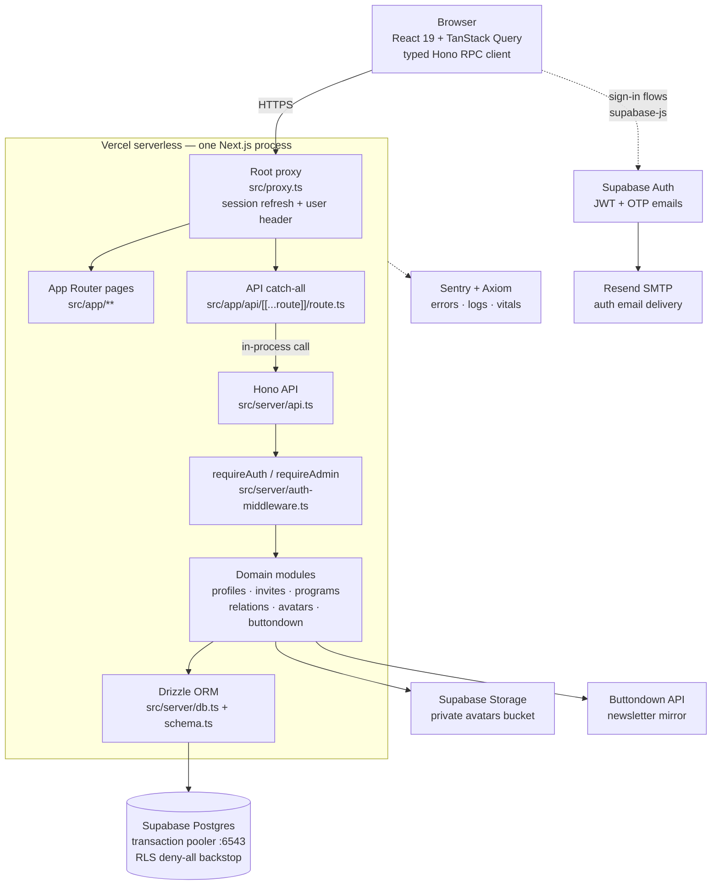
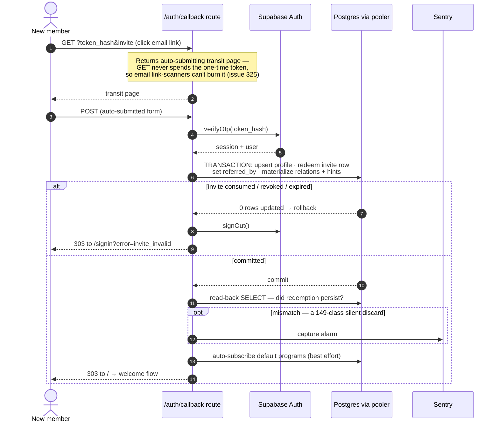
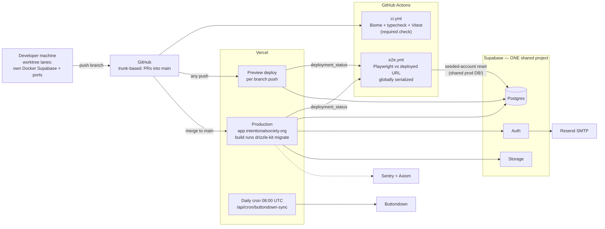

# is-app — TPM Ramp-Up Briefing (5-Pass)

*Prepared from the repo's code, docs, and git history as of 2026-07-22 (1,087 commits, 2026-04-04 → 2026-07-20). Every claim cites a real file; inferences and open questions are flagged as such.*

---

## How I'd explain this system in 2 minutes

is-app is the members-only web app for Intentional Society — a small, globally distributed membership community — live at **app.intentionalsociety.org** (`README.md`). Members sign in (passwordless email links by default), maintain a profile, browse a member directory, join "programs" (cohorts/pods), and — the distinctive feature — record who they know and how well in a visual **relationship web** (`docs/design-relations.md`, `src/app/myweb/`). New members can only join via **invites** issued by existing members.

Technically it's one codebase deployed as one thing: a **Next.js 16** app on **Vercel** that renders the React frontend *and* hosts the entire backend — a **Hono** API mounted behind a catch-all route (`src/app/api/[[...route]]/route.ts` → `src/server/api.ts`). Data lives in **Supabase**: managed Postgres (accessed only through **Drizzle ORM** — Supabase's own data API is deliberately disabled), plus authentication and avatar file storage. Around the edges: **Resend** delivers auth emails, **Buttondown** is the newsletter system (kept in sync by a daily cron), and **Sentry**/**Axiom** watch errors and logs. Merging to `main` auto-deploys to production; there is no staging environment — previews and production share one Supabase database, which is the single most important operational fact to hold in your head (comment in `src/server/api.ts` `/_test/reset`, and `.github/workflows/e2e.yml`).

The team is tiny (devjournal entries name James, Blake, Ola — `docs/devjournal.md`), moves fast (~9 commits/day average), and invests unusually heavily in engineering process: extensive strategy docs, a decision journal, and even sandboxed evals for their AI-assistant workflows (`docs/strategy-skill-evals.md`).

---

## Pass 1 — ORIENT

### What it is and what problem it solves

An authenticated community platform replacing (inference: judging by feature set) spreadsheets/ad-hoc tools for a membership network: who's a member, how to reach them, what programs they're in, who invited whom, and the social graph between members. It also mirrors program membership into the Buttondown newsletter so mailing-list tags never drift from app reality (`docs/design-buttondown.md`).

### Tech stack (from `package.json`, `README.md`)

| Layer | Choice |
|---|---|
| Runtime | Node.js 24, TypeScript 6 |
| Framework | Next.js 16 (App Router) + React 19 |
| API | Hono 4 (mounted inside Next.js; typed RPC client `hc<ApiRoutes>` in `src/lib/api.ts`) |
| Data | Drizzle ORM 0.45 + `postgres` driver → Supabase Postgres |
| Auth/Storage | Supabase (`@supabase/ssr`, `@supabase/supabase-js`) |
| Client state | TanStack Query 5 |
| Styling | Tailwind CSS v4, shadcn-style components, lucide icons |
| Graph UI | `@xyflow/react` + `d3-force` (the relationship web) |
| Quality | Biome (lint/format), Vitest (functional), Playwright (e2e), lefthook (git hooks) |
| Observability | `@sentry/nextjs`, `next-axiom` |

### The 5 things to understand first

1. **One deployable, two routers.** Next.js file-routing serves pages; *all* API logic lives in a single Hono app (`src/server/api.ts`, ~920 lines). The catch-all route is 8 lines — Hono is the real backend. The Hono RPC client gives the frontend end-to-end type safety with no codegen (`docs/architecture-appstack.md`).
2. **Auth is enforced in exactly two places.** A root proxy (`src/proxy.ts` → `src/lib/supabase/middleware.ts`) refreshes the Supabase session on every page request and stamps a validated user header; Hono's `requireAuth` middleware (`src/server/auth-middleware.ts`) trusts that header (or falls back to cookie verification) and 401s everything not on a short `PUBLIC_PATHS` allowlist. Admin routes 404 (not 403) to avoid advertising themselves.
3. **The database has one door.** Supabase's auto-generated REST/GraphQL API is turned off and RLS (row-level security — per-row database permissions) is enabled on every table *with no policies*, i.e. as a pure deny-all backstop. All access goes app → Drizzle → Postgres via the transaction pooler (`src/server/schema.ts` header comment, `docs/doc-supabase.md`).
4. **Multi-statement DB transactions are treated as hazardous by policy.** A 2026-05 incident (#149) showed `db.transaction(...)` over Supabase's transaction pooler *silently losing writes*. The team's rule: single autocommit statements are safe; multi-statement transactions need special patterns. Read `docs/strategy-db-transactions.md` before touching anything transactional.
5. **Trunk-based, continuous deployment, no staging.** PRs into `main`; every merge auto-deploys to production; migrations run inside the production Vercel build (`vercel.json` `buildCommand`). E2e tests run *against the deployed URL* using two seeded accounts in the **shared production database**, serialized globally (`.github/workflows/e2e.yml`).

### Component list

- **Pages** — `src/app/` (directory: `members/`, web: `myweb/`, `programs/`, `invites/`, `welcome/` onboarding, `admin/`, auth pages)
- **API** — `src/server/api.ts` + domain modules: `profiles.ts`, `invites.ts`, `programs.ts`, `relations*.ts`, `avatars.ts`, `members-admin.ts`, `system-metrics.ts`
- **Buttondown sync** — `buttondown.ts` (client), `buttondown-sync.ts` (reconciler), `buttondown-runner.ts` (locking/logging wrapper), `sync-locks.ts`
- **Auth plumbing** — `src/proxy.ts`, `src/lib/supabase/*`, `src/server/auth-middleware.ts`, `src/app/auth/callback/route.ts`
- **Schema & migrations** — `src/server/schema.ts`, `drizzle/`
- **Dev/CI tooling** — `scripts/` (setup, lane isolation, seeding, prod migration), `.github/workflows/`, `.claude/skills/` (AI workflow skills + evals)

---

## Pass 2 — LANDSCAPE

### Glossary (domain terms, from schema and design docs)

- **Profile / Member** — one row per authenticated user, keyed by the Supabase auth user id (`profiles` table, `src/server/schema.ts`). Carries display name, URL **slug** (stable once set — renames don't break links), bio, keywords, current **intention** (a short "what I'm focused on" statement shown in an `/intentions` cloud), and workflow timestamps (`lastSignedAgreements`, `lastUpdatedProfile`, `lastReviewedPrograms`, `lastUpdatedWeb`) that drive the **welcome flow** — the multi-step onboarding checklist (`docs/design-welcome.md`).
- **Hidden vs. deactivated** — two distinct invisibility flags: `hidden` is an admin-set test-account flag; `deactivatedAt` is member-initiated self-deactivation (`schema.ts` comments).
- **Invite** — a single-use code created by a member with a personal note; expires, can be revoked, and records who redeemed it (`invites` table; redemption invariants enforced by DB `check` constraints). Members have an active-invite limit (`src/lib/invite-limits.ts`).
- **Relation / the Web** — a directed edge "relator → relatee" with a closeness **value 1–4**, or a **hint** (an admin/inviter suggestion that two people might know each other, value NULL until confirmed). One row per direction; constraints forbid self-relations (`relations` table). Rendered as a force-directed graph in `/myweb`; each profile page shows a **mini-map** (member's strong ties + your shortest path to them, `src/server/relations-mini-map.ts`).
- **Invite hints** — when inviting someone, you can hint who else they know; on redemption these materialize into relation hints (`invite_hints`, `materializeInviteRelations` in `src/server/relations.ts`).
- **Program** — a named cohort/pod with slug, blurb, `signupsOpen` gate, archive timestamp, and an optional **buttondownTag** (the per-program opt-in to newsletter sync). Membership is soft-deleted (`profilePrograms.leftAt`) so join history survives (`schema.ts`).
- **Buttondown sync** — daily reconciliation making Buttondown subscribers/tags mirror app state; "the cron is the safety net" for best-effort inline resyncs after joins/leaves/renames (`docs/design-buttondown.md`, `src/server/api.ts`).
- **Sync lock** — a lease-style DB lock (`sync_locks` table) so cron, admin-button, and inline syncs never run concurrently.
- **Update banner / Skew Protection** — active browser tabs poll `/api/version` to detect new deployments and prompt refresh, tiered by urgency (`docs/strategy-deployment.md`, `src/lib/update-tier.ts`).
- **Lane** — a fully isolated local dev environment per git worktree (own Docker Supabase stack + ports) for parallel work (`docs/strategy-worktree-lanes.md`).
- **Skills / skill-evals** — versioned AI-assistant procedures (`/commit`, `/pr`, `/ship` under `.claude/skills/`) with a sandboxed eval harness (`scripts/skill-evals/`). Process tooling, not app features — but a large share of recent commits.

### Public interfaces

The Hono API under `/api` (all routes in `src/server/api.ts`) is the only programmatic interface. Route families:

- **Self**: `GET/PUT /me`, avatar upload/delete, deactivate/reactivate, password flag, welcome-step timestamps
- **Community**: `/members`, `/members/:id`, `/intentions`, `/metrics`
- **Invites**: create/list/revoke; `GET /invites/:code/check` is public (pre-signup validation)
- **Programs**: list, `by-slug`, join/leave
- **Relations**: suggestions feed, personal subgraph, mini-map, get/set/delete own edge values; hint create/delete (admin)
- **Admin** (`/api/admin/*`, 404-cloaked): members, sign-ins, programs + participants, hidden profiles, invites, app settings, Buttondown dry-run/write sync
- **Machine endpoints**: `GET /api/version` (public deploy-identity probe), `POST /api/_test/reset` (CI-token-gated e2e reset), `GET /api/cron/buttondown-sync` (Vercel cron, `CRON_SECRET` bearer)

### External dependencies

| Service | Role | Where wired |
|---|---|---|
| **Supabase** | Auth (JWT/OTP), Postgres, Storage (private `avatars` bucket, signed URLs) | `src/lib/supabase/*`, `src/server/db.ts`, `src/server/avatars.ts` |
| **Vercel** | Hosting, previews, cron scheduler, Runtime Cache (avatar URL cache), Skew Protection | `vercel.json`, `docs/doc-vercel.md` |
| **Resend** | SMTP relay for Supabase auth emails (`mail.intentionalsociety.org`) | `docs/doc-resend.md`, `docs/design-emails.md` |
| **Buttondown** | Newsletter; subscriber/tag mirror of members and programs | `src/server/buttondown*.ts`, `docs/design-buttondown.md` |
| **Sentry** | Error tracking (with PII scrubbing, `src/lib/sentry-scrub.ts`) | `sentry.server.config.ts`, `docs/doc-sentry.md` |
| **Axiom** | Structured logs + Web Vitals (`next-axiom`; note the `waitUntil(log.flush())` pattern to survive serverless freezes) | `src/server/api.ts`, `docs/doc-axiom.md` |
| **GitHub Actions** | CI (lint+unit), e2e vs deployed URL, CodeQL, prod schema-expansion workflow, AI review bots | `.github/workflows/` |

No queues or caches beyond Vercel's — the architecture is deliberately minimal ("low operational complexity", `docs/architecture-appstack.md`).

---

## Pass 3 — FLOWS

### Flow A — any authenticated API call (the everyday path)

Example: the profile page calls `apiClient.api.me.$get()`.

1. **Browser** — components use TanStack Query wrapping the typed Hono client (`src/lib/api.ts`), cookies included.
2. **Root proxy** (`src/proxy.ts`, matcher excludes static assets and `/api/version`) → `updateSession` (`src/lib/supabase/middleware.ts`): deletes any inbound forged user header, refreshes the Supabase session cookie, calls `supabase.auth.getUser()` (a network call to Supabase Auth), and — if valid — stamps the serialized user into `SUPABASE_USER_HEADER` for downstream handlers. This is the per-request auth cost, paid once.
3. **Next.js catch-all** (`src/app/api/[[...route]]/route.ts`) hands the request to Hono in-process — a function call, not a network hop.
4. **Hono middleware chain** (`src/server/api.ts`): request-logging middleware (Axiom, with the flush-keepalive), then `requireAuth` (`src/server/auth-middleware.ts`) — fast path decodes the proxy's header; fallback re-verifies cookies (used by functional tests that call `app.request()` directly).
5. **Handler** `GET /me`: reads the profile via `getProfileForSelf` (`src/server/profiles.ts`); if missing, **self-heals** by upserting one (profiles are normally created at sign-in, but the API defends against that having failed). Note the `x-debug-timing` diagnostic probe still wired in from the #149 investigation.
6. **Drizzle → Postgres** through the transaction pooler (`src/server/db.ts`, `prepare: false`), response typed end-to-end back to the component.

**Complexity concentration:** steps 2 and 4–5 — session refresh semantics, the header trust chain, and self-healing writes hidden inside reads.

### Flow B — invited sign-up (the highest-stakes write path)

Traced through `src/app/auth/callback/route.ts` (~290 lines, one of the most careful files in the repo):

1. Prospect validates their invite code on `/signup` (public `GET /api/invites/:code/check`), enters email; Supabase Auth sends an OTP link via Resend.
2. **GET `/auth/callback?token_hash=…&invite=…`** does *not* verify the token. It returns a self-submitting "transit page" — because corporate email link-scanners prefetch links with GET and would otherwise consume the single-use token before the human clicks (issue #325; the fix is documented inline).
3. The page **POSTs back**; the route calls `supabase.auth.verifyOtp()`.
4. **One `db.transaction`** (a deliberate, documented exception to the no-transactions policy): insert/upsert the profile, redeem the invite (single-row `UPDATE` guarded by not-redeemed/not-revoked/not-expired predicates — row locks make exactly one concurrent redeemer win), set `referredBy`, and materialize invite relations + hints into the web. Any failure rolls the whole thing back and signs the user out.
5. **Post-commit read-back**: a fresh SELECT verifies the redemption actually persisted; a mismatch fires a Sentry alarm tagged as a "#149-class silent discard". This is a live tripwire for the pooler hazard.
6. Best-effort, non-transactional tail: auto-subscribe to default programs (`autoSubscribeNewMember`); failures go to Sentry but never break sign-in.
7. 303 redirect to `/` → the welcome flow takes over (profile save later fires the Buttondown first-save hook in `PUT /me`).

**Complexity concentration:** atomicity vs. the pooler hazard, scanner-defense, and the many "best-effort with cron safety net" side effects. Also the third notable flow — the **daily Buttondown cron** (`vercel.json` schedule 08:00 UTC → `/api/cron/buttondown-sync` → lease lock → reconciler) — shares this "inline best-effort + cron reconciles" pattern.

---

## Pass 4 — STRESS (hotspot / risk map)

### Highest-churn files (all-time, from `git log --name-only`)

| File | Commits | Reading |
|---|---|---|
| `src/server/api.ts` | 74 | Every feature touches the monolithic route file. Growing merge-conflict / review-load magnet; watch for when the team splits it. |
| `src/app/myweb/web-graph.tsx` | 51 | The force-directed relationship web — the hardest UI in the app; has its own test cluster (layout/filtering/selection tests). |
| `src/app/page.tsx` | 44 | Home + welcome-flow redirect logic; was ground zero for the #149 flake. |
| `src/server/profiles.ts` | 43 | Core domain logic (slugs, self-heal upserts, welcome timestamps). |
| `src/server/schema.ts` | 23 | Schema evolves steadily; expand-contract discipline required. |

### Where the bodies are buried

1. **The #149 pooler saga (silent write loss).** The defining incident: multi-statement transactions over Supabase's transaction pooler silently dropped writes; root cause *never confirmed* — the policy in `docs/strategy-db-transactions.md` is defensive, and residual flake turned out to be CI concurrency (devjournal 2026-07-02). Fossils remain armed throughout: the `/me` debug probe, the invite read-back alarm, `prepare: false` in `db.ts`, probe assertions in `tests/e2e/helpers/session.ts`. **TPM watch:** any new feature needing multi-write atomicity carries hidden design cost (writable CTE / Postgres function / session-pooler client).
2. **E2e tests run against the production database.** Two seeded accounts, state reset mid-run via `/api/_test/reset`, serialized by a single global concurrency group (`.github/workflows/e2e.yml`). Safe-ish today, but it is a throughput ceiling (deploys queue behind each other's e2e) and a standing prod-data hazard. Previews share prod's Supabase too — a preview branch with a bad migration or write path touches real data (the `CI_RESET_TOKEN` comment in `api.ts` is explicit about this).
3. **Migrations run inside the production Vercel build** (`vercel.json`), forward-only (Drizzle has no rollback), with a separate manual "expand" workflow for prod schema expansion (`.github/workflows/forward-migrate-prod-schema-expansion.yml`, `npm run prod:db:expand`). A failed migration mid-build is an untested (inference) failure mode worth asking about.
4. **Naming debt in the schema.** SQL columns lag the code's vocabulary: `relations.rater_id/ratee_id` ↔ `relatorId/relateeId`, `profiles.avatar_url` holds a storage *path*, `invites.creator_value` ↔ `relationValue` (`schema.ts` comments). Harmless until someone queries the DB directly or writes the rename migration — then expand-contract choreography applies.
5. **Buttondown sync correctness levers are environmental.** Writes are gated by `BUTTONDOWN_SYNC_WRITE=1` and `BUTTONDOWN_API_KEY` presence ("prod-only by construction", `buttondown-runner.ts`); dry-run is the default. Drift is bounded by the daily cron; per-profile inline resyncs absorb lock contention with retries. Complexity lives in the reconciler (`buttondown-sync.ts`) and its fake-backed test suite; the real-API "golds" are manual-run only (`tests/manual/`).
6. **Avatar egress economics.** Signed-URL rotation invalidates image-optimizer caches; #382 fixed a real egress cost leak with a 5-day sign TTL + Vercel Runtime Cache (`src/server/avatars.ts`). Fragile in the sense that cache-key coupling (token ∈ URL ∈ cache key) is easy to regress.
7. **Test coverage shape.** Strong: 58 test files — server functional suite mirrors domain modules closely, client tests cover the web-graph logic, 16 e2e specs cover the user journeys. Thinner (by inspection): admin UI pages, the Next.js page components generally (server tests hit the Hono app, not RSC rendering), and anything only exercised against real third parties (Buttondown golds, Resend). TODO/FIXME markers are nearly absent (one hit in `scripts/skill-evals/`) — this team files issues instead; churn + devjournal, not TODOs, are the debt signal.
8. **Recent effort mix.** June–July commits are dominated by AI-workflow meta-tooling (skill evals, Phases 4–8). Product-feature velocity vs. process investment is a resourcing conversation, not a code problem.

### Softest-estimate zones for planning

Anything touching: multi-write atomicity (pooler policy), the relationship web UI (`myweb/`), schema renames (expand-contract, forward-only), Buttondown reconciliation edge cases, and e2e-affecting auth/welcome changes (the flakiest historical area).

---

## Pass 5 — VERIFY

### (a) What I can state confidently

- The architecture: Next.js shell + Hono API + Drizzle + Supabase, single deployable on Vercel; typed RPC end-to-end; DB reachable only through the app (Data API off, deny-all RLS).
- The auth chain (proxy header → `requireAuth` fallback), the public-path allowlist, and admin 404-cloaking.
- Domain model: profiles, invites (single-use, constrained), directed 1–4 relations + hints, soft-membership programs, Buttondown tag mirroring, sync locks.
- Ops posture: trunk-based CD to prod, prod-build migrations, docs-only deploy skip, daily Buttondown cron, e2e serialized against the shared prod DB, previews sharing prod's Supabase.
- The #149 history and the resulting transaction policy, straight from `docs/strategy-db-transactions.md` and in-code fossils.

### (b) What I should NOT claim

- **Scale**: member counts, traffic, DB size, cost — nothing in the repo quantifies them (`docs/budget.md` exists; I didn't verify its currency).
- **Prod incident frequency** or whether the #149 alarms have ever fired in production since June.
- **Whether `BUTTONDOWN_SYNC_WRITE=1` is actually set in prod** — env-only, invisible here.
- **Roadmap** (mobile path is described as options in `architecture-appstack.md`, not a plan).
- **Why the pooler bug happened** — the team themselves never confirmed the mechanism; treat it as an open hazard, not a solved bug.
- Anything about the marketing site (`docs/architecture-www.md` covers it; separate from this app).

### (c) 10 sharpest questions for the engineers

1. What's the actual blast radius if a preview deployment misbehaves against the shared prod Supabase — and has "get a real staging project" ever been costed?
2. Has the invite-redemption read-back alarm or any #149-class Sentry tripwire fired since 2026-06? What's the retirement plan for the probe code (`/me` debug probe says "remove once #149 is closed" — it's closed)?
3. What happens operationally when `drizzle-kit migrate` fails mid-production-build on Vercel — is the deploy atomic, and who gets paged?
4. `src/server/api.ts` is 74-commits hot and ~900 lines. Is there an agreed trigger point for splitting it (and the admin router) into modules?
5. Is `BUTTONDOWN_SYNC_WRITE` on in production today, and how do you detect silent drift beyond the daily cron summary (e.g., has the unsubscribe Sentry alert fired)?
6. The e2e global serialization queues all deploys behind one suite. What's the current p95 merge-to-prod-verified time, and at what team size does this become the bottleneck?
7. The pending column renames (`rater_id`, `avatar_url`, `creator_value`) — is there a scheduled contract phase, or is the divergence considered permanent?
8. Auth resilience: if Supabase Auth is degraded, the proxy's per-request `getUser()` sits on every page load — is there a measured latency budget / fallback story (`src/lib/timing.ts` suggests you measure it)?
9. Admin authorization does a DB round-trip per check (`isAdmin` in `auth-middleware.ts` notes attaching it to context as "a fair next step") — has that next step been prioritized?
10. The skill-evals program consumed most of July's commits. What's the intended steady-state split between process tooling and product work, and how is the eval sandbox kept from ever touching real GitHub (I read `docs/strategy-skill-evals.md`'s safety model — is it audited)?

---

## Diagrams

### 1. Component architecture

### 2. Critical flow — invited sign-up (`src/app/auth/callback/route.ts`)

### 3. Deployment / topology

*Companion file: `is-app-visuals.html` renders these three diagrams standalone (self-contained, no CDN).*
